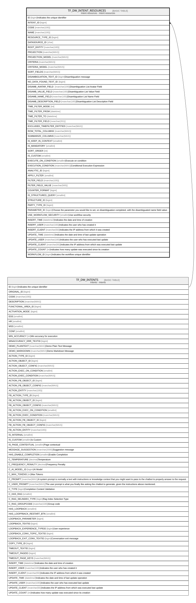

# TF_DW_INTENT_RESOURCES

## Description

Intent resources - Intent resources  

## Columns

| Name | Type | Default | Nullable | Parents | Comment |
| ---- | ---- | ------- | -------- | ------- | ------- |
| ID | bigint |  | false |  | Indicates the unique identifier |
| INTENT_ID | bigint |  | false | [TF_DW_INTENTS](TF_DW_INTENTS.md) |  |
| CODE | nvarchar(100) |  | false |  |  |
| NAME | nvarchar(100) |  | false |  |  |
| RESOURCE_TYPE_ID | bigint | ((0)) | false |  |  |
| DATASOURCE_ID | char |  | true |  |  |
| ROOT_ENTITY | nvarchar(100) |  | true |  |  |
| PROJECTION | nvarchar(MAX) |  | true |  |  |
| PROJECTION_MODEL | nvarchar(MAX) |  | true |  |  |
| CRITERIA | nvarchar(MAX) |  | true |  |  |
| CRITERIA_MODEL | nvarchar(MAX) |  | true |  |  |
| SORT_FIELDS | nvarchar(MAX) |  | true |  |  |
| DISAMBIGUATION_TEXT_ID | bigint |  | true |  | Disambiguation message |
| NO_DATA_FOUND_TEXT_ID | bigint |  | true |  |  |
| DISAMB_AVATAR_FIELD | nvarchar(100) |  | true |  | Disambiguation List Avatar Field |
| DISAMB_VALUE_FIELD | nvarchar(100) |  | true |  | Disambiguation List Value Field |
| DISAMB_NAME_FIELD | nvarchar(100) |  | true |  | Disambiguation List Name Field |
| DISAMB_DESCRIPTION_FIELD | nvarchar(100) |  | true |  | Disambiguation List Description Field |
| TIME_FILTER_MODE | int |  | true |  |  |
| TIME_FILTER_FROM | datetime |  | true |  |  |
| TIME_FILTER_TO | datetime |  | true |  |  |
| TIME_FILTER_FIELD | nvarchar(201) |  | true |  |  |
| EXCLUDED_TIMEFILTER_ENTITIES | nvarchar(MAX) |  | true |  |  |
| ROW_TOTAL_COLUMNS | nvarchar(MAX) |  | true |  |  |
| SUMMARIZE_COLUMNS | nvarchar(MAX) |  | true |  |  |
| IS_KEEP_IN_CONTEXT | smallint |  | true |  |  |
| IS_MANDATORY | smallint |  | false |  |  |
| SORT_ORDER | int | ((0)) | false |  |  |
| IS_CUSTOM | smallint |  | false |  |  |
| EXECUTE_ON_CONDTION | smallint |  | true |  | Execute on condition |
| EXECUTION_CONDTION | nvarchar(MAX) |  | true |  | Conditional Execution Expression |
| ANALYTIC_ID | bigint |  | true |  |  |
| APPLY_FILTER | smallint |  | true |  |  |
| FILTER_FIELD | nvarchar(100) |  | true |  |  |
| FILTER_FIELD_VALUE | nvarchar(500) |  | true |  |  |
| COUNTER_FORMAT | bigint |  | true |  |  |
| IS_STRUCTURED_QUERY | smallint |  | true |  |  |
| STRUCTURE_ID | bigint |  | true |  |  |
| PARTY_TYPE_ID | bigint |  | true |  |  |
| PARAMETER_ID | bigint |  | true |  | Choose the parameter you would like to set, on disambiguation completed, with the disambiguated name field value. |
| USE_WORKFLOW_SECURITY | smallint |  | true |  | Use workflow security |
| INSERT_TIME | datetime2 | (sysutcdatetime()) | false |  | Indicates the date and time of creation |
| INSERT_USER | nvarchar(100) | (N'MAIN') | false |  | Indicates the user who has created it |
| INSERT_CLIENT | nvarchar(50) | (N'localhost') | false |  | Indicates the IP address from which it was created |
| UPDATE_TIME | datetime2 | (sysutcdatetime()) | false |  | Indicates the date and time of last update operation |
| UPDATE_USER | nvarchar(100) | (N'MAIN') | false |  | Indicates the user who has executed last update |
| UPDATE_CLIENT | nvarchar(50) | (N'localhost') | false |  | Indicates the IP address from which was executed last update |
| UPDATE_COUNT | int | ((0)) | false |  | Indicates how many update was executed since its creation |
| WORKFLOW_ID | bigint |  | true |  | Indicates the workflow unique identifier |

## Constraints

| Name | Type | Definition |
| ---- | ---- | ---------- |
| PK_DW_INTENT_RESOURCES | PRIMARY KEY | CLUSTERED, unique, part of a PRIMARY KEY constraint, [ ID ] |
| UQ_DW_INTENT_RESOURCES | UNIQUE | NONCLUSTERED, unique, part of a UNIQUE constraint, [ INTENT_ID, CODE ] |
| FK_DW_RESOURCE_INTENT | FOREIGN KEY | FOREIGN KEY(INTENT_ID) REFERENCES TF_DW_INTENTS(ID) ON UPDATE NO_ACTION ON DELETE NO_ACTION |

## Indexes

| Name | Definition |
| ---- | ---------- |
| PK_DW_INTENT_RESOURCES | CLUSTERED, unique, part of a PRIMARY KEY constraint, [ ID ] |
| UQ_DW_INTENT_RESOURCES | NONCLUSTERED, unique, part of a UNIQUE constraint, [ INTENT_ID, CODE ] |

## Relations

---

> Generated by [tbls](https://github.com/k1LoW/tbls)
