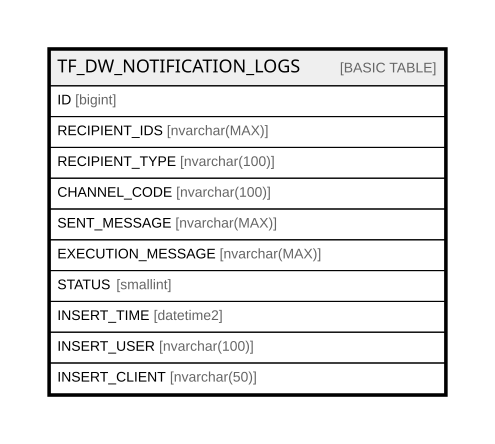

# TF_DW_NOTIFICATION_LOGS

## Columns

| Name | Type | Default | Nullable | Comment |
| ---- | ---- | ------- | -------- | ------- |
| ID | bigint |  | false |  |
| RECIPIENT_IDS | nvarchar(MAX) |  | false |  |
| RECIPIENT_TYPE | nvarchar(100) |  | false |  |
| CHANNEL_CODE | nvarchar(100) |  | false |  |
| SENT_MESSAGE | nvarchar(MAX) |  | true |  |
| EXECUTION_MESSAGE | nvarchar(MAX) |  | true |  |
| STATUS | smallint | ((1)) | false |  |
| INSERT_TIME | datetime2 | (sysutcdatetime()) | false |  |
| INSERT_USER | nvarchar(100) | (N'MAIN') | false |  |
| INSERT_CLIENT | nvarchar(50) | (N'localhost') | false |  |

## Constraints

| Name | Type | Definition |
| ---- | ---- | ---------- |
| PK_DW_NOTIFICATION_LOGS | PRIMARY KEY | CLUSTERED, unique, part of a PRIMARY KEY constraint, [ ID ] |

## Indexes

| Name | Definition |
| ---- | ---------- |
| PK_DW_NOTIFICATION_LOGS | CLUSTERED, unique, part of a PRIMARY KEY constraint, [ ID ] |

## Relations

---

> Generated by [tbls](https://github.com/k1LoW/tbls)
