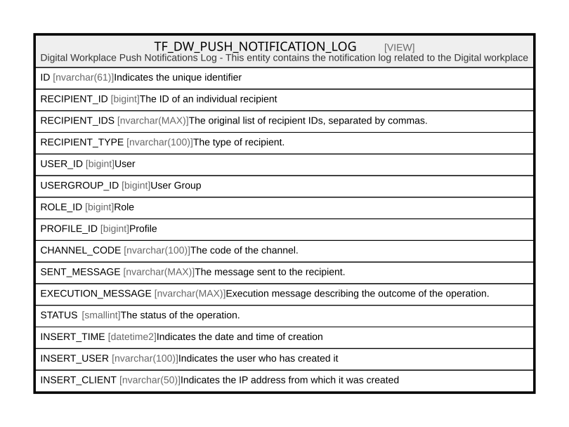

# TF_DW_PUSH_NOTIFICATION_LOG

## Description

Digital Workplace Push Notifications Log - This entity contains the notification log related to the Digital workplace  


<details>
<summary><strong>Table Definition</strong></summary>

```sql
-- Talentia Software - All right reserved
-- Type: VIEW                     Name: TF_DW_PUSH_NOTIFICATION_LOG
-- Date: 09-04-2026 07:27:59 (UTC)
-- 
-- ChangeLogId: 00000000-0000-0000-0000-000000000000
-- ChangeSetId: ae6fb7fb-7448-4246-8eb4-6c3cb5d582ec
-- Original file name: C:\repos\Talentia-Software\hcm-core/DB/ProductDB/EDM\Schema\Views\TF_DW_PUSH_NOTIFICATION_LOG.xml


CREATE VIEW [TF_DW_PUSH_NOTIFICATION_LOG]
 ( ID, RECIPIENT_ID, RECIPIENT_IDS, RECIPIENT_TYPE, USER_ID, USERGROUP_ID, ROLE_ID, PROFILE_ID, CHANNEL_CODE, SENT_MESSAGE, EXECUTION_MESSAGE, STATUS, INSERT_TIME, INSERT_USER, INSERT_CLIENT ) 
 AS 
( 
					SELECT
					CONVERT(nvarchar, NL.ID) + '_' + CONVERT(nvarchar, A.ORDINAL) AS ID,
					CAST(LTRIM(RTRIM(A.VALUE)) AS BIGINT) AS RECIPIENT_ID,
					NL.RECIPIENT_IDS,
					NL.RECIPIENT_TYPE,
					CASE
					WHEN NL.RECIPIENT_TYPE = 'User' THEN CAST(LTRIM(RTRIM(A.VALUE)) AS BIGINT)
					ELSE NULL
					END AS USER_ID,
					CASE
					WHEN NL.RECIPIENT_TYPE = 'UserGroup' THEN CAST(LTRIM(RTRIM(A.VALUE)) AS BIGINT)
					ELSE NULL
					END AS USERGROUP_ID,
					CASE
					WHEN NL.RECIPIENT_TYPE = 'Role' THEN CAST(LTRIM(RTRIM(A.VALUE)) AS BIGINT)
					ELSE NULL
					END AS ROLE_ID,
					CASE
					WHEN NL.RECIPIENT_TYPE = 'Profile' THEN CAST(LTRIM(RTRIM(A.VALUE)) AS BIGINT)
					ELSE NULL
					END AS PROFILE_ID,
					NL.CHANNEL_CODE,
					NL.SENT_MESSAGE,
					NL.EXECUTION_MESSAGE,
					NL.STATUS,
					NL.INSERT_TIME,
					NL.INSERT_USER,
					NL.INSERT_CLIENT
					FROM
					TF_DW_NOTIFICATION_LOGS NL
					CROSS APPLY OPENJSON(CONCAT('[', NL.RECIPIENT_IDS, ']'))
					WITH (VALUE bigint '$', ORDINAL int '$.ordinal') A
				 )

```

</details>

## Columns

| Name | Type | Default | Nullable | Comment |
| ---- | ---- | ------- | -------- | ------- |
| ID | nvarchar(61) |  | true | Indicates the unique identifier |
| RECIPIENT_ID | bigint |  | true | The ID of an individual recipient |
| RECIPIENT_IDS | nvarchar(MAX) |  | false | The original list of recipient IDs, separated by commas. |
| RECIPIENT_TYPE | nvarchar(100) |  | false | The type of recipient. |
| USER_ID | bigint |  | true | User |
| USERGROUP_ID | bigint |  | true | User Group |
| ROLE_ID | bigint |  | true | Role |
| PROFILE_ID | bigint |  | true | Profile |
| CHANNEL_CODE | nvarchar(100) |  | false | The code of the channel. |
| SENT_MESSAGE | nvarchar(MAX) |  | true | The message sent to the recipient. |
| EXECUTION_MESSAGE | nvarchar(MAX) |  | true | Execution message describing the outcome of the operation. |
| STATUS | smallint |  | false | The status of the operation. |
| INSERT_TIME | datetime2 |  | false | Indicates the date and time of creation |
| INSERT_USER | nvarchar(100) |  | false | Indicates the user who has created it |
| INSERT_CLIENT | nvarchar(50) |  | false | Indicates the IP address from which it was created |

## Referenced Tables

| Name | Columns | Comment | Type |
| ---- | ------- | ------- | ---- |
| [TF_DW_NOTIFICATION_LOGS](TF_DW_NOTIFICATION_LOGS.md) | 10 |  | BASIC TABLE |

## Relations



---

> Generated by [tbls](https://github.com/k1LoW/tbls)
