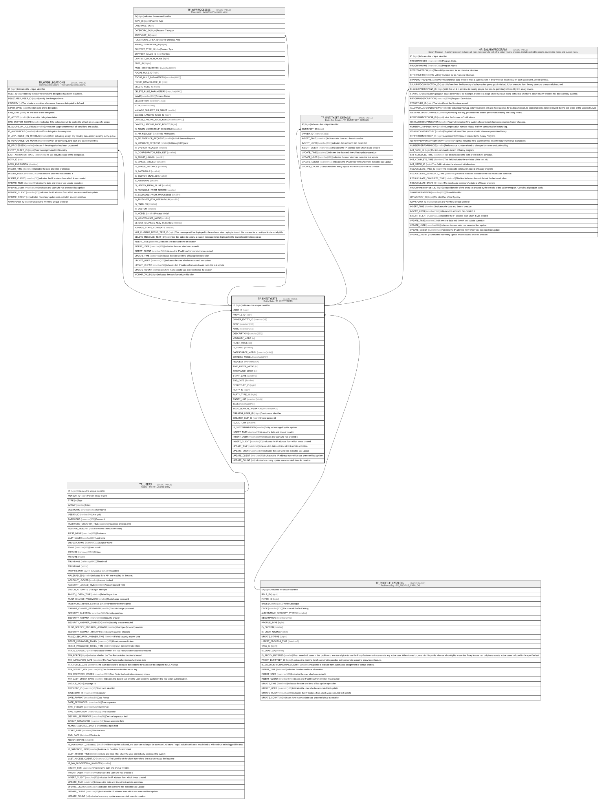

# TF_ENTITYSETS

## Description

Entity Sets - TF_ENTITYSETS  

## Columns

| Name | Type | Default | Nullable | Children | Parents | Comment |
| ---- | ---- | ------- | -------- | -------- | ------- | ------- |
| ID | bigint |  | false | [TF_WFDELEGATIONS](TF_WFDELEGATIONS.md) [TF_WFPROCESSES](TF_WFPROCESSES.md) [TF_ENTITYSET_DETAILS](TF_ENTITYSET_DETAILS.md) [HR_SALARYPROGRAM](HR_SALARYPROGRAM.md) |  | Indicates the unique identifier |
| USER_ID | bigint |  | true |  | [TF_USERS](TF_USERS.md) |  |
| PROFILE_ID | bigint |  | true |  | [TF_PROFILE_CATALOG](TF_PROFILE_CATALOG.md) |  |
| OWNER_ENTITY_ID | nvarchar(36) |  | false |  |  |  |
| CODE | nvarchar(200) |  | false |  |  |  |
| NAME | nvarchar(250) |  | false |  |  |  |
| DESCRIPTION | nvarchar(250) |  | true |  |  |  |
| VISIBILITY_MODE | int | ((0)) | false |  |  |  |
| FILTER_MODE | int |  | true |  |  |  |
| IS_STATIC | smallint | ((1)) | false |  |  |  |
| DATASOURCE_MODEL | nvarchar(MAX) |  | true |  |  |  |
| CRITERIA_MODEL | nvarchar(MAX) |  | true |  |  |  |
| REQUEST | nvarchar(MAX) |  | true |  |  |  |
| TIME_FILTER_MODE | int |  | true |  |  |  |
| CODETABLE_MODE | int |  | true |  |  |  |
| START_DATE | datetime |  | true |  |  |  |
| END_DATE | datetime |  | true |  |  |  |
| STRUCTURE_ID | bigint |  | true |  |  |  |
| PARTY_ID | bigint |  | true |  |  |  |
| PARTY_TYPE_ID | bigint |  | true |  |  |  |
| ENTITY_LIST | nvarchar(MAX) |  | true |  |  |  |
| TAGS | nvarchar(MAX) |  | true |  |  |  |
| TAGS_SEARCH_OPERATOR | nvarchar(MAX) |  | true |  |  |  |
| CREATOR_USER_ID | bigint |  | true |  |  | Creator user identifier |
| CREATOR_EMP_ID | bigint |  | true |  |  | Creator person id |
| IS_FACTORY | smallint | ((0)) | false |  |  |  |
| IS_SYSTEMMANAGED | smallint | ((0)) | true |  |  | Entity set managed by the system. |
| INSERT_TIME | datetime2 | (sysutcdatetime()) | false |  |  | Indicates the date and time of creation |
| INSERT_USER | nvarchar(100) | (N'MAIN') | false |  |  | Indicates the user who has created it |
| INSERT_CLIENT | nvarchar(50) | (N'localhost') | false |  |  | Indicates the IP address from which it was created |
| UPDATE_TIME | datetime2 | (sysutcdatetime()) | false |  |  | Indicates the date and time of last update operation |
| UPDATE_USER | nvarchar(100) | (N'MAIN') | false |  |  | Indicates the user who has executed last update |
| UPDATE_CLIENT | nvarchar(50) | (N'localhost') | false |  |  | Indicates the IP address from which was executed last update |
| UPDATE_COUNT | int | ((0)) | false |  |  | Indicates how many update was executed since its creation |

## Constraints

| Name | Type | Definition |
| ---- | ---- | ---------- |
| PK_ENTITYSETS | PRIMARY KEY | CLUSTERED, unique, part of a PRIMARY KEY constraint, [ ID ] |
| UQ_ENTITYSETS_CODE | UNIQUE | NONCLUSTERED, unique, part of a UNIQUE constraint, [ CODE ] |
| FK_ENTITYSETS_PROFILES | FOREIGN KEY | FOREIGN KEY(PROFILE_ID) REFERENCES TF_PROFILE_CATALOG(ID) ON UPDATE NO_ACTION ON DELETE NO_ACTION |
| FK_ENTITYSETS_USERS | FOREIGN KEY | FOREIGN KEY(USER_ID) REFERENCES TF_USERS(ID) ON UPDATE NO_ACTION ON DELETE NO_ACTION |

## Indexes

| Name | Definition |
| ---- | ---------- |
| PK_ENTITYSETS | CLUSTERED, unique, part of a PRIMARY KEY constraint, [ ID ] |
| UQ_ENTITYSETS_CODE | NONCLUSTERED, unique, part of a UNIQUE constraint, [ CODE ] |

## Relations

---

> Generated by [tbls](https://github.com/k1LoW/tbls)
