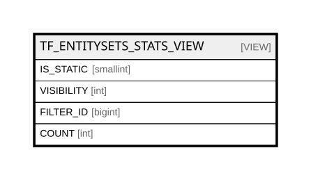

# TF_ENTITYSETS_STATS_VIEW

## Description

<details>
<summary><strong>Table Definition</strong></summary>

```sql
-- Talentia Software - All right reserved
-- Type: VIEW                     Name: TF_ENTITYSETS_STATS_VIEW
-- Date: 09-04-2026 07:27:59 (UTC)
-- 
-- ChangeLogId: 00000000-0000-0000-0000-000000000000
-- ChangeSetId: 6dcf9a04-cc96-4219-b959-7c4dec17ba57
-- Original file name: C:\repos\Talentia-Software\hcm-core/DB/ProductDB/EDM\Schema\Views\TF_ENTITYSETS_STATS_VIEW.xml


CREATE VIEW [TF_ENTITYSETS_STATS_VIEW]
 AS 
( 
          SELECT
          IS_STATIC, 0 as VISIBILITY, USER_ID as FILTER_ID, SUM(CASE WHEN USER_ID IS NULL THEN 0 ELSE 1 END) AS COUNT
          FROM TF_ENTITYSETS
          where user_id is not null
          GROUP BY IS_STATIC, USER_ID
          Union
          SELECT
          IS_STATIC, 1 as TYPE, PROFILE_ID as FILTER_ID, SUM(CASE WHEN PROFILE_ID IS NULL THEN 0 ELSE 1 END) AS COUNT
          FROM TF_ENTITYSETS
          where PROFILE_ID is not null
          GROUP BY IS_STATIC, PROFILE_ID
          Union
          SELECT
          IS_STATIC, 2 as PUBL, NULL as FILTER_ID, SUM(CASE WHEN VISIBILITY_MODE = 2 THEN 1 ELSE 0 END) AS COUNT
          FROM TF_ENTITYSETS
          where VISIBILITY_MODE = 2
          GROUP BY IS_STATIC
         )

```

</details>

## Columns

| Name | Type | Default | Nullable | Comment |
| ---- | ---- | ------- | -------- | ------- |
| IS_STATIC | smallint |  | false |  |
| VISIBILITY | int |  | false |  |
| FILTER_ID | bigint |  | true |  |
| COUNT | int |  | true |  |

## Referenced Tables

| Name | Columns | Comment | Type |
| ---- | ------- | ------- | ---- |
| [TF_ENTITYSETS](TF_ENTITYSETS.md) | 34 | Entity Sets - TF_ENTITYSETS<br /> | BASIC TABLE |

## Relations



---

> Generated by [tbls](https://github.com/k1LoW/tbls)
