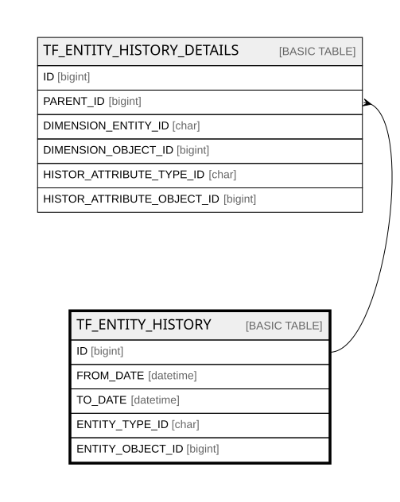

# TF_ENTITY_HISTORY

## Columns

| Name | Type | Default | Nullable | Children | Comment |
| ---- | ---- | ------- | -------- | -------- | ------- |
| ID | bigint |  | false | [TF_ENTITY_HISTORY_DETAILS](TF_ENTITY_HISTORY_DETAILS.md) |  |
| FROM_DATE | datetime |  | true |  |  |
| TO_DATE | datetime |  | true |  |  |
| ENTITY_TYPE_ID | char |  | false |  |  |
| ENTITY_OBJECT_ID | bigint |  | false |  |  |

## Constraints

| Name | Type | Definition |
| ---- | ---- | ---------- |
| PK_ENTITY_HISTORY | PRIMARY KEY | CLUSTERED, unique, part of a PRIMARY KEY constraint, [ ID ] |
| UQ_ENTITY_HISTORY | UNIQUE | NONCLUSTERED, unique, part of a UNIQUE constraint, [ FROM_DATE, TO_DATE, ENTITY_TYPE_ID, ENTITY_OBJECT_ID ] |

## Indexes

| Name | Definition |
| ---- | ---------- |
| PK_ENTITY_HISTORY | CLUSTERED, unique, part of a PRIMARY KEY constraint, [ ID ] |
| UQ_ENTITY_HISTORY | NONCLUSTERED, unique, part of a UNIQUE constraint, [ FROM_DATE, TO_DATE, ENTITY_TYPE_ID, ENTITY_OBJECT_ID ] |
| IDX_ENTITYHISTORY_TOFT | NONCLUSTERED, [ ENTITY_TYPE_ID, ENTITY_OBJECT_ID, FROM_DATE, TO_DATE ] |

## Relations

---

> Generated by [tbls](https://github.com/k1LoW/tbls)
