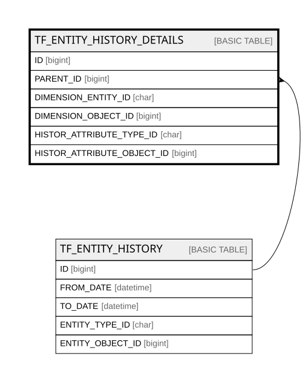

# TF_ENTITY_HISTORY_DETAILS

## Columns

| Name | Type | Default | Nullable | Parents | Comment |
| ---- | ---- | ------- | -------- | ------- | ------- |
| ID | bigint |  | false |  |  |
| PARENT_ID | bigint |  | false | [TF_ENTITY_HISTORY](TF_ENTITY_HISTORY.md) |  |
| DIMENSION_ENTITY_ID | char |  | false |  |  |
| DIMENSION_OBJECT_ID | bigint |  | false |  |  |
| HISTOR_ATTRIBUTE_TYPE_ID | char |  | false |  |  |
| HISTOR_ATTRIBUTE_OBJECT_ID | bigint |  | false |  |  |

## Constraints

| Name | Type | Definition |
| ---- | ---- | ---------- |
| PK_ENTITY_HISTORY_DETAILS | PRIMARY KEY | CLUSTERED, unique, part of a PRIMARY KEY constraint, [ ID ] |
| UQ_ENTITY_HISTORY_DETAILS | UNIQUE | NONCLUSTERED, unique, part of a UNIQUE constraint, [ PARENT_ID, DIMENSION_ENTITY_ID, DIMENSION_OBJECT_ID, HISTOR_ATTRIBUTE_TYPE_ID, HISTOR_ATTRIBUTE_OBJECT_ID ] |
| FK_ENTITYHISTORY_HISTDETAILS | FOREIGN KEY | FOREIGN KEY(PARENT_ID) REFERENCES TF_ENTITY_HISTORY(ID) ON UPDATE NO_ACTION ON DELETE NO_ACTION |

## Indexes

| Name | Definition |
| ---- | ---------- |
| PK_ENTITY_HISTORY_DETAILS | CLUSTERED, unique, part of a PRIMARY KEY constraint, [ ID ] |
| UQ_ENTITY_HISTORY_DETAILS | NONCLUSTERED, unique, part of a UNIQUE constraint, [ PARENT_ID, DIMENSION_ENTITY_ID, DIMENSION_OBJECT_ID, HISTOR_ATTRIBUTE_TYPE_ID, HISTOR_ATTRIBUTE_OBJECT_ID ] |
| IDX_ENTITYHISTORYDETAILS_TO | NONCLUSTERED, [ HISTOR_ATTRIBUTE_TYPE_ID, HISTOR_ATTRIBUTE_OBJECT_ID ] |
| IDX_ENTITYHISTORYDETAILS_IOP | NONCLUSTERED, [ DIMENSION_ENTITY_ID, DIMENSION_OBJECT_ID, PARENT_ID ] |

## Relations

---

> Generated by [tbls](https://github.com/k1LoW/tbls)
