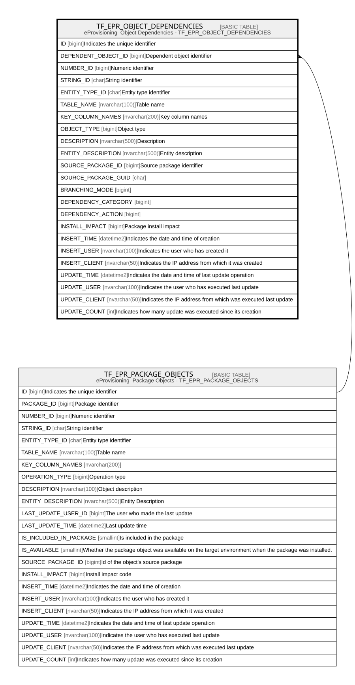

# TF_EPR_OBJECT_DEPENDENCIES

## Description

eProvisioning  Object Dependencies - TF_EPR_OBJECT_DEPENDENCIES  

## Columns

| Name | Type | Default | Nullable | Parents | Comment |
| ---- | ---- | ------- | -------- | ------- | ------- |
| ID | bigint |  | false |  | Indicates the unique identifier |
| DEPENDENT_OBJECT_ID | bigint |  | false | [TF_EPR_PACKAGE_OBJECTS](TF_EPR_PACKAGE_OBJECTS.md) | Dependent object identifier |
| NUMBER_ID | bigint |  | true |  | Numeric identifier |
| STRING_ID | char |  | true |  | String identifier |
| ENTITY_TYPE_ID | char |  | true |  | Entity type identifier |
| TABLE_NAME | nvarchar(100) |  | true |  | Table name |
| KEY_COLUMN_NAMES | nvarchar(200) |  | true |  | Key column names |
| OBJECT_TYPE | bigint | ((0)) | false |  | Object type |
| DESCRIPTION | nvarchar(500) |  | true |  | Description |
| ENTITY_DESCRIPTION | nvarchar(500) |  | true |  | Entity description |
| SOURCE_PACKAGE_ID | bigint |  | true |  | Source package identifier |
| SOURCE_PACKAGE_GUID | char |  | true |  |  |
| BRANCHING_MODE | bigint | ((0)) | false |  |  |
| DEPENDENCY_CATEGORY | bigint | ((0)) | false |  |  |
| DEPENDENCY_ACTION | bigint | ((0)) | false |  |  |
| INSTALL_IMPACT | bigint | ((0)) | false |  | Package install impact |
| INSERT_TIME | datetime2 | (sysutcdatetime()) | true |  | Indicates the date and time of creation |
| INSERT_USER | nvarchar(100) | (N'MAIN') | true |  | Indicates the user who has created it |
| INSERT_CLIENT | nvarchar(50) | (N'localhost') | true |  | Indicates the IP address from which it was created |
| UPDATE_TIME | datetime2 | (sysutcdatetime()) | true |  | Indicates the date and time of last update operation |
| UPDATE_USER | nvarchar(100) | (N'MAIN') | true |  | Indicates the user who has executed last update |
| UPDATE_CLIENT | nvarchar(50) | (N'localhost') | true |  | Indicates the IP address from which was executed last update |
| UPDATE_COUNT | int | ((0)) | true |  | Indicates how many update was executed since its creation |

## Constraints

| Name | Type | Definition |
| ---- | ---- | ---------- |
| PK_EPR_OBJECT_DEPENDENCIES | PRIMARY KEY | CLUSTERED, unique, part of a PRIMARY KEY constraint, [ ID ] |
| UQ_EPR_OBJECT_DEPENDENCIES | UNIQUE | NONCLUSTERED, unique, part of a UNIQUE constraint, [ DEPENDENT_OBJECT_ID, TABLE_NAME, NUMBER_ID, STRING_ID ] |
| FK_OBJDEPENDENCIES_OBJECTS | FOREIGN KEY | FOREIGN KEY(DEPENDENT_OBJECT_ID) REFERENCES TF_EPR_PACKAGE_OBJECTS(ID) ON UPDATE NO_ACTION ON DELETE CASCADE |

## Indexes

| Name | Definition |
| ---- | ---------- |
| PK_EPR_OBJECT_DEPENDENCIES | CLUSTERED, unique, part of a PRIMARY KEY constraint, [ ID ] |
| UQ_EPR_OBJECT_DEPENDENCIES | NONCLUSTERED, unique, part of a UNIQUE constraint, [ DEPENDENT_OBJECT_ID, TABLE_NAME, NUMBER_ID, STRING_ID ] |

## Relations

---

> Generated by [tbls](https://github.com/k1LoW/tbls)
