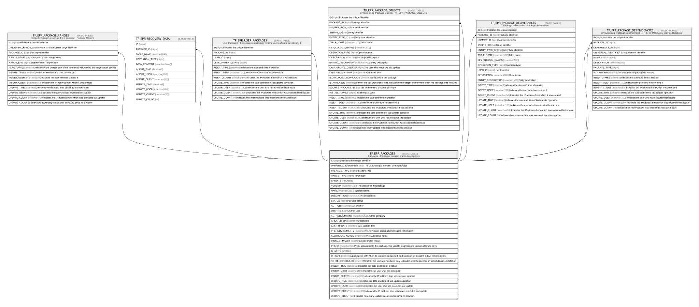

# TF_EPR_PACKAGES

## Description

Packages - Packages installed and in development  

## Columns

| Name | Type | Default | Nullable | Children | Comment |
| ---- | ---- | ------- | -------- | -------- | ------- |
| ID | bigint |  | false | [TF_EPR_PACKAGE_RANGES](TF_EPR_PACKAGE_RANGES.md) [TF_EPR_RECOVERY_DATA](TF_EPR_RECOVERY_DATA.md) [TF_EPR_USER_PACKAGES](TF_EPR_USER_PACKAGES.md) [TF_EPR_PACKAGE_OBJECTS](TF_EPR_PACKAGE_OBJECTS.md) [TF_EPR_PACKAGE_DELIVERABLES](TF_EPR_PACKAGE_DELIVERABLES.md) [TF_EPR_PACKAGE_DEPENDENCIES](TF_EPR_PACKAGE_DEPENDENCIES.md) | Indicates the unique identifier |
| UNIVERSAL_IDENTIFIER | char |  | false |  | The GUID unique identifier of the package |
| PACKAGE_TYPE | bigint | ((0)) | false |  | Package Type |
| RANGE_TYPE | bigint |  | false |  | Range type |
| CREDITS | int | ((50)) | false |  | Credits |
| VERSION | nvarchar(100) | (N'0') | false |  | The version of the package |
| NAME | nvarchar(255) |  | false |  | Package Name |
| DESCRIPTION | nvarchar(2000) |  | true |  | Description |
| STATUS | bigint | ((0)) | false |  | Package status |
| AUTHOR | nvarchar(255) |  | true |  | Author |
| USER_ID | bigint |  | true |  | Author user |
| AUTHORCOMPANY | nvarchar(255) |  | true |  | Author company |
| CREATED_ON | datetime |  | true |  | Created on |
| LAST_UPDATE | datetime |  | true |  | Last update date |
| PREREQUIREMENTS | nvarchar(MAX) |  | true |  | Product prerequirements json information |
| ADDITIONAL_NOTES | nvarchar(MAX) |  | true |  | Additional notes |
| INSTALL_IMPACT | bigint | ((0)) | false |  | Package install impact |
| PREFIX | nvarchar(50) |  | false |  | Prefix associated to the package. It is used to disambiguate unique alternate keys |
| IS_DIRTY | smallint | ((0)) | false |  |  |
| IS_SAFE | smallint | ((1)) | false |  | A package is safe when its status is Completed, and so it can be installed in Live environments. |
| TO_BE_SCHEDULED | smallint | ((0)) | false |  | Whether the package has been only uploaded with the purpose of scheduling its installation |
| INSERT_TIME | datetime2 | (sysutcdatetime()) | true |  | Indicates the date and time of creation |
| INSERT_USER | nvarchar(100) | (N'MAIN') | true |  | Indicates the user who has created it |
| INSERT_CLIENT | nvarchar(50) | (N'localhost') | true |  | Indicates the IP address from which it was created |
| UPDATE_TIME | datetime2 | (sysutcdatetime()) | true |  | Indicates the date and time of last update operation |
| UPDATE_USER | nvarchar(100) | (N'MAIN') | true |  | Indicates the user who has executed last update |
| UPDATE_CLIENT | nvarchar(50) | (N'localhost') | true |  | Indicates the IP address from which was executed last update |
| UPDATE_COUNT | int | ((0)) | true |  | Indicates how many update was executed since its creation |

## Constraints

| Name | Type | Definition |
| ---- | ---- | ---------- |
| PK_EPR_PACKAGES | PRIMARY KEY | CLUSTERED, unique, part of a PRIMARY KEY constraint, [ ID ] |
| UQ_PACKAGES_GUID_VERSION | UNIQUE | NONCLUSTERED, unique, part of a UNIQUE constraint, [ UNIVERSAL_IDENTIFIER, VERSION ] |

## Indexes

| Name | Definition |
| ---- | ---------- |
| PK_EPR_PACKAGES | CLUSTERED, unique, part of a PRIMARY KEY constraint, [ ID ] |
| UQ_PACKAGES_GUID_VERSION | NONCLUSTERED, unique, part of a UNIQUE constraint, [ UNIVERSAL_IDENTIFIER, VERSION ] |

## Relations

---

> Generated by [tbls](https://github.com/k1LoW/tbls)
