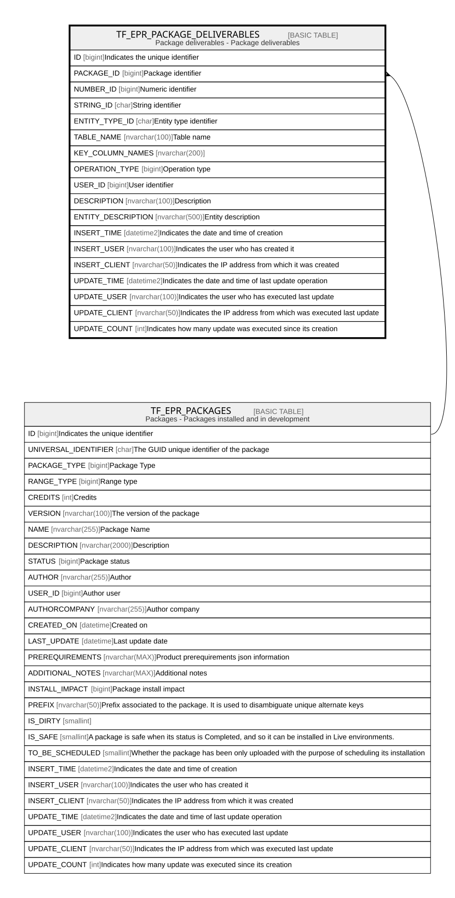

# TF_EPR_PACKAGE_DELIVERABLES

## Description

Package deliverables - Package deliverables  

## Columns

| Name | Type | Default | Nullable | Parents | Comment |
| ---- | ---- | ------- | -------- | ------- | ------- |
| ID | bigint |  | false |  | Indicates the unique identifier |
| PACKAGE_ID | bigint |  | false | [TF_EPR_PACKAGES](TF_EPR_PACKAGES.md) | Package identifier |
| NUMBER_ID | bigint |  | true |  | Numeric identifier |
| STRING_ID | char |  | true |  | String identifier |
| ENTITY_TYPE_ID | char |  | true |  | Entity type identifier |
| TABLE_NAME | nvarchar(100) |  | true |  | Table name |
| KEY_COLUMN_NAMES | nvarchar(200) |  | true |  |  |
| OPERATION_TYPE | bigint | ((0)) | false |  | Operation type |
| USER_ID | bigint |  | false |  | User identifier |
| DESCRIPTION | nvarchar(100) |  | true |  | Description |
| ENTITY_DESCRIPTION | nvarchar(500) |  | true |  | Entity description |
| INSERT_TIME | datetime2 | (sysutcdatetime()) | true |  | Indicates the date and time of creation |
| INSERT_USER | nvarchar(100) | (N'MAIN') | true |  | Indicates the user who has created it |
| INSERT_CLIENT | nvarchar(50) | (N'localhost') | true |  | Indicates the IP address from which it was created |
| UPDATE_TIME | datetime2 | (sysutcdatetime()) | true |  | Indicates the date and time of last update operation |
| UPDATE_USER | nvarchar(100) | (N'MAIN') | true |  | Indicates the user who has executed last update |
| UPDATE_CLIENT | nvarchar(50) | (N'localhost') | true |  | Indicates the IP address from which was executed last update |
| UPDATE_COUNT | int | ((0)) | true |  | Indicates how many update was executed since its creation |

## Constraints

| Name | Type | Definition |
| ---- | ---- | ---------- |
| PK_EPR_PACKAGE_DELIVERABLES | PRIMARY KEY | CLUSTERED, unique, part of a PRIMARY KEY constraint, [ ID ] |
| FK_PACKDELIVERABLES_PACKAGE | FOREIGN KEY | FOREIGN KEY(PACKAGE_ID) REFERENCES TF_EPR_PACKAGES(ID) ON UPDATE NO_ACTION ON DELETE CASCADE |

## Indexes

| Name | Definition |
| ---- | ---------- |
| PK_EPR_PACKAGE_DELIVERABLES | CLUSTERED, unique, part of a PRIMARY KEY constraint, [ ID ] |

## Relations

---

> Generated by [tbls](https://github.com/k1LoW/tbls)
