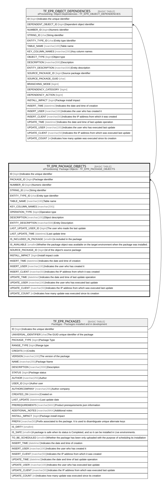

# TF_EPR_PACKAGE_OBJECTS

## Description

eProvisioning  Package Objects - TF_EPR_PACKAGE_OBJECTS  

## Columns

| Name | Type | Default | Nullable | Children | Parents | Comment |
| ---- | ---- | ------- | -------- | -------- | ------- | ------- |
| ID | bigint |  | false | [TF_EPR_OBJECT_DEPENDENCIES](TF_EPR_OBJECT_DEPENDENCIES.md) |  | Indicates the unique identifier |
| PACKAGE_ID | bigint |  | false |  | [TF_EPR_PACKAGES](TF_EPR_PACKAGES.md) | Package identifier |
| NUMBER_ID | bigint |  | true |  |  | Numeric identifier |
| STRING_ID | char |  | true |  |  | String identifier |
| ENTITY_TYPE_ID | char |  | true |  |  | Entity type identifier |
| TABLE_NAME | nvarchar(100) |  | true |  |  | Table name |
| KEY_COLUMN_NAMES | nvarchar(200) |  | true |  |  |  |
| OPERATION_TYPE | bigint | ((0)) | false |  |  | Operation type |
| DESCRIPTION | nvarchar(100) |  | true |  |  | Object description |
| ENTITY_DESCRIPTION | nvarchar(500) |  | true |  |  | Entity Description |
| LAST_UPDATE_USER_ID | bigint |  | true |  |  | The user who made the last update |
| LAST_UPDATE_TIME | datetime2 |  | true |  |  | Last update time |
| IS_INCLUDED_IN_PACKAGE | smallint | ((1)) | false |  |  | Is included in the package |
| IS_AVAILABLE | smallint | ((1)) | false |  |  | Whether the package object was available on the target environment when the package was installed. |
| SOURCE_PACKAGE_ID | bigint |  | true |  |  | Id of the object's source package |
| INSTALL_IMPACT | bigint | ((0)) | false |  |  | Install impact code |
| INSERT_TIME | datetime2 | (sysutcdatetime()) | true |  |  | Indicates the date and time of creation |
| INSERT_USER | nvarchar(100) | (N'MAIN') | true |  |  | Indicates the user who has created it |
| INSERT_CLIENT | nvarchar(50) | (N'localhost') | true |  |  | Indicates the IP address from which it was created |
| UPDATE_TIME | datetime2 | (sysutcdatetime()) | true |  |  | Indicates the date and time of last update operation |
| UPDATE_USER | nvarchar(100) | (N'MAIN') | true |  |  | Indicates the user who has executed last update |
| UPDATE_CLIENT | nvarchar(50) | (N'localhost') | true |  |  | Indicates the IP address from which was executed last update |
| UPDATE_COUNT | int | ((0)) | true |  |  | Indicates how many update was executed since its creation |

## Constraints

| Name | Type | Definition |
| ---- | ---- | ---------- |
| PK_EPR_PACKAGE_OBJECTS | PRIMARY KEY | CLUSTERED, unique, part of a PRIMARY KEY constraint, [ ID ] |
| UQ_PACKAGE_OBJECTS | UNIQUE | NONCLUSTERED, unique, part of a UNIQUE constraint, [ PACKAGE_ID, NUMBER_ID, STRING_ID, ENTITY_TYPE_ID, TABLE_NAME ] |
| FK_PACKOBJECTS_PACKAGE | FOREIGN KEY | FOREIGN KEY(PACKAGE_ID) REFERENCES TF_EPR_PACKAGES(ID) ON UPDATE NO_ACTION ON DELETE CASCADE |

## Indexes

| Name | Definition |
| ---- | ---------- |
| PK_EPR_PACKAGE_OBJECTS | CLUSTERED, unique, part of a PRIMARY KEY constraint, [ ID ] |
| UQ_PACKAGE_OBJECTS | NONCLUSTERED, unique, part of a UNIQUE constraint, [ PACKAGE_ID, NUMBER_ID, STRING_ID, ENTITY_TYPE_ID, TABLE_NAME ] |

## Relations

---

> Generated by [tbls](https://github.com/k1LoW/tbls)
