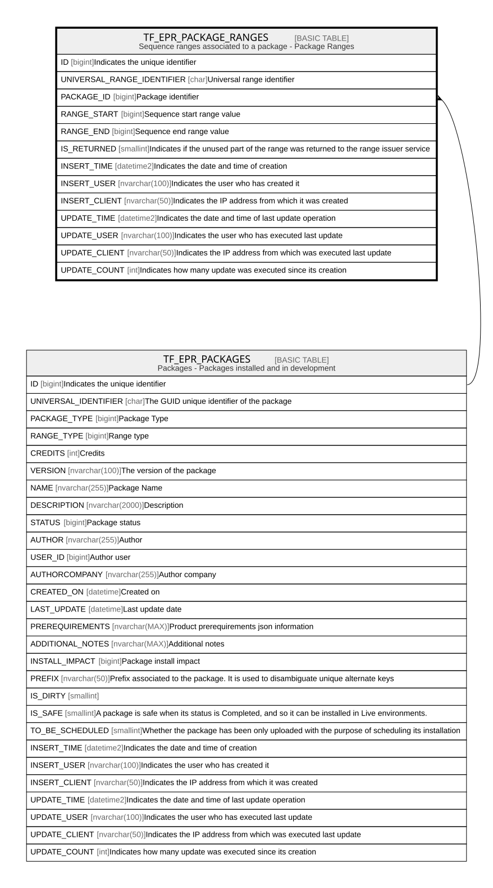

# TF_EPR_PACKAGE_RANGES

## Description

Sequence ranges associated to a package - Package Ranges  

## Columns

| Name | Type | Default | Nullable | Parents | Comment |
| ---- | ---- | ------- | -------- | ------- | ------- |
| ID | bigint |  | false |  | Indicates the unique identifier |
| UNIVERSAL_RANGE_IDENTIFIER | char |  | false |  | Universal range identifier |
| PACKAGE_ID | bigint |  | false | [TF_EPR_PACKAGES](TF_EPR_PACKAGES.md) | Package identifier |
| RANGE_START | bigint |  | false |  | Sequence start range value |
| RANGE_END | bigint |  | false |  | Sequence end range value |
| IS_RETURNED | smallint | ((0)) | true |  | Indicates if the unused part of the range was returned to the range issuer service |
| INSERT_TIME | datetime2 | (sysutcdatetime()) | true |  | Indicates the date and time of creation |
| INSERT_USER | nvarchar(100) | (N'MAIN') | true |  | Indicates the user who has created it |
| INSERT_CLIENT | nvarchar(50) | (N'localhost') | true |  | Indicates the IP address from which it was created |
| UPDATE_TIME | datetime2 | (sysutcdatetime()) | true |  | Indicates the date and time of last update operation |
| UPDATE_USER | nvarchar(100) | (N'MAIN') | true |  | Indicates the user who has executed last update |
| UPDATE_CLIENT | nvarchar(50) | (N'localhost') | true |  | Indicates the IP address from which was executed last update |
| UPDATE_COUNT | int | ((0)) | true |  | Indicates how many update was executed since its creation |

## Constraints

| Name | Type | Definition |
| ---- | ---- | ---------- |
| PK_EPR_PACKAGE_RANGES | PRIMARY KEY | CLUSTERED, unique, part of a PRIMARY KEY constraint, [ ID ] |
| UQ_PACKAGE_RANGES | UNIQUE | NONCLUSTERED, unique, part of a UNIQUE constraint, [ PACKAGE_ID, RANGE_START, RANGE_END ] |
| FK_PACKAGE_RANGES_PACKAGE | FOREIGN KEY | FOREIGN KEY(PACKAGE_ID) REFERENCES TF_EPR_PACKAGES(ID) ON UPDATE NO_ACTION ON DELETE CASCADE |

## Indexes

| Name | Definition |
| ---- | ---------- |
| PK_EPR_PACKAGE_RANGES | CLUSTERED, unique, part of a PRIMARY KEY constraint, [ ID ] |
| UQ_PACKAGE_RANGES | NONCLUSTERED, unique, part of a UNIQUE constraint, [ PACKAGE_ID, RANGE_START, RANGE_END ] |

## Relations

---

> Generated by [tbls](https://github.com/k1LoW/tbls)
