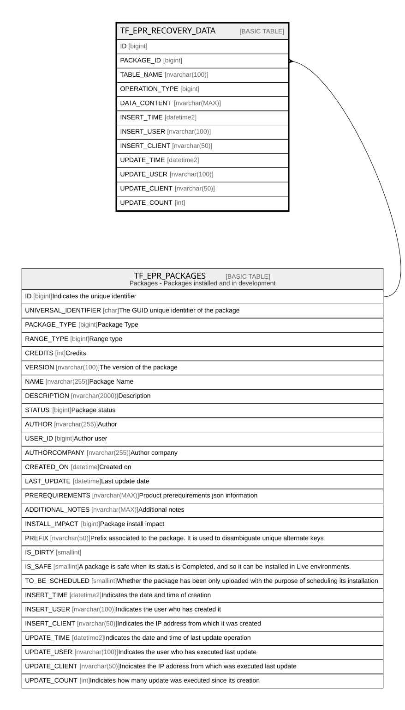

# TF_EPR_RECOVERY_DATA

## Columns

| Name | Type | Default | Nullable | Parents | Comment |
| ---- | ---- | ------- | -------- | ------- | ------- |
| ID | bigint |  | false |  |  |
| PACKAGE_ID | bigint |  | false | [TF_EPR_PACKAGES](TF_EPR_PACKAGES.md) |  |
| TABLE_NAME | nvarchar(100) |  | true |  |  |
| OPERATION_TYPE | bigint | ((0)) | false |  |  |
| DATA_CONTENT | nvarchar(MAX) |  | true |  |  |
| INSERT_TIME | datetime2 | (sysutcdatetime()) | true |  |  |
| INSERT_USER | nvarchar(100) | (N'MAIN') | true |  |  |
| INSERT_CLIENT | nvarchar(50) | (N'localhost') | true |  |  |
| UPDATE_TIME | datetime2 | (sysutcdatetime()) | true |  |  |
| UPDATE_USER | nvarchar(100) | (N'MAIN') | true |  |  |
| UPDATE_CLIENT | nvarchar(50) | (N'localhost') | true |  |  |
| UPDATE_COUNT | int | ((0)) | true |  |  |

## Constraints

| Name | Type | Definition |
| ---- | ---- | ---------- |
| PK_EPR_RECOVERY_DATA | PRIMARY KEY | CLUSTERED, unique, part of a PRIMARY KEY constraint, [ ID ] |
| UQ_PRECOVERY_DATA | UNIQUE | NONCLUSTERED, unique, part of a UNIQUE constraint, [ PACKAGE_ID, TABLE_NAME, OPERATION_TYPE ] |
| FK_RECOVDATA_PACKAGE | FOREIGN KEY | FOREIGN KEY(PACKAGE_ID) REFERENCES TF_EPR_PACKAGES(ID) ON UPDATE NO_ACTION ON DELETE CASCADE |

## Indexes

| Name | Definition |
| ---- | ---------- |
| PK_EPR_RECOVERY_DATA | CLUSTERED, unique, part of a PRIMARY KEY constraint, [ ID ] |
| UQ_PRECOVERY_DATA | NONCLUSTERED, unique, part of a UNIQUE constraint, [ PACKAGE_ID, TABLE_NAME, OPERATION_TYPE ] |

## Relations

---

> Generated by [tbls](https://github.com/k1LoW/tbls)
