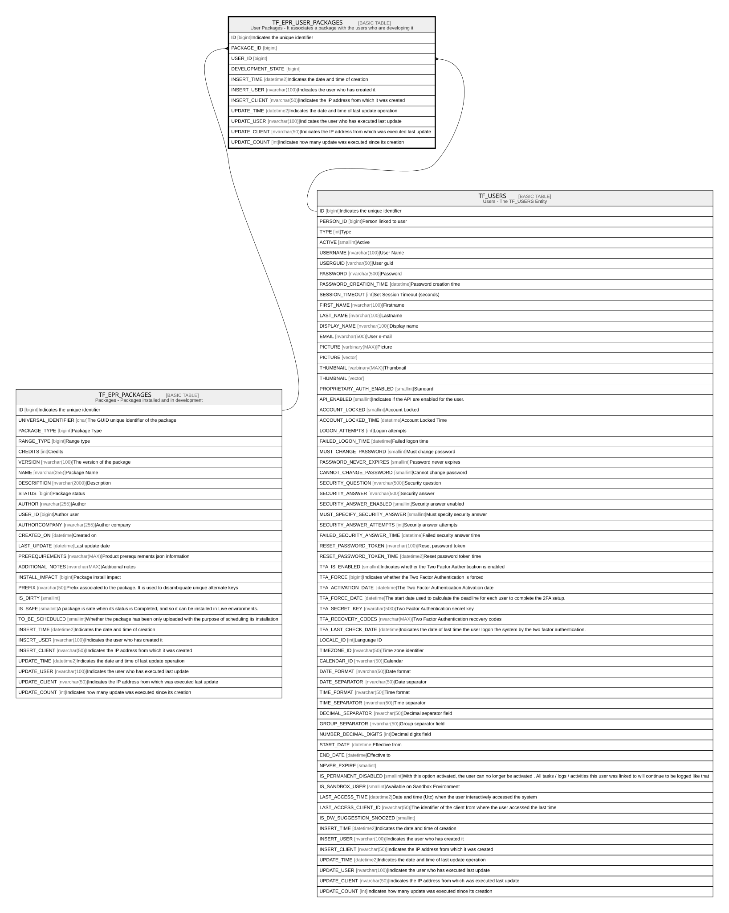

# TF_EPR_USER_PACKAGES

## Description

User Packages - It associates a package with the users who are developing it  

## Columns

| Name | Type | Default | Nullable | Parents | Comment |
| ---- | ---- | ------- | -------- | ------- | ------- |
| ID | bigint |  | false |  | Indicates the unique identifier |
| PACKAGE_ID | bigint |  | false | [TF_EPR_PACKAGES](TF_EPR_PACKAGES.md) |  |
| USER_ID | bigint |  | false | [TF_USERS](TF_USERS.md) |  |
| DEVELOPMENT_STATE | bigint | ((0)) | false |  |  |
| INSERT_TIME | datetime2 | (sysutcdatetime()) | true |  | Indicates the date and time of creation |
| INSERT_USER | nvarchar(100) | (N'MAIN') | true |  | Indicates the user who has created it |
| INSERT_CLIENT | nvarchar(50) | (N'localhost') | true |  | Indicates the IP address from which it was created |
| UPDATE_TIME | datetime2 | (sysutcdatetime()) | true |  | Indicates the date and time of last update operation |
| UPDATE_USER | nvarchar(100) | (N'MAIN') | true |  | Indicates the user who has executed last update |
| UPDATE_CLIENT | nvarchar(50) | (N'localhost') | true |  | Indicates the IP address from which was executed last update |
| UPDATE_COUNT | int | ((0)) | true |  | Indicates how many update was executed since its creation |

## Constraints

| Name | Type | Definition |
| ---- | ---- | ---------- |
| PK_EPR_USER_PACKAGES | PRIMARY KEY | CLUSTERED, unique, part of a PRIMARY KEY constraint, [ ID ] |
| UQ_USER_PACKAGES | UNIQUE | NONCLUSTERED, unique, part of a UNIQUE constraint, [ PACKAGE_ID, USER_ID ] |
| FK_USERPACKAGES_PACKAGE | FOREIGN KEY | FOREIGN KEY(PACKAGE_ID) REFERENCES TF_EPR_PACKAGES(ID) ON UPDATE NO_ACTION ON DELETE CASCADE |
| FK_USERPACKAGES_USERS | FOREIGN KEY | FOREIGN KEY(USER_ID) REFERENCES TF_USERS(ID) ON UPDATE NO_ACTION ON DELETE NO_ACTION |

## Indexes

| Name | Definition |
| ---- | ---------- |
| PK_EPR_USER_PACKAGES | CLUSTERED, unique, part of a PRIMARY KEY constraint, [ ID ] |
| UQ_USER_PACKAGES | NONCLUSTERED, unique, part of a UNIQUE constraint, [ PACKAGE_ID, USER_ID ] |

## Relations

---

> Generated by [tbls](https://github.com/k1LoW/tbls)
