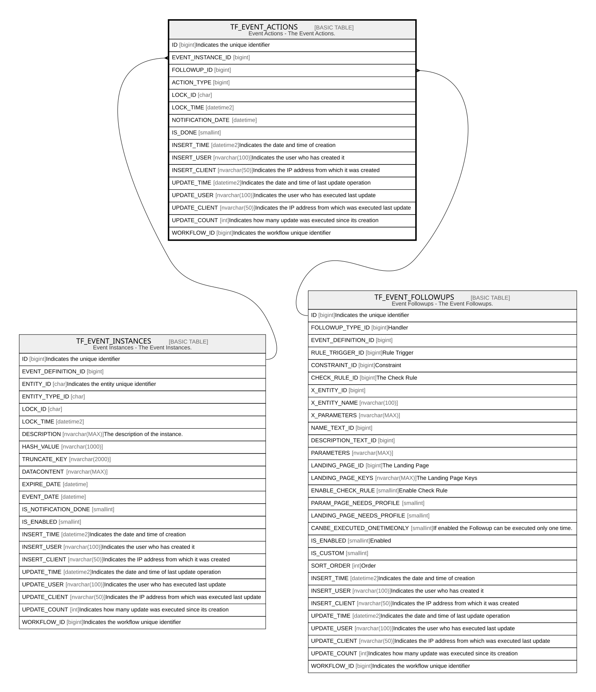

# TF_EVENT_ACTIONS

## Description

Event Actions - The Event Actions.  

## Columns

| Name | Type | Default | Nullable | Parents | Comment |
| ---- | ---- | ------- | -------- | ------- | ------- |
| ID | bigint |  | false |  | Indicates the unique identifier |
| EVENT_INSTANCE_ID | bigint |  | false | [TF_EVENT_INSTANCES](TF_EVENT_INSTANCES.md) |  |
| FOLLOWUP_ID | bigint |  | true | [TF_EVENT_FOLLOWUPS](TF_EVENT_FOLLOWUPS.md) |  |
| ACTION_TYPE | bigint |  | false |  |  |
| LOCK_ID | char |  | true |  |  |
| LOCK_TIME | datetime2 |  | true |  |  |
| NOTIFICATION_DATE | datetime |  | true |  |  |
| IS_DONE | smallint |  | false |  |  |
| INSERT_TIME | datetime2 | (sysutcdatetime()) | false |  | Indicates the date and time of creation |
| INSERT_USER | nvarchar(100) | (N'MAIN') | false |  | Indicates the user who has created it |
| INSERT_CLIENT | nvarchar(50) | (N'localhost') | false |  | Indicates the IP address from which it was created |
| UPDATE_TIME | datetime2 | (sysutcdatetime()) | false |  | Indicates the date and time of last update operation |
| UPDATE_USER | nvarchar(100) | (N'MAIN') | false |  | Indicates the user who has executed last update |
| UPDATE_CLIENT | nvarchar(50) | (N'localhost') | false |  | Indicates the IP address from which was executed last update |
| UPDATE_COUNT | int | ((0)) | false |  | Indicates how many update was executed since its creation |
| WORKFLOW_ID | bigint |  | true |  | Indicates the workflow unique identifier |

## Constraints

| Name | Type | Definition |
| ---- | ---- | ---------- |
| PK_TFEVENT_ACTIONS | PRIMARY KEY | CLUSTERED, unique, part of a PRIMARY KEY constraint, [ ID ] |
| FK_TFEVENT_ACT_EVINSTANCES | FOREIGN KEY | FOREIGN KEY(EVENT_INSTANCE_ID) REFERENCES TF_EVENT_INSTANCES(ID) ON UPDATE NO_ACTION ON DELETE CASCADE |
| FK_TFEVENT_ACT_FOLLOWUP | FOREIGN KEY | FOREIGN KEY(FOLLOWUP_ID) REFERENCES TF_EVENT_FOLLOWUPS(ID) ON UPDATE NO_ACTION ON DELETE NO_ACTION |

## Indexes

| Name | Definition |
| ---- | ---------- |
| PK_TFEVENT_ACTIONS | CLUSTERED, unique, part of a PRIMARY KEY constraint, [ ID ] |
| IDX_EVNACT_INSTANCEID | NONCLUSTERED, [ EVENT_INSTANCE_ID, IS_DONE, NOTIFICATION_DATE ] |

## Relations

---

> Generated by [tbls](https://github.com/k1LoW/tbls)
