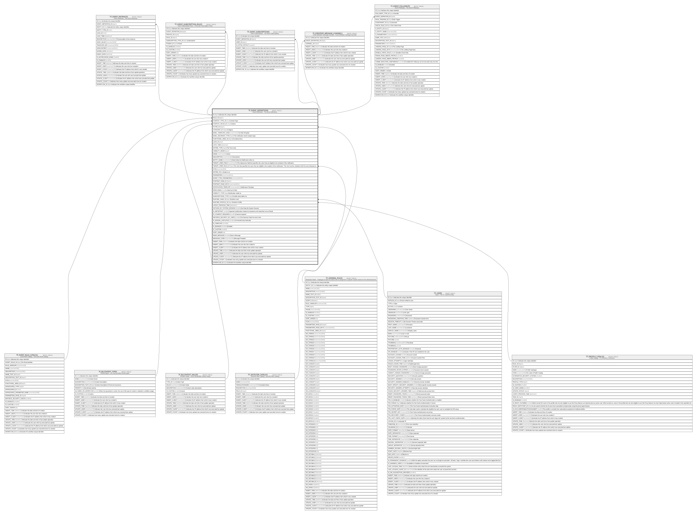

# TF_EVENT_DEFINITIONS

## Description

Event Definitions - The Event Definitions.  

## Columns

| Name | Type | Default | Nullable | Children | Parents | Comment |
| ---- | ---- | ------- | -------- | -------- | ------- | ------- |
| ID | bigint |  | false | [TF_EVENT_INSTANCES](TF_EVENT_INSTANCES.md) [TF_EVENT_SUBSCRIPTION_RULES](TF_EVENT_SUBSCRIPTION_RULES.md) [TF_EVENT_SUBSCRIPTIONS](TF_EVENT_SUBSCRIPTIONS.md) [TF_EVENTDEF_MESSAGE_CHANNELS](TF_EVENTDEF_MESSAGE_CHANNELS.md) [TF_EVENT_FOLLOWUPS](TF_EVENT_FOLLOWUPS.md) |  | Indicates the unique identifier |
| RULE_ID | bigint |  | false |  | [TF_EVENT_RULE_CATALOG](TF_EVENT_RULE_CATALOG.md) |  |
| CONTEXT_TYPE_ID | char |  | true |  | [TF_BLCONTEXT_TYPES](TF_BLCONTEXT_TYPES.md) | Context Type |
| CONTEXT_VALUE_ID | char |  | true |  | [TF_BLCONTEXT_VALUES](TF_BLCONTEXT_VALUES.md) | Context |
| FILTER_ID | bigint |  | true |  | [TF_SECFILTER_CATALOG](TF_SECFILTER_CATALOG.md) |  |
| CATEGORY_ID | bigint |  | true |  |  | Category |
| EMAIL_TEMPLATE_CODE | nvarchar(100) |  | true |  |  | E-Mail Template |
| EMAIL_RECIPIENT_TYPE | bigint | ((2)) | false |  |  | The notification email recipient type. |
| FUNCTIONAL_AREA_ID | bigint |  | true |  |  | Functional Area |
| LOCK_ID | char |  | true |  |  |  |
| LOCK_TIME | datetime2 |  | true |  |  |  |
| EXPIRE_TYPE | bigint | ((1)) | false |  |  | The Time Units. |
| VISIBILITY_MODE | bigint | ((0)) | false |  |  |  |
| NAME | nvarchar(100) |  | false |  |  | Name |
| DESCRIPTION | nvarchar(1000) |  | true |  |  | Description |
| ENTITY_NAME | nvarchar(100) |  | false |  |  | Main Entity the Notification refers to. |
| TARGET_USER_FIELD | nvarchar(200) |  | true |  |  | The datasource field that specifies the users that are eligible to be recipient of the notification. |
| TARGET_USER_RULE_ID | bigint |  | true |  | [TF_GENERAL_RULES](TF_GENERAL_RULES.md) | The rule that specifies the users that are eligible to be recipient of the notification. The rule must be compliant with the event datasource. |
| ICON | nvarchar(500) |  | true |  |  |  |
| EXPIRE_ON | int | ((1)) | false |  |  | Expires on |
| PARAMETERS | nvarchar(MAX) |  | true |  |  |  |
| EVENT_TYPE_PARAMETERS | nvarchar(MAX) |  | true |  |  |  |
| PORTRAIT_PAGE_ID | bigint |  | true |  |  |  |
| PORTRAIT_PAGE_KEYS | nvarchar(MAX) |  | true |  |  |  |
| NOTIFICATION_TEMPLATE | nvarchar(MAX) |  | true |  |  | Notification Template |
| SEND_EMAIL | smallint |  | true |  |  | Send an E-Mail |
| VISIBILITY_TYPE | bigint | ((0)) | true |  |  | Notification visible to |
| SUBSCRIPTIONS_TYPE | bigint | ((1)) | true |  |  | Enable subscription by |
| RUNTIME_USER_ID | bigint |  | true |  | [TF_USERS](TF_USERS.md) | Runtime User |
| RUNTIME_PROFILE_ID | bigint |  | true |  | [TF_PROFILE_CATALOG](TF_PROFILE_CATALOG.md) | Runtime Profile |
| LATEST_PROCESS_TIME | datetime2 |  | true |  |  |  |
| GETDATA_BY_SYSTEM_SESSION | smallint | ((0)) | false |  |  | Get Data By System Session |
| IS_IMPORTANT | smallint | ((0)) | false |  |  | Important (notification marked as important until subscriber set as Read). |
| IS_CONSENT_REQUIRED | smallint | ((0)) | false |  |  | Consent required |
| ENFORCE_SECURITY_BY_USER | smallint | ((0)) | false |  |  | The Security Check for each User. |
| IS_MANUAL_EXECUTED | smallint | ((0)) | false |  |  | Is Executed only Manually. |
| IS_TEMPLATE | smallint | ((0)) | false |  |  |  |
| IS_ENABLED | smallint | ((0)) | false |  |  | Enabled |
| IS_CUSTOM | smallint | ((1)) | false |  |  |  |
| SORT_ORDER | int | ((0)) | true |  |  |  |
| SEND_MESSAGE | smallint |  | true |  |  | Send a Message |
| MESSAGE_CODE | nvarchar(100) |  | true |  |  | Message Template |
| INSERT_TIME | datetime2 | (sysutcdatetime()) | false |  |  | Indicates the date and time of creation |
| INSERT_USER | nvarchar(100) | (N'MAIN') | false |  |  | Indicates the user who has created it |
| INSERT_CLIENT | nvarchar(50) | (N'localhost') | false |  |  | Indicates the IP address from which it was created |
| UPDATE_TIME | datetime2 | (sysutcdatetime()) | false |  |  | Indicates the date and time of last update operation |
| UPDATE_USER | nvarchar(100) | (N'MAIN') | false |  |  | Indicates the user who has executed last update |
| UPDATE_CLIENT | nvarchar(50) | (N'localhost') | false |  |  | Indicates the IP address from which was executed last update |
| UPDATE_COUNT | int | ((0)) | false |  |  | Indicates how many update was executed since its creation |
| WORKFLOW_ID | bigint |  | true |  |  | Indicates the workflow unique identifier |

## Constraints

| Name | Type | Definition |
| ---- | ---- | ---------- |
| PK_TFEVENT_DEFINITIONS | PRIMARY KEY | CLUSTERED, unique, part of a PRIMARY KEY constraint, [ ID ] |
| FK_TFEVENTDEF_CONTEXTTYPES | FOREIGN KEY | FOREIGN KEY(CONTEXT_TYPE_ID) REFERENCES TF_BLCONTEXT_TYPES(ID) ON UPDATE NO_ACTION ON DELETE NO_ACTION |
| FK_TFEVENTDEF_CONTEXTVALUE | FOREIGN KEY | FOREIGN KEY(CONTEXT_VALUE_ID) REFERENCES TF_BLCONTEXT_VALUES(ID) ON UPDATE NO_ACTION ON DELETE NO_ACTION |
| FK_TFEVENTDEF_PROFILECAT | FOREIGN KEY | FOREIGN KEY(RUNTIME_PROFILE_ID) REFERENCES TF_PROFILE_CATALOG(ID) ON UPDATE NO_ACTION ON DELETE NO_ACTION |
| FK_TFEVENTDEF_RECIPIENTSRULE | FOREIGN KEY | FOREIGN KEY(TARGET_USER_RULE_ID) REFERENCES TF_GENERAL_RULES(ID) ON UPDATE NO_ACTION ON DELETE NO_ACTION |
| FK_TFEVENTDEF_RULECAT | FOREIGN KEY | FOREIGN KEY(RULE_ID) REFERENCES TF_EVENT_RULE_CATALOG(ID) ON UPDATE NO_ACTION ON DELETE NO_ACTION |
| FK_TFEVENTDEF_SECFILTER | FOREIGN KEY | FOREIGN KEY(FILTER_ID) REFERENCES TF_SECFILTER_CATALOG(ID) ON UPDATE NO_ACTION ON DELETE NO_ACTION |
| FK_TFEVENTDEF_USERS | FOREIGN KEY | FOREIGN KEY(RUNTIME_USER_ID) REFERENCES TF_USERS(ID) ON UPDATE NO_ACTION ON DELETE NO_ACTION |

## Indexes

| Name | Definition |
| ---- | ---------- |
| PK_TFEVENT_DEFINITIONS | CLUSTERED, unique, part of a PRIMARY KEY constraint, [ ID ] |

## Relations

---

> Generated by [tbls](https://github.com/k1LoW/tbls)
