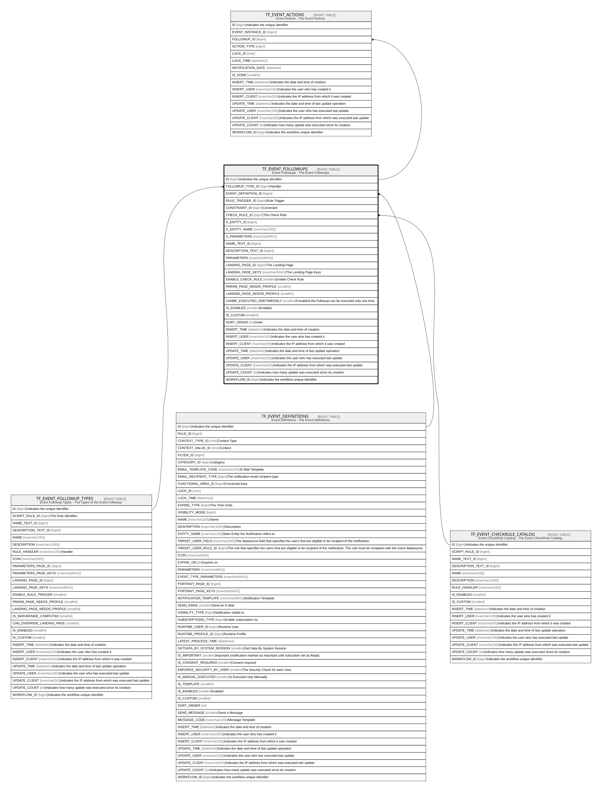

# TF_EVENT_FOLLOWUPS

## Description

Event Followups - The Event Followups.  

## Columns

| Name | Type | Default | Nullable | Children | Parents | Comment |
| ---- | ---- | ------- | -------- | -------- | ------- | ------- |
| ID | bigint |  | false | [TF_EVENT_ACTIONS](TF_EVENT_ACTIONS.md) |  | Indicates the unique identifier |
| FOLLOWUP_TYPE_ID | bigint |  | false |  | [TF_EVENT_FOLLOWUP_TYPES](TF_EVENT_FOLLOWUP_TYPES.md) | Handler |
| EVENT_DEFINITION_ID | bigint |  | false |  | [TF_EVENT_DEFINITIONS](TF_EVENT_DEFINITIONS.md) |  |
| RULE_TRIGGER_ID | bigint | ((1)) | false |  |  | Rule Trigger |
| CONSTRAINT_ID | bigint | ((0)) | false |  |  | Constraint |
| CHECK_RULE_ID | bigint |  | true |  | [TF_EVENT_CHECKRULE_CATALOG](TF_EVENT_CHECKRULE_CATALOG.md) | The Check Rule |
| X_ENTITY_ID | bigint |  | true |  |  |  |
| X_ENTITY_NAME | nvarchar(100) |  | true |  |  |  |
| X_PARAMETERS | nvarchar(MAX) |  | true |  |  |  |
| NAME_TEXT_ID | bigint |  | true |  |  |  |
| DESCRIPTION_TEXT_ID | bigint |  | true |  |  |  |
| PARAMETERS | nvarchar(MAX) |  | true |  |  |  |
| LANDING_PAGE_ID | bigint |  | true |  |  | The Landing Page |
| LANDING_PAGE_KEYS | nvarchar(MAX) |  | true |  |  | The Landing Page Keys |
| ENABLE_CHECK_RULE | smallint | ((0)) | false |  |  | Enable Check Rule |
| PARAM_PAGE_NEEDS_PROFILE | smallint | ((1)) | false |  |  |  |
| LANDING_PAGE_NEEDS_PROFILE | smallint | ((1)) | false |  |  |  |
| CANBE_EXECUTED_ONETIMEONLY | smallint | ((0)) | false |  |  | If enabled the Followup can be executed only one time. |
| IS_ENABLED | smallint |  | false |  |  | Enabled |
| IS_CUSTOM | smallint |  | false |  |  |  |
| SORT_ORDER | int | ((0)) | true |  |  | Order |
| INSERT_TIME | datetime2 | (sysutcdatetime()) | false |  |  | Indicates the date and time of creation |
| INSERT_USER | nvarchar(100) | (N'MAIN') | false |  |  | Indicates the user who has created it |
| INSERT_CLIENT | nvarchar(50) | (N'localhost') | false |  |  | Indicates the IP address from which it was created |
| UPDATE_TIME | datetime2 | (sysutcdatetime()) | false |  |  | Indicates the date and time of last update operation |
| UPDATE_USER | nvarchar(100) | (N'MAIN') | false |  |  | Indicates the user who has executed last update |
| UPDATE_CLIENT | nvarchar(50) | (N'localhost') | false |  |  | Indicates the IP address from which was executed last update |
| UPDATE_COUNT | int | ((0)) | false |  |  | Indicates how many update was executed since its creation |
| WORKFLOW_ID | bigint |  | true |  |  | Indicates the workflow unique identifier |

## Constraints

| Name | Type | Definition |
| ---- | ---- | ---------- |
| PK_TFEVENT_FOLLOWUPS | PRIMARY KEY | CLUSTERED, unique, part of a PRIMARY KEY constraint, [ ID ] |
| FK_TFEV_FOLLOWUP_CHECKRULE | FOREIGN KEY | FOREIGN KEY(CHECK_RULE_ID) REFERENCES TF_EVENT_CHECKRULE_CATALOG(ID) ON UPDATE NO_ACTION ON DELETE NO_ACTION |
| FK_TFEV_FOLLOWUP_EVENT_DEF | FOREIGN KEY | FOREIGN KEY(EVENT_DEFINITION_ID) REFERENCES TF_EVENT_DEFINITIONS(ID) ON UPDATE NO_ACTION ON DELETE CASCADE |
| FK_TFEV_FOLLOWUP_FUP_TYPES | FOREIGN KEY | FOREIGN KEY(FOLLOWUP_TYPE_ID) REFERENCES TF_EVENT_FOLLOWUP_TYPES(ID) ON UPDATE NO_ACTION ON DELETE NO_ACTION |

## Indexes

| Name | Definition |
| ---- | ---------- |
| PK_TFEVENT_FOLLOWUPS | CLUSTERED, unique, part of a PRIMARY KEY constraint, [ ID ] |

## Relations

---

> Generated by [tbls](https://github.com/k1LoW/tbls)
