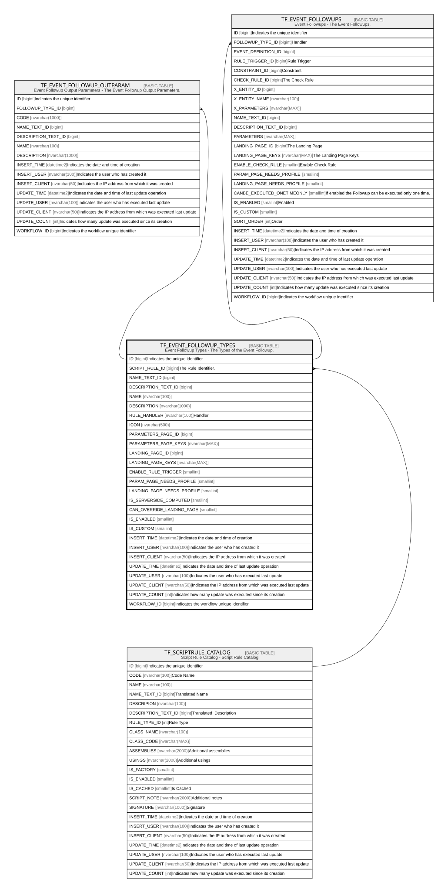

# TF_EVENT_FOLLOWUP_TYPES

## Description

Event Followup Types - The Types of the Event Followup.  

## Columns

| Name | Type | Default | Nullable | Children | Parents | Comment |
| ---- | ---- | ------- | -------- | -------- | ------- | ------- |
| ID | bigint |  | false | [TF_EVENT_FOLLOWUP_OUTPARAM](TF_EVENT_FOLLOWUP_OUTPARAM.md) [TF_EVENT_FOLLOWUPS](TF_EVENT_FOLLOWUPS.md) |  | Indicates the unique identifier |
| SCRIPT_RULE_ID | bigint |  | true |  | [TF_SCRIPTRULE_CATALOG](TF_SCRIPTRULE_CATALOG.md) | The Rule Identifier. |
| NAME_TEXT_ID | bigint |  | true |  |  |  |
| DESCRIPTION_TEXT_ID | bigint |  | true |  |  |  |
| NAME | nvarchar(100) |  | false |  |  |  |
| DESCRIPTION | nvarchar(1000) |  | true |  |  |  |
| RULE_HANDLER | nvarchar(100) |  | true |  |  | Handler |
| ICON | nvarchar(500) |  | true |  |  |  |
| PARAMETERS_PAGE_ID | bigint |  | true |  |  |  |
| PARAMETERS_PAGE_KEYS | nvarchar(MAX) |  | true |  |  |  |
| LANDING_PAGE_ID | bigint |  | true |  |  |  |
| LANDING_PAGE_KEYS | nvarchar(MAX) |  | true |  |  |  |
| ENABLE_RULE_TRIGGER | smallint | ((1)) | false |  |  |  |
| PARAM_PAGE_NEEDS_PROFILE | smallint | ((0)) | false |  |  |  |
| LANDING_PAGE_NEEDS_PROFILE | smallint | ((0)) | false |  |  |  |
| IS_SERVERSIDE_COMPUTED | smallint | ((1)) | false |  |  |  |
| CAN_OVERRIDE_LANDING_PAGE | smallint | ((1)) | false |  |  |  |
| IS_ENABLED | smallint | ((0)) | false |  |  |  |
| IS_CUSTOM | smallint |  | false |  |  |  |
| INSERT_TIME | datetime2 | (sysutcdatetime()) | false |  |  | Indicates the date and time of creation |
| INSERT_USER | nvarchar(100) | (N'MAIN') | false |  |  | Indicates the user who has created it |
| INSERT_CLIENT | nvarchar(50) | (N'localhost') | false |  |  | Indicates the IP address from which it was created |
| UPDATE_TIME | datetime2 | (sysutcdatetime()) | false |  |  | Indicates the date and time of last update operation |
| UPDATE_USER | nvarchar(100) | (N'MAIN') | false |  |  | Indicates the user who has executed last update |
| UPDATE_CLIENT | nvarchar(50) | (N'localhost') | false |  |  | Indicates the IP address from which was executed last update |
| UPDATE_COUNT | int | ((0)) | false |  |  | Indicates how many update was executed since its creation |
| WORKFLOW_ID | bigint |  | true |  |  | Indicates the workflow unique identifier |

## Constraints

| Name | Type | Definition |
| ---- | ---- | ---------- |
| PK_TFEVENT_FUP_TYPES | PRIMARY KEY | CLUSTERED, unique, part of a PRIMARY KEY constraint, [ ID ] |
| FK_TFEVENT_FUP_SCRRUL_CAT | FOREIGN KEY | FOREIGN KEY(SCRIPT_RULE_ID) REFERENCES TF_SCRIPTRULE_CATALOG(ID) ON UPDATE NO_ACTION ON DELETE NO_ACTION |

## Indexes

| Name | Definition |
| ---- | ---------- |
| PK_TFEVENT_FUP_TYPES | CLUSTERED, unique, part of a PRIMARY KEY constraint, [ ID ] |

## Relations

---

> Generated by [tbls](https://github.com/k1LoW/tbls)
