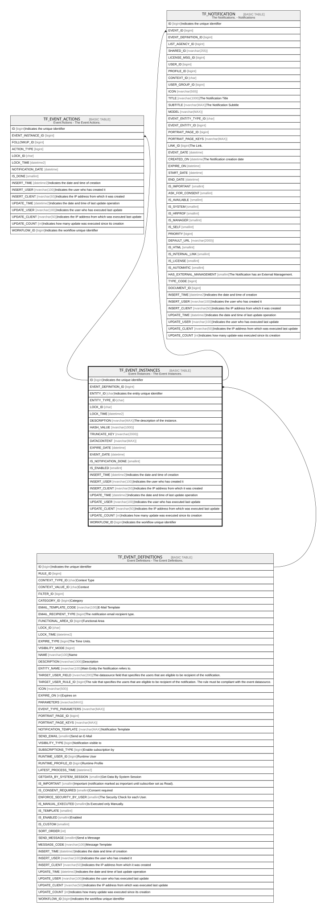

# TF_EVENT_INSTANCES

## Description

Event Instances - The Event Instances.  

## Columns

| Name | Type | Default | Nullable | Children | Parents | Comment |
| ---- | ---- | ------- | -------- | -------- | ------- | ------- |
| ID | bigint |  | false | [TF_EVENT_ACTIONS](TF_EVENT_ACTIONS.md) [TF_NOTIFICATION](TF_NOTIFICATION.md) |  | Indicates the unique identifier |
| EVENT_DEFINITION_ID | bigint |  | false |  | [TF_EVENT_DEFINITIONS](TF_EVENT_DEFINITIONS.md) |  |
| ENTITY_ID | char |  | true |  |  | Indicates the entity unique identifier |
| ENTITY_TYPE_ID | char |  | true |  |  |  |
| LOCK_ID | char |  | true |  |  |  |
| LOCK_TIME | datetime2 |  | true |  |  |  |
| DESCRIPTION | nvarchar(MAX) |  | true |  |  | The description of the instance. |
| HASH_VALUE | nvarchar(1000) |  | false |  |  |  |
| TRUNCATE_KEY | nvarchar(2000) |  | false |  |  |  |
| DATACONTENT | nvarchar(MAX) |  | true |  |  |  |
| EXPIRE_DATE | datetime |  | true |  |  |  |
| EVENT_DATE | datetime |  | true |  |  |  |
| IS_NOTIFICATION_DONE | smallint | ((0)) | false |  |  |  |
| IS_ENABLED | smallint | ((1)) | false |  |  |  |
| INSERT_TIME | datetime2 | (sysutcdatetime()) | false |  |  | Indicates the date and time of creation |
| INSERT_USER | nvarchar(100) | (N'MAIN') | false |  |  | Indicates the user who has created it |
| INSERT_CLIENT | nvarchar(50) | (N'localhost') | false |  |  | Indicates the IP address from which it was created |
| UPDATE_TIME | datetime2 | (sysutcdatetime()) | false |  |  | Indicates the date and time of last update operation |
| UPDATE_USER | nvarchar(100) | (N'MAIN') | false |  |  | Indicates the user who has executed last update |
| UPDATE_CLIENT | nvarchar(50) | (N'localhost') | false |  |  | Indicates the IP address from which was executed last update |
| UPDATE_COUNT | int | ((0)) | false |  |  | Indicates how many update was executed since its creation |
| WORKFLOW_ID | bigint |  | true |  |  | Indicates the workflow unique identifier |

## Constraints

| Name | Type | Definition |
| ---- | ---- | ---------- |
| PK_TFEVENT_INSTANCES | PRIMARY KEY | CLUSTERED, unique, part of a PRIMARY KEY constraint, [ ID ] |
| FK_TFEV_INST_EV_DEF | FOREIGN KEY | FOREIGN KEY(EVENT_DEFINITION_ID) REFERENCES TF_EVENT_DEFINITIONS(ID) ON UPDATE NO_ACTION ON DELETE CASCADE |

## Indexes

| Name | Definition |
| ---- | ---------- |
| PK_TFEVENT_INSTANCES | CLUSTERED, unique, part of a PRIMARY KEY constraint, [ ID ] |
| IDX_INST_DID_ENA_EXD_HASH | NONCLUSTERED, [ EVENT_DEFINITION_ID, IS_ENABLED, EXPIRE_DATE, HASH_VALUE ] |

## Relations

---

> Generated by [tbls](https://github.com/k1LoW/tbls)
