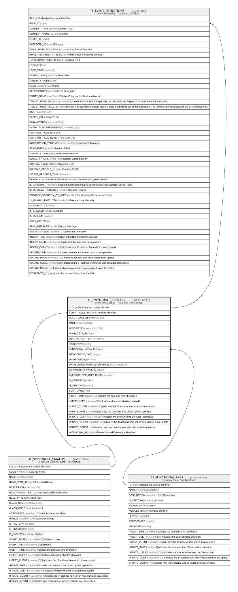

# TF_EVENT_RULE_CATALOG

## Description

Event Rule Catalog - The Event Rule Catalog.  

## Columns

| Name | Type | Default | Nullable | Children | Parents | Comment |
| ---- | ---- | ------- | -------- | -------- | ------- | ------- |
| ID | bigint |  | false | [TF_EVENT_DEFINITIONS](TF_EVENT_DEFINITIONS.md) |  | Indicates the unique identifier |
| SCRIPT_RULE_ID | bigint |  | true |  | [TF_SCRIPTRULE_CATALOG](TF_SCRIPTRULE_CATALOG.md) | The Rule Identifier. |
| RULE_HANDLER | nvarchar(100) |  | true |  |  |  |
| NAME | nvarchar(100) |  | false |  |  |  |
| DESCRIPTION | nvarchar(1000) |  | true |  |  |  |
| NAME_TEXT_ID | bigint |  | true |  |  |  |
| DESCRIPTION_TEXT_ID | bigint |  | true |  |  |  |
| ICON | nvarchar(500) |  | true |  |  |  |
| FUNCTIONAL_AREA_ID | bigint |  | true |  | [TF_FUNCTIONAL_AREA](TF_FUNCTIONAL_AREA.md) |  |
| DATASOURCE_TYPE | bigint |  | false |  |  |  |
| DATASOURCE_ID | char |  | true |  |  |  |
| DATASOURCE_PARAMETER_NAME | nvarchar(1000) |  | true |  |  |  |
| PARAMETERS_PAGE_ID | bigint |  | true |  |  |  |
| ENFORCE_SECURITY_CHECK | smallint | ((0)) | false |  |  |  |
| IS_ENABLED | smallint | ((0)) | false |  |  |  |
| IS_CUSTOM | smallint | ((1)) | false |  |  |  |
| SORT_ORDER | int | ((0)) | true |  |  |  |
| INSERT_TIME | datetime2 | (sysutcdatetime()) | false |  |  | Indicates the date and time of creation |
| INSERT_USER | nvarchar(100) | (N'MAIN') | false |  |  | Indicates the user who has created it |
| INSERT_CLIENT | nvarchar(50) | (N'localhost') | false |  |  | Indicates the IP address from which it was created |
| UPDATE_TIME | datetime2 | (sysutcdatetime()) | false |  |  | Indicates the date and time of last update operation |
| UPDATE_USER | nvarchar(100) | (N'MAIN') | false |  |  | Indicates the user who has executed last update |
| UPDATE_CLIENT | nvarchar(50) | (N'localhost') | false |  |  | Indicates the IP address from which was executed last update |
| UPDATE_COUNT | int | ((0)) | false |  |  | Indicates how many update was executed since its creation |
| WORKFLOW_ID | bigint |  | true |  |  | Indicates the workflow unique identifier |

## Constraints

| Name | Type | Definition |
| ---- | ---- | ---------- |
| PK_TFEVENT_RULE_CATALOG | PRIMARY KEY | CLUSTERED, unique, part of a PRIMARY KEY constraint, [ ID ] |
| UQ_EVENTRULE_CAT_NAME | UNIQUE | NONCLUSTERED, unique, part of a UNIQUE constraint, [ NAME ] |
| FK_TFEVENT_RULECAT_FUNCAREA | FOREIGN KEY | FOREIGN KEY(FUNCTIONAL_AREA_ID) REFERENCES TF_FUNCTIONAL_AREA(ID) ON UPDATE NO_ACTION ON DELETE NO_ACTION |
| FK_TFEVENT_RULECAT_SRCAT | FOREIGN KEY | FOREIGN KEY(SCRIPT_RULE_ID) REFERENCES TF_SCRIPTRULE_CATALOG(ID) ON UPDATE NO_ACTION ON DELETE NO_ACTION |

## Indexes

| Name | Definition |
| ---- | ---------- |
| PK_TFEVENT_RULE_CATALOG | CLUSTERED, unique, part of a PRIMARY KEY constraint, [ ID ] |
| UQ_EVENTRULE_CAT_NAME | NONCLUSTERED, unique, part of a UNIQUE constraint, [ NAME ] |

## Relations

---

> Generated by [tbls](https://github.com/k1LoW/tbls)
