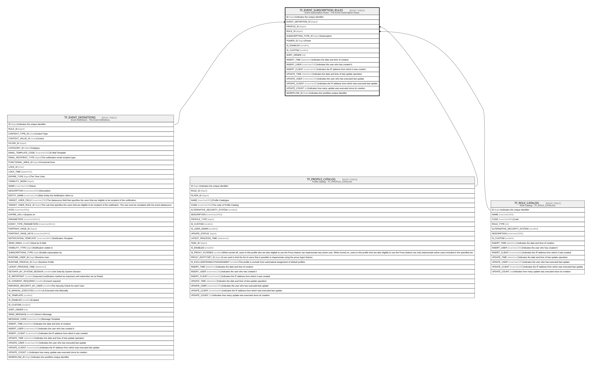

# TF_EVENT_SUBSCRIPTION_RULES

## Description

Event Subscription Rules - The Event Subscription Rules.  

## Columns

| Name | Type | Default | Nullable | Parents | Comment |
| ---- | ---- | ------- | -------- | ------- | ------- |
| ID | bigint |  | false |  | Indicates the unique identifier |
| EVENT_DEFINITION_ID | bigint |  | false | [TF_EVENT_DEFINITIONS](TF_EVENT_DEFINITIONS.md) |  |
| PROFILE_ID | bigint |  | true | [TF_PROFILE_CATALOG](TF_PROFILE_CATALOG.md) |  |
| ROLE_ID | bigint |  | true | [TF_ROLE_CATALOG](TF_ROLE_CATALOG.md) |  |
| SUBSCRIPTION_TYPE_ID | bigint | ((1)) | false |  | Subscription |
| POWER_ID | bigint | ((1)) | false |  | Power |
| IS_ENABLED | smallint | ((1)) | false |  |  |
| IS_CUSTOM | smallint |  | false |  |  |
| SORT_ORDER | int | ((0)) | true |  |  |
| INSERT_TIME | datetime2 | (sysutcdatetime()) | false |  | Indicates the date and time of creation |
| INSERT_USER | nvarchar(100) | (N'MAIN') | false |  | Indicates the user who has created it |
| INSERT_CLIENT | nvarchar(50) | (N'localhost') | false |  | Indicates the IP address from which it was created |
| UPDATE_TIME | datetime2 | (sysutcdatetime()) | false |  | Indicates the date and time of last update operation |
| UPDATE_USER | nvarchar(100) | (N'MAIN') | false |  | Indicates the user who has executed last update |
| UPDATE_CLIENT | nvarchar(50) | (N'localhost') | false |  | Indicates the IP address from which was executed last update |
| UPDATE_COUNT | int | ((0)) | false |  | Indicates how many update was executed since its creation |
| WORKFLOW_ID | bigint |  | true |  | Indicates the workflow unique identifier |

## Constraints

| Name | Type | Definition |
| ---- | ---- | ---------- |
| PK_TFEV_SUB_RULES | PRIMARY KEY | CLUSTERED, unique, part of a PRIMARY KEY constraint, [ ID ] |
| FK_TFEV_SUB_EV_DEF | FOREIGN KEY | FOREIGN KEY(EVENT_DEFINITION_ID) REFERENCES TF_EVENT_DEFINITIONS(ID) ON UPDATE NO_ACTION ON DELETE CASCADE |
| FK_TFEV_SUB_RUL_PROFILES | FOREIGN KEY | FOREIGN KEY(PROFILE_ID) REFERENCES TF_PROFILE_CATALOG(ID) ON UPDATE NO_ACTION ON DELETE NO_ACTION |
| FK_TFEV_SUB_RUL_ROLES | FOREIGN KEY | FOREIGN KEY(ROLE_ID) REFERENCES TF_ROLE_CATALOG(ID) ON UPDATE NO_ACTION ON DELETE NO_ACTION |

## Indexes

| Name | Definition |
| ---- | ---------- |
| PK_TFEV_SUB_RULES | CLUSTERED, unique, part of a PRIMARY KEY constraint, [ ID ] |

## Relations

---

> Generated by [tbls](https://github.com/k1LoW/tbls)
