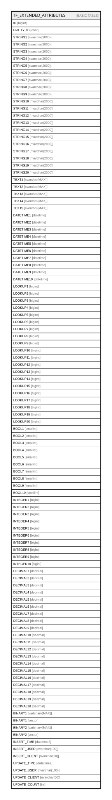

# TF_EXTENDED_ATTRIBUTES

## Columns

| Name | Type | Default | Nullable | Comment |
| ---- | ---- | ------- | -------- | ------- |
| ID | bigint |  | false |  |
| ENTITY_ID | char |  | false |  |
| STRING1 | nvarchar(2000) |  | true |  |
| STRING2 | nvarchar(2000) |  | true |  |
| STRING3 | nvarchar(2000) |  | true |  |
| STRING4 | nvarchar(2000) |  | true |  |
| STRING5 | nvarchar(2000) |  | true |  |
| STRING6 | nvarchar(2000) |  | true |  |
| STRING7 | nvarchar(2000) |  | true |  |
| STRING8 | nvarchar(2000) |  | true |  |
| STRING9 | nvarchar(2000) |  | true |  |
| STRING10 | nvarchar(2000) |  | true |  |
| STRING11 | nvarchar(2000) |  | true |  |
| STRING12 | nvarchar(2000) |  | true |  |
| STRING13 | nvarchar(2000) |  | true |  |
| STRING14 | nvarchar(2000) |  | true |  |
| STRING15 | nvarchar(2000) |  | true |  |
| STRING16 | nvarchar(2000) |  | true |  |
| STRING17 | nvarchar(2000) |  | true |  |
| STRING18 | nvarchar(2000) |  | true |  |
| STRING19 | nvarchar(2000) |  | true |  |
| STRING20 | nvarchar(2000) |  | true |  |
| TEXT1 | nvarchar(MAX) |  | true |  |
| TEXT2 | nvarchar(MAX) |  | true |  |
| TEXT3 | nvarchar(MAX) |  | true |  |
| TEXT4 | nvarchar(MAX) |  | true |  |
| TEXT5 | nvarchar(MAX) |  | true |  |
| DATETIME1 | datetime |  | true |  |
| DATETIME2 | datetime |  | true |  |
| DATETIME3 | datetime |  | true |  |
| DATETIME4 | datetime |  | true |  |
| DATETIME5 | datetime |  | true |  |
| DATETIME6 | datetime |  | true |  |
| DATETIME7 | datetime |  | true |  |
| DATETIME8 | datetime |  | true |  |
| DATETIME9 | datetime |  | true |  |
| DATETIME10 | datetime |  | true |  |
| LOOKUP1 | bigint |  | true |  |
| LOOKUP2 | bigint |  | true |  |
| LOOKUP3 | bigint |  | true |  |
| LOOKUP4 | bigint |  | true |  |
| LOOKUP5 | bigint |  | true |  |
| LOOKUP6 | bigint |  | true |  |
| LOOKUP7 | bigint |  | true |  |
| LOOKUP8 | bigint |  | true |  |
| LOOKUP9 | bigint |  | true |  |
| LOOKUP10 | bigint |  | true |  |
| LOOKUP11 | bigint |  | true |  |
| LOOKUP12 | bigint |  | true |  |
| LOOKUP13 | bigint |  | true |  |
| LOOKUP14 | bigint |  | true |  |
| LOOKUP15 | bigint |  | true |  |
| LOOKUP16 | bigint |  | true |  |
| LOOKUP17 | bigint |  | true |  |
| LOOKUP18 | bigint |  | true |  |
| LOOKUP19 | bigint |  | true |  |
| LOOKUP20 | bigint |  | true |  |
| BOOL1 | smallint |  | true |  |
| BOOL2 | smallint |  | true |  |
| BOOL3 | smallint |  | true |  |
| BOOL4 | smallint |  | true |  |
| BOOL5 | smallint |  | true |  |
| BOOL6 | smallint |  | true |  |
| BOOL7 | smallint |  | true |  |
| BOOL8 | smallint |  | true |  |
| BOOL9 | smallint |  | true |  |
| BOOL10 | smallint |  | true |  |
| INTEGER1 | bigint |  | true |  |
| INTEGER2 | bigint |  | true |  |
| INTEGER3 | bigint |  | true |  |
| INTEGER4 | bigint |  | true |  |
| INTEGER5 | bigint |  | true |  |
| INTEGER6 | bigint |  | true |  |
| INTEGER7 | bigint |  | true |  |
| INTEGER8 | bigint |  | true |  |
| INTEGER9 | bigint |  | true |  |
| INTEGER10 | bigint |  | true |  |
| DECIMAL1 | decimal |  | true |  |
| DECIMAL2 | decimal |  | true |  |
| DECIMAL3 | decimal |  | true |  |
| DECIMAL4 | decimal |  | true |  |
| DECIMAL5 | decimal |  | true |  |
| DECIMAL6 | decimal |  | true |  |
| DECIMAL7 | decimal |  | true |  |
| DECIMAL8 | decimal |  | true |  |
| DECIMAL9 | decimal |  | true |  |
| DECIMAL10 | decimal |  | true |  |
| DECIMAL11 | decimal |  | true |  |
| DECIMAL12 | decimal |  | true |  |
| DECIMAL13 | decimal |  | true |  |
| DECIMAL14 | decimal |  | true |  |
| DECIMAL15 | decimal |  | true |  |
| DECIMAL16 | decimal |  | true |  |
| DECIMAL17 | decimal |  | true |  |
| DECIMAL18 | decimal |  | true |  |
| DECIMAL19 | decimal |  | true |  |
| DECIMAL20 | decimal |  | true |  |
| BINARY1 | varbinary(MAX) |  | true |  |
| BINARY1 | vector |  | true |  |
| BINARY2 | varbinary(MAX) |  | true |  |
| BINARY2 | vector |  | true |  |
| INSERT_TIME | datetime2 | (sysutcdatetime()) | false |  |
| INSERT_USER | nvarchar(100) | (N'MAIN') | false |  |
| INSERT_CLIENT | nvarchar(50) | (N'localhost') | false |  |
| UPDATE_TIME | datetime2 | (sysutcdatetime()) | false |  |
| UPDATE_USER | nvarchar(100) | (N'MAIN') | false |  |
| UPDATE_CLIENT | nvarchar(50) | (N'localhost') | false |  |
| UPDATE_COUNT | int | ((0)) | false |  |

## Constraints

| Name | Type | Definition |
| ---- | ---- | ---------- |
| PK_EXTENDED_ATTRIBUTES | PRIMARY KEY | CLUSTERED, unique, part of a PRIMARY KEY constraint, [ ID, ENTITY_ID ] |

## Indexes

| Name | Definition |
| ---- | ---------- |
| PK_EXTENDED_ATTRIBUTES | CLUSTERED, unique, part of a PRIMARY KEY constraint, [ ID, ENTITY_ID ] |
| TF_EXT_ATT_LOOKUP1 | NONCLUSTERED, [ LOOKUP1 ] |
| TF_EXT_ATT_LOOKUP2 | NONCLUSTERED, [ LOOKUP2 ] |
| TF_EXT_ATT_LOOKUP3 | NONCLUSTERED, [ LOOKUP3 ] |
| TF_EXT_ATT_LOOKUP4 | NONCLUSTERED, [ LOOKUP4 ] |
| TF_EXT_ATT_LOOKUP5 | NONCLUSTERED, [ LOOKUP5 ] |
| TF_EXT_ATT_LOOKUP6 | NONCLUSTERED, [ LOOKUP6 ] |
| TF_EXT_ATT_LOOKUP7 | NONCLUSTERED, [ LOOKUP7 ] |
| TF_EXT_ATT_LOOKUP8 | NONCLUSTERED, [ LOOKUP8 ] |
| TF_EXT_ATT_LOOKUP9 | NONCLUSTERED, [ LOOKUP9 ] |
| TF_EXT_ATT_LOOKUP10 | NONCLUSTERED, [ LOOKUP10 ] |
| TF_EXT_ATT_LOOKUP11 | NONCLUSTERED, [ LOOKUP11 ] |
| TF_EXT_ATT_LOOKUP12 | NONCLUSTERED, [ LOOKUP12 ] |
| TF_EXT_ATT_LOOKUP13 | NONCLUSTERED, [ LOOKUP13 ] |
| TF_EXT_ATT_LOOKUP14 | NONCLUSTERED, [ LOOKUP14 ] |
| TF_EXT_ATT_LOOKUP15 | NONCLUSTERED, [ LOOKUP15 ] |
| TF_EXT_ATT_LOOKUP16 | NONCLUSTERED, [ LOOKUP16 ] |
| TF_EXT_ATT_LOOKUP17 | NONCLUSTERED, [ LOOKUP17 ] |
| TF_EXT_ATT_LOOKUP18 | NONCLUSTERED, [ LOOKUP18 ] |
| TF_EXT_ATT_LOOKUP19 | NONCLUSTERED, [ LOOKUP19 ] |
| TF_EXT_ATT_LOOKUP20 | NONCLUSTERED, [ LOOKUP20 ] |

## Triggers

| Name | Definition |
| ---- | ---------- |
| AUDIT_TF_EXTENDED_ATTRIBUTES | -- Talentia Software - All right reserved -- Type: TRIGGER                  Name: AUDIT_TF_EXTENDED_ATTRIBUTES -- Date: 09-04-2026 07:27:59 (UTC) --  -- ChangeLogId: 00000000-0000-0000-0000-000000000000 -- ChangeSetId: d1171dda-519d-4718-b7b5-918bd0c79788 -- Original file name: C:\repos\Talentia-Software\hcm-core/DB/ProductDB/EDM\Schema\Triggers\AUDIT_TF_EXTENDED_ATTRIBUTES.xml                      CREATE TRIGGER AUDIT_TF_EXTENDED_ATTRIBUTES                   ON  TF_EXTENDED_ATTRIBUTES                   AFTER INSERT,DELETE,UPDATE                   AS                   BEGIN                   -- SET NOCOUNT ON added to prevent extra result sets from                   -- interfering with SELECT statements.                   SET NOCOUNT ON;                    -- Insert statements for trigger here                    DECLARE @EntityAuditedFields int                   DECLARE @TableName varchar(100)                   DECLARE @LinkedEntityID varchar(36)                    DECLARE	@DefAuditPolicyStatus bit                   DECLARE @OperationType smallint -- Insert 1, Update 2, Delete 3                   DECLARE @ColumnKey varchar(100)                   DECLARE @PrimaryKey int                   DECLARE @Fields nvarchar(max)                   DECLARE @PrimaryKeyFieldName nvarchar(100)                   DECLARE @UpdateDate varchar(23)                    DECLARE @HasEntityId bit = 0                   DECLARE @EntityIdColumn varchar(100)                    DECLARE @ColumnName nvarchar(max)                   DECLARE @EntityName nvarchar(max)                   DECLARE @EntityID char(36)                   DECLARE @ColumnID char(36)                   DECLARE @FieldID char(36)                   DECLARE @FieldName nvarchar(max)                   DECLARE @FieldType smallint                    DECLARE @ContextInfo varchar(128)                   DECLARE @ClientInfo nvarchar(max)                   DECLARE @DirectSQL bit = 0                    DECLARE @SQL nvarchar(max)                    DECLARE @SQLWorkTable nvarchar(max)                   DECLARE @SQLWorkTable2 nvarchar(max)                   DECLARE @SQLWorkTableRef nvarchar(max)                    DECLARE @SQLStartInsertTo nvarchar(max)                    DECLARE @SQLPrimaryKeyField nvarchar(max)                   DECLARE @SQLNewValueFields nvarchar(max)                   DECLARE @SQLOldValueFields nvarchar(max)                   DECLARE @SQLInsertUser nvarchar(max)                   DECLARE @SQLInsertClient  nvarchar(max)                    DECLARE @ListNbLong BigInt = 0                   DECLARE @ListLong1 NVARCHAR(MAX)  = NULL                   DECLARE @ListLong2 NVARCHAR(MAX) = NULL                   DECLARE @ListNbDecimal BigInt = 0                   DECLARE @ListDecimal1 NVARCHAR(MAX) = NULL                   DECLARE @ListDecimal2 NVARCHAR(MAX) = NULL                   DECLARE @ListNbDateTime BigInt = 0                   DECLARE @ListDateTime1 NVARCHAR(MAX) = NULL                   DECLARE @ListDateTime2 NVARCHAR(MAX) = NULL                   DECLARE @ListNbStr BigInt = 0                   DECLARE @ListStr1 NVARCHAR(MAX) = NULL                   DECLARE @Liststr2 NVARCHAR(MAX) = NULL                   DECLARE @ListNbBinary BigInt = 0                   DECLARE @ListBinary1 NVARCHAR(MAX) = NULL                   DECLARE @ListBinary2 NVARCHAR(MAX) = NULL                   DECLARE @SQLUnion NVARCHAR(MAX) = ''                    DECLARE @LOOKUP_ENTITY_NAME VARCHAR(100)                   DECLARE @LOOKUP_ENTITY_ID VARCHAR(36)                   DECLARE @LOOKUP_COLUMN_NAME VARCHAR(100)                   DECLARE @LOOKUP_FIELD_NAME VARCHAR(100)                   DECLARE @LOOKUP_FOCUS NVARCHAR(500)                   DECLARE @LOOKUP_DESCRIPTION NVARCHAR(500)                    SET @Tablename = 'TF_EXTENDED_ATTRIBUTES'                    --IF AUDITED IS ENABLE                   SELECT @DefAuditPolicyStatus = ACTIVE FROM TF_AUDIT_SWITCH WHERE [ID]=1                   if (@DefAuditPolicyStatus=1)                   BEGIN                    SELECT @EntityAuditedFields = COUNT(*) FROM TF_AUDITED_COLUMNS WHERE ENTITY_ID IN                   (                   SELECT DISTINCT ENTITY_ID FROM inserted                   UNION                   SELECT DISTINCT ENTITY_ID FROM deleted                   )                   AND IS_UNDER_AUDIT = 1 AND TABLE_NAME = @Tablename                    IF (@EntityAuditedFields = 0)                   RETURN;                    --Get Operation Type                   if exists (SELECT * FROM inserted)                   if exists (SELECT * FROM deleted)                   SELECT @OperationType = 2 --Update                   else                   SELECT @OperationType = 1 --Insert                   else                   SELECT @OperationType = 3 --Delete                    --GET EntityIdColumn                   SET @EntityIdColumn = 'ENTITY_ID'                    --GET THE SAME DATE FOR ALL                   SELECT @UpdateDate = '''' + convert(varchar(8), getutcdate(), 112) + ' ' + convert(varchar(12), getutcdate(), 114) + ''''                    --Get Primary field name                   SELECT @PrimaryKeyFieldName = 'ID'                    --get Context Info                   IF CONTEXT_INFO() is null                   BEGIN                   SELECT @ContextInfo= ''                   SET @DirectSQL = 1                   END                   ELSE                   BEGIN                   -- Context Info should contain the Applicative UserName                   SELECT @ContextInfo = REPLACE(CAST(CONTEXT_INFO() as varchar(128)), NCHAR(0) COLLATE Latin1_General_100_BIN2, N'');                   SET @DirectSQL = 0                   END                    --Get Client Info                   --SELECT  @ClientInfo = client_net_address                   --FROM sys.dm_exec_connections                   --WHERE Session_id = @@SPID;                   ----Or                   --SELECT @ClientInfo = CONVERT(char(15), CONNECTIONPROPERTY('client_net_address'))                   SET @ClientInfo = SYSTEM_USER                    -- TEMPORARY TABLES                   SELECT * INTO #ins FROM inserted                   SELECT * INTO #del FROM deleted                    -- Start of the SQL request                   SET @SQLStartInsertTo = 'INSERT INTO TF_AUDIT                   (  [TABLE_NAME], [ENTITY_NAME], [ENTITY_ID], [COLUMN_NAME], [FIELD_NAME], [FIELD_ID], [FIELD_TYPE]                   ,[PRIMARY_KEY], [OPERATION_TYPE]                   ,[LONG_VALUE],[DECIMAL_VALUE],[DATETIME_VALUE],[STRING_VALUE],[VARBINARY_VALUE],[LOOKUP_DESC]                   ,[OLD_LONG_VALUE],[OLD_DECIMAL_VALUE],[OLD_DATETIME_VALUE],[OLD_STRING_VALUE],[OLD_VARBINARY_VALUE],[OLD_LOOKUP_DESC]                   ,[INSERT_USER],[INSERT_CLIENT],[INSERT_TIME],[TRANSACTION_ID]                   )                   '                    SELECT @ListNbLong = count(*) FROM TF_AUDITED_COLUMNS  WHERE TF_AUDITED_COLUMNS.TABLE_NAME = @TableName AND TF_AUDITED_COLUMNS.FIELD_TYPE = 2 AND TF_AUDITED_COLUMNS.DESCRIPTION IS NULL                   SET @ListLong1 = STUFF((SELECT DISTINCT ',' +   QUOTENAME(RTRIM(TF_AUDITED_COLUMNS.COLUMN_NAME))                   FROM TF_AUDITED_COLUMNS                   WHERE TF_AUDITED_COLUMNS.TABLE_NAME = @TableName AND TF_AUDITED_COLUMNS.FIELD_TYPE = 2 AND TF_AUDITED_COLUMNS.DESCRIPTION IS NULL                   FOR XML PATH(''), TYPE).value('.', 'VARCHAR(MAX)')                   ,1,1,'')                   SET @ListLong2 = STUFF((SELECT DISTINCT ',CONVERT(bigint, ' +   QUOTENAME(RTRIM(TF_AUDITED_COLUMNS.COLUMN_NAME)) +') as ' + QUOTENAME(RTRIM(TF_AUDITED_COLUMNS.COLUMN_NAME))                   FROM TF_AUDITED_COLUMNS                   WHERE TF_AUDITED_COLUMNS.TABLE_NAME = @TableName AND TF_AUDITED_COLUMNS.FIELD_TYPE = 2 AND TF_AUDITED_COLUMNS.DESCRIPTION IS NULL                   FOR XML PATH(''), TYPE).value('.', 'VARCHAR(MAX)')                   ,1,1,'')                   SELECT @ListNbDecimal = count(*) FROM TF_AUDITED_COLUMNS  WHERE TF_AUDITED_COLUMNS.TABLE_NAME = @TableName AND TF_AUDITED_COLUMNS.FIELD_TYPE = 3                   SET @ListDecimal1 = STUFF((SELECT DISTINCT ',' +   QUOTENAME(RTRIM(TF_AUDITED_COLUMNS.COLUMN_NAME) )                   FROM TF_AUDITED_COLUMNS                   WHERE TF_AUDITED_COLUMNS.TABLE_NAME = @TableName AND TF_AUDITED_COLUMNS.FIELD_TYPE = 3                   FOR XML PATH(''), TYPE).value('.', 'VARCHAR(MAX)')                   ,1,1,'')                   SET @ListDecimal2 = STUFF((SELECT DISTINCT ',CONVERT(decimal, ' +   QUOTENAME(RTRIM(TF_AUDITED_COLUMNS.COLUMN_NAME)) +') as ' + QUOTENAME(RTRIM(TF_AUDITED_COLUMNS.COLUMN_NAME))                   FROM TF_AUDITED_COLUMNS                   WHERE TF_AUDITED_COLUMNS.TABLE_NAME = @TableName AND TF_AUDITED_COLUMNS.FIELD_TYPE = 3                   FOR XML PATH(''), TYPE).value('.', 'VARCHAR(MAX)')                   ,1,1,'')                   SELECT @ListNbDateTime = count(*) FROM TF_AUDITED_COLUMNS  WHERE TF_AUDITED_COLUMNS.TABLE_NAME = @TableName AND TF_AUDITED_COLUMNS.FIELD_TYPE = 4                   SET @ListDateTime1 = STUFF((SELECT DISTINCT ',' +   QUOTENAME(RTRIM(TF_AUDITED_COLUMNS.COLUMN_NAME))                   FROM TF_AUDITED_COLUMNS                   WHERE TF_AUDITED_COLUMNS.TABLE_NAME = @TableName AND TF_AUDITED_COLUMNS.FIELD_TYPE = 4                   FOR XML PATH(''), TYPE).value('.', 'VARCHAR(MAX)')                   ,1,1,'')                   SET @ListDateTime2 = STUFF((SELECT DISTINCT ',CONVERT(datetime2, ' +   QUOTENAME(RTRIM(TF_AUDITED_COLUMNS.COLUMN_NAME)) +') as ' + QUOTENAME(RTRIM(TF_AUDITED_COLUMNS.COLUMN_NAME))                   FROM TF_AUDITED_COLUMNS                   WHERE TF_AUDITED_COLUMNS.TABLE_NAME = @TableName AND TF_AUDITED_COLUMNS.FIELD_TYPE = 4                   FOR XML PATH(''), TYPE).value('.', 'VARCHAR(MAX)')                   ,1,1,'')                   SELECT @ListNbStr = count(*) FROM TF_AUDITED_COLUMNS  WHERE TF_AUDITED_COLUMNS.TABLE_NAME = @TableName AND TF_AUDITED_COLUMNS.FIELD_TYPE = 1                   SET @ListStr1 = STUFF((SELECT DISTINCT ',' +   QUOTENAME(RTRIM(TF_AUDITED_COLUMNS.COLUMN_NAME))                   FROM TF_AUDITED_COLUMNS                   WHERE TF_AUDITED_COLUMNS.TABLE_NAME = @TableName AND TF_AUDITED_COLUMNS.FIELD_TYPE = 1                   FOR XML PATH(''), TYPE).value('.', 'VARCHAR(MAX)')                   ,1,1,'')                   SET @ListStr2 = STUFF((SELECT DISTINCT ',CONVERT(nvarchar(max), ' +   QUOTENAME(RTRIM(TF_AUDITED_COLUMNS.COLUMN_NAME)) +') as ' + QUOTENAME(RTRIM(TF_AUDITED_COLUMNS.COLUMN_NAME))                   FROM TF_AUDITED_COLUMNS                   WHERE TF_AUDITED_COLUMNS.TABLE_NAME = @TableName AND TF_AUDITED_COLUMNS.FIELD_TYPE = 1                   FOR XML PATH(''), TYPE).value('.', 'VARCHAR(MAX)')                   ,1,1,'')                   SELECT @ListNbBinary = count(*) FROM TF_AUDITED_COLUMNS  WHERE TF_AUDITED_COLUMNS.TABLE_NAME = @TableName AND TF_AUDITED_COLUMNS.FIELD_TYPE = 5                   SET @ListBinary1 = STUFF((SELECT DISTINCT ',' +   QUOTENAME(RTRIM(TF_AUDITED_COLUMNS.COLUMN_NAME))                   FROM TF_AUDITED_COLUMNS                   WHERE TF_AUDITED_COLUMNS.TABLE_NAME = @TableName AND TF_AUDITED_COLUMNS.FIELD_TYPE = 5                   FOR XML PATH(''), TYPE).value('.', 'VARCHAR(MAX)')                   ,1,1,'')                   SET @ListBinary2 = STUFF((SELECT DISTINCT ',CONVERT(varbinary(max), ' +   QUOTENAME(RTRIM(TF_AUDITED_COLUMNS.COLUMN_NAME)) +') as ' + QUOTENAME(RTRIM(TF_AUDITED_COLUMNS.COLUMN_NAME))                   FROM TF_AUDITED_COLUMNS                   WHERE TF_AUDITED_COLUMNS.TABLE_NAME = @TableName AND TF_AUDITED_COLUMNS.FIELD_TYPE = 5                   FOR XML PATH(''), TYPE).value('.', 'VARCHAR(MAX)')                   ,1,1,'')                     -- INSERTED OPERATION TYPE                   IF(@OperationType = 1)                   BEGIN                   SET @SQLWorkTable = '#ins'                   SET @SQLWorkTableRef = @SQLWOrkTable + '.'                   SET @SQLPrimaryKeyField = @SQLWorkTableRef + @PrimaryKeyFieldName                    SET @SQLInsertUser = '''' + Replace(@ContextInfo,'''','''''') + ''''                   SET @SQLInsertClient =  '''' + @ClientInfo + ''''                    if @ListNbLong > 0 				BEGIN 					If @SQLUNION <> ''  						BEGIN 							SET @SQLUNION = @SQLUNION + ' UNION ' 						END 					SET @SQLUNION = @SQLUNION + '( 							SELECT AUDITED_COLUMNS.[TABLE_NAME], AUDITED_COLUMNS.[ENTITY_NAME], AUDITED_COLUMNS.[ENTITY_ID], AUDITED_COLUMNS.[COLUMN_NAME], AUDITED_COLUMNS.[FIELD_NAME], AUDITED_COLUMNS.[FIELD_ID], AUDITED_COLUMNS.[FIELD_TYPE], 							A.#PK,  1, A.#LVALUE, A.#DVALUE, A.#TVALUE, A.#SVALUE, A.#BVALUE, NULL, NULL, NULL, NULL, NULL, NULL, NULL, ' + @SQLInsertUser + ',' + @SQLInsertClient +', ' + @UpdateDate + ', CURRENT_TRANSACTION_ID() 			 							FROM TF_AUDITED_COLUMNS AUDITED_COLUMNS INNER JOIN  								(SELECT  #COL, #PK, #ENTITY_ID, value #LVALUE, NULL #DVALUE, NULL #TVALUE, NULL AS #SVALUE, NULL AS #BVALUE 								FROM  (SELECT  ' + @PrimaryKeyFieldName + ' AS #PK, '+ @EntityIdColumn +' AS #ENTITY_ID, ' + @ListLong2 +'  FROM  ' + @SQLWorkTable +' )  p 								UNPIVOT (value  FOR  #COL  IN  ('+@ListLong1+'))  as  unpvt) A ON AUDITED_COLUMNS.TABLE_NAME = '''+@TableName+''' AND AUDITED_COLUMNS.COLUMN_NAME = A.#COL AND AUDITED_COLUMNS.ENTITY_ID = A.#ENTITY_ID 							)' 				END 			if @ListNbDecimal > 0 				BEGIN 					If @SQLUNION <> ''  						BEGIN 							SET @SQLUNION = @SQLUNION + ' UNION ' 						END 					SET @SQLUNION = @SQLUNION + '( 							SELECT AUDITED_COLUMNS.[TABLE_NAME], AUDITED_COLUMNS.[ENTITY_NAME], AUDITED_COLUMNS.[ENTITY_ID], AUDITED_COLUMNS.[COLUMN_NAME], AUDITED_COLUMNS.[FIELD_NAME], AUDITED_COLUMNS.[FIELD_ID], AUDITED_COLUMNS.[FIELD_TYPE], 							A.#PK,  1, A.#LVALUE, A.#DVALUE, A.#TVALUE, A.#SVALUE, A.#BVALUE, NULL, NULL, NULL, NULL, NULL, NULL, NULL, ' + @SQLInsertUser + ',' + @SQLInsertClient +', ' + @UpdateDate + ', CURRENT_TRANSACTION_ID() 			 							FROM TF_AUDITED_COLUMNS AUDITED_COLUMNS INNER JOIN  								(SELECT  #COL, #PK, #ENTITY_ID, NULL #LVALUE, value #DVALUE, NULL #TVALUE, NULL AS #SVALUE, NULL AS #BVALUE 								FROM  (SELECT  ' + @PrimaryKeyFieldName + ' AS #PK, '+ @EntityIdColumn +' AS #ENTITY_ID, ' + @ListDecimal2 +'  FROM  ' + @SQLWorkTable + ')  p 								UNPIVOT (value  FOR  #COL  IN  ('+@ListDecimal1+'))  as  unpvt) A ON AUDITED_COLUMNS.TABLE_NAME = ''' + @TableName + ''' AND AUDITED_COLUMNS.COLUMN_NAME = A.#COL AND AUDITED_COLUMNS.ENTITY_ID = A.#ENTITY_ID 							)' 				END 			if @ListNbDateTime > 0 				BEGIN 					If @SQLUNION <> ''  						BEGIN 							SET @SQLUNION = @SQLUNION + ' UNION ' 						END 					SET @SQLUNION = @SQLUNION + '( 							SELECT AUDITED_COLUMNS.[TABLE_NAME], AUDITED_COLUMNS.[ENTITY_NAME], AUDITED_COLUMNS.[ENTITY_ID], AUDITED_COLUMNS.[COLUMN_NAME], AUDITED_COLUMNS.[FIELD_NAME], AUDITED_COLUMNS.[FIELD_ID], AUDITED_COLUMNS.[FIELD_TYPE], 							A.#PK,  1, A.#LVALUE, A.#DVALUE, A.#TVALUE, A.#SVALUE, A.#BVALUE, NULL, NULL, NULL, NULL, NULL, NULL, NULL, ' + @SQLInsertUser + ',' + @SQLInsertClient +', ' + @UpdateDate + ', CURRENT_TRANSACTION_ID() 			 							FROM TF_AUDITED_COLUMNS AUDITED_COLUMNS INNER JOIN  								(SELECT  #COL, #PK,  #ENTITY_ID, NULL #LVALUE, NULL #DVALUE, value #TVALUE, NULL AS #SVALUE, NULL AS #BVALUE 								FROM  (SELECT  ' + @PrimaryKeyFieldName + ' AS #PK, '+ @EntityIdColumn +' AS #ENTITY_ID, ' + @ListDateTime2 +'  FROM  ' + @SQLWorkTable + ')  p 								UNPIVOT (value  FOR  #COL  IN  ('+@ListDateTime1+'))  as  unpvt) A ON AUDITED_COLUMNS.TABLE_NAME = ''' + @TableName + ''' AND AUDITED_COLUMNS.COLUMN_NAME = A.#COL AND AUDITED_COLUMNS.ENTITY_ID = A.#ENTITY_ID 							)' 				END 			if @ListNbStr > 0 				BEGIN 					If @SQLUNION <> ''  						BEGIN 							SET @SQLUNION = @SQLUNION + ' UNION ' 						END 					SET @SQLUNION = @SQLUNION + '( 							SELECT AUDITED_COLUMNS.[TABLE_NAME], AUDITED_COLUMNS.[ENTITY_NAME], AUDITED_COLUMNS.[ENTITY_ID], AUDITED_COLUMNS.[COLUMN_NAME], AUDITED_COLUMNS.[FIELD_NAME], AUDITED_COLUMNS.[FIELD_ID], AUDITED_COLUMNS.[FIELD_TYPE], 							A.#PK,  1, A.#LVALUE, A.#DVALUE, A.#TVALUE, A.#SVALUE, A.#BVALUE, NULL, NULL, NULL, NULL, NULL, NULL, NULL, ' + @SQLInsertUser + ',' + @SQLInsertClient +', ' + @UpdateDate + ', CURRENT_TRANSACTION_ID() 			 							FROM TF_AUDITED_COLUMNS AUDITED_COLUMNS INNER JOIN  								(SELECT  #COL, #PK, #ENTITY_ID, NULL #LVALUE, NULL #DVALUE, NULL #TVALUE, value AS #SVALUE, NULL AS #BVALUE 								FROM  (SELECT  ' + @PrimaryKeyFieldName + ' AS #PK, '+ @EntityIdColumn +' AS #ENTITY_ID, ' + @ListStr2 +'  FROM  ' + @SQLWorkTable + ')  p 								UNPIVOT (value  FOR  #COL  IN  ('+@ListStr1+'))  as  unpvt) A ON AUDITED_COLUMNS.TABLE_NAME = ''' + @TableName + ''' AND AUDITED_COLUMNS.COLUMN_NAME = A.#COL AND AUDITED_COLUMNS.ENTITY_ID = A.#ENTITY_ID 							)' 				END 			if @ListNbBinary > 0 				BEGIN 					If @SQLUNION <> ''  						BEGIN 							SET @SQLUNION = @SQLUNION + ' UNION ' 						END 					SET @SQLUNION = @SQLUNION + '( 							SELECT AUDITED_COLUMNS.[TABLE_NAME], AUDITED_COLUMNS.[ENTITY_NAME], AUDITED_COLUMNS.[ENTITY_ID], AUDITED_COLUMNS.[COLUMN_NAME], AUDITED_COLUMNS.[FIELD_NAME], AUDITED_COLUMNS.[FIELD_ID], AUDITED_COLUMNS.[FIELD_TYPE], 							A.#PK,  1, A.#LVALUE, A.#DVALUE, A.#TVALUE, A.#SVALUE, A.#BVALUE, NULL, NULL, NULL, NULL, NULL, NULL, NULL, ' + @SQLInsertUser + ',' + @SQLInsertClient +', ' + @UpdateDate + ', CURRENT_TRANSACTION_ID() 			 							FROM TF_AUDITED_COLUMNS AUDITED_COLUMNS INNER JOIN  								(SELECT  #COL, #PK, #ENTITY_ID, NULL #LVALUE, NULL #DVALUE, NULL #TVALUE, NULL #SVALUE, value AS #BVALUE 								FROM  (SELECT  ' + @PrimaryKeyFieldName + ' AS #PK, '+ @EntityIdColumn +' AS #ENTITY_ID, ' + @ListBinary2 +'  FROM  ' + @SQLWorkTable + ')  p 								UNPIVOT (value  FOR  #COL  IN  ('+@ListBinary1+'))  as  unpvt) A ON AUDITED_COLUMNS.TABLE_NAME = ''' + @TableName + ''' AND AUDITED_COLUMNS.COLUMN_NAME = A.#COL AND AUDITED_COLUMNS.ENTITY_ID = A.#ENTITY_ID 							)' 				END  			DECLARE LOOKUP_CURSOR CURSOR   			FOR SELECT RTRIM(ENTITY_NAME) AS ENTITY_NAME, ENTITY_ID, RTRIM(COLUMN_NAME) AS COLUMN_NAME, RTRIM(FIELD_NAME) AS FIELD_NAME, RTRIM(FOCUS) AS FOCUS, RTRIM(DESCRIPTION) AS DESCRPTION 				FROM TF_AUDITED_COLUMNS 				WHERE TF_AUDITED_COLUMNS.TABLE_NAME = @TableName AND TF_AUDITED_COLUMNS.FIELD_TYPE = 2   AND TF_AUDITED_COLUMNS.DESCRIPTION IS not NULL  AND IS_KEY = 0 			OPEN LOOKUP_CURSOR   			FETCH NEXT FROM LOOKUP_CURSOR into @LOOKUP_ENTITY_NAME, @LOOKUP_ENTITY_ID, @LOOKUP_COLUMN_NAME, @LOOKUP_FIELD_NAME, @LOOKUP_FOCUS, @LOOKUP_DESCRIPTION 			WHILE @@FETCH_STATUS = 0   			BEGIN  				IF @SQLUNION <> ''  						BEGIN 							SET @SQLUNION = @SQLUNION + ' UNION ' 						END 				SET @SQLUNION = @SQLUNION + ' 				( 						SELECT AUDITED_COLUMNS.[TABLE_NAME], AUDITED_COLUMNS.[ENTITY_NAME], AUDITED_COLUMNS.[ENTITY_ID], AUDITED_COLUMNS.[COLUMN_NAME], AUDITED_COLUMNS.[FIELD_NAME], AUDITED_COLUMNS.[FIELD_ID], AUDITED_COLUMNS.[FIELD_TYPE], 						A.#PK,  1, A.#LVALUE, A.#DVALUE, A.#TVALUE, A.#SVALUE, A.#BVALUE, A.#LOOKUP_DESC, NULL, NULL, NULL, NULL, NULL, NULL, ' + @SQLInsertUser + ',' + @SQLInsertClient +', ' + @UpdateDate + ', CURRENT_TRANSACTION_ID()  						FROM TF_AUDITED_COLUMNS AUDITED_COLUMNS INNER JOIN  								(SELECT  #COL, #PK, #ENTITY_ID, value #LVALUE, NULL #DVALUE, NULL #TVALUE, NULL AS #SVALUE, NULL AS #BVALUE, #LOOKUP_DESC 								FROM  (SELECT  ' + @PrimaryKeyFieldName + ' AS #PK, ' + @EntityIdColumn +' AS #ENTITY_ID, ' +@LOOKUP_COLUMN_NAME +', #LOOKUP.LOOKUP_DESCRIPTION as #LOOKUP_DESC FROM  ' + @SQLWorkTable + 										' LEFT OUTER JOIN (' + @LOOKUP_DESCRIPTION + ') #LOOKUP ON ' + @SQLWorkTable + '.' +@LOOKUP_COLUMN_NAME + ' = #LOOKUP.ID_LOOKUP' + 										')  p 								UNPIVOT (value  FOR  #COL  IN  ('+@LOOKUP_COLUMN_NAME+'))  as  unpvt) A ON AUDITED_COLUMNS.TABLE_NAME = ''' + @TableName + ''' AND AUDITED_COLUMNS.COLUMN_NAME = A.#COL  AND AUDITED_COLUMNS.ENTITY_ID = A.#ENTITY_ID 				) 				' 				FETCH NEXT FROM LOOKUP_CURSOR into @LOOKUP_ENTITY_NAME, @LOOKUP_ENTITY_ID, @LOOKUP_COLUMN_NAME,@LOOKUP_COLUMN_NAME, @LOOKUP_FOCUS, @LOOKUP_DESCRIPTION  			END  			CLOSE LOOKUP_CURSOR;   			DEALLOCATE LOOKUP_CURSOR;  			SET @SQL = @SQLStartInsertTo + @SQLUNION  			EXEC ( @Sql )		 			    		END 		-- UPDATED OPERATION TYPE 		IF(@OperationType = 2) 		BEGIN 			SET @SQLWorkTable = '#ins' 			SET @SQLWorkTable2 = '#del' 			SET @SQLWorkTableRef = @SQLWOrkTable + '.' 			SET @SQLPrimaryKeyField = @SQLWorkTableRef + @PrimaryKeyFieldName 					 			SET @SQLInsertUser = '''' + Replace(@ContextInfo,'''','''''') + ''''  			SET @SQLInsertClient =  '''' + @ClientInfo + '''' 					 			if @ListNbLong > 0 				BEGIN 					If @SQLUNION <> ''  						BEGIN 							SET @SQLUNION = @SQLUNION + ' UNION ' 						END 					SET @SQLUNION = @SQLUNION + ' 						( 							SELECT AUDITED_COLUMNS.[TABLE_NAME], AUDITED_COLUMNS.[ENTITY_NAME], AUDITED_COLUMNS.[ENTITY_ID], AUDITED_COLUMNS.[COLUMN_NAME], AUDITED_COLUMNS.[FIELD_NAME], AUDITED_COLUMNS.[FIELD_ID], AUDITED_COLUMNS.[FIELD_TYPE], 							C.#PK,  2, C.#LVALUE, C.#DVALUE, C.#TVALUE, C.#SVALUE, C.#BVALUE, NULL, C.#OLDLVALUE, C.#OLDDVALUE, C.#OLDTVALUE, C.#OLDSVALUE, C.#OLDBVALUE, NULL, ' + @SQLInsertUser + ',' + @SQLInsertClient +', ' + @UpdateDate + ', CURRENT_TRANSACTION_ID() 			 							FROM TF_AUDITED_COLUMNS AUDITED_COLUMNS INNER JOIN  							( 							SELECT case WHEN A.#COL is null then B.#COL else A.#COL END #COL, 								   case WHEN A.#PK is null then B.#PK else A.#PK END #PK, 								   case WHEN A.#ENTITY_ID is null then B.#ENTITY_ID else A.#ENTITY_ID END #ENTITY_ID, 								   A.#LVALUE #LVALUE,  								   A.#DVALUE #DVALUE,  								   A.#TVALUE #TVALUE,  								   A.#SVALUE #SVALUE,  								   A.#BVALUE #BVALUE, 								   B.#LVALUE #OLDLVALUE,  								   B.#DVALUE #OLDDVALUE,  								   B.#TVALUE #OLDTVALUE,  								   B.#SVALUE #OLDSVALUE,  								   B.#BVALUE #OLDBVALUE 							FROM 								( 								SELECT  #COL, #PK, #ENTITY_ID, value #LVALUE, NULL #DVALUE, NULL #TVALUE, NULL AS #SVALUE, NULL AS #BVALUE 								FROM  (SELECT  ' + @PrimaryKeyFieldName + ' AS #PK, '+ @EntityIdColumn +' AS #ENTITY_ID, ' + @ListLong2 +'  FROM  ' + @SQLWorkTable +' )  p 								UNPIVOT (value  FOR  #COL  IN  ('+@ListLong1+'))  as  unpvt 								) A  							FULL JOIN  								( 								SELECT  #COL, #PK, #ENTITY_ID, value #LVALUE, NULL #DVALUE, NULL #TVALUE, NULL AS #SVALUE, NULL AS #BVALUE 								FROM  (SELECT  ' + @PrimaryKeyFieldName + ' AS #PK, '+ @EntityIdColumn +' AS #ENTITY_ID, ' + @ListLong2 +'  FROM  ' + @SQLWorkTable2 +' )  p 								UNPIVOT (value  FOR  #COL  IN  ('+@ListLong1+'))  as  unpvt 								) B  								ON A.#COL = B.#COL AND A.#PK = B.#PK                WHERE (A.#LVALUE is NULL AND B.#LVALUE IS NOT NULL) OR (A.#LVALUE IS NOT NULL AND B.#LVALUE IS NULL) OR (B.#LVALUE <> A.#LVALUE) 							) C 							ON AUDITED_COLUMNS.TABLE_NAME = '''+@TableName+''' AND AUDITED_COLUMNS.COLUMN_NAME = C.#COL AND AUDITED_COLUMNS.ENTITY_ID = C.#ENTITY_ID 						)' 				END 			if @ListNbDecimal > 0 				BEGIN 					If @SQLUNION <> ''  						BEGIN 							SET @SQLUNION = @SQLUNION + ' UNION ' 						END 					SET @SQLUNION = @SQLUNION + ' 					( 							SELECT AUDITED_COLUMNS.[TABLE_NAME], AUDITED_COLUMNS.[ENTITY_NAME], AUDITED_COLUMNS.[ENTITY_ID], AUDITED_COLUMNS.[COLUMN_NAME], AUDITED_COLUMNS.[FIELD_NAME], AUDITED_COLUMNS.[FIELD_ID], AUDITED_COLUMNS.[FIELD_TYPE], 							C.#PK,  2, C.#LVALUE, C.#DVALUE, C.#TVALUE, C.#SVALUE, C.#BVALUE, NULL, C.#OLDLVALUE, C.#OLDDVALUE, C.#OLDTVALUE, C.#OLDSVALUE, C.#OLDBVALUE, NULL, ' + @SQLInsertUser + ',' + @SQLInsertClient +', ' + @UpdateDate + ', CURRENT_TRANSACTION_ID() 			 							FROM TF_AUDITED_COLUMNS AUDITED_COLUMNS INNER JOIN  							( 							SELECT case WHEN A.#COL is null then B.#COL else A.#COL END #COL, 								   case WHEN A.#PK is null then B.#PK else A.#PK END #PK, 								   case WHEN A.#ENTITY_ID is null then B.#ENTITY_ID else A.#ENTITY_ID END #ENTITY_ID, 								   A.#LVALUE #LVALUE,  								   A.#DVALUE #DVALUE,  								   A.#TVALUE #TVALUE,  								   A.#SVALUE #SVALUE,  								   A.#BVALUE #BVALUE, 								   B.#LVALUE #OLDLVALUE,  								   B.#DVALUE #OLDDVALUE,  								   B.#TVALUE #OLDTVALUE,  								   B.#SVALUE #OLDSVALUE,  								   B.#BVALUE #OLDBVALUE 							FROM 								( 								SELECT  #COL, #PK, #ENTITY_ID, NULL #LVALUE, value #DVALUE, NULL #TVALUE, NULL AS #SVALUE, NULL AS #BVALUE 								FROM  (SELECT  ' + @PrimaryKeyFieldName + ' AS #PK, '+ @EntityIdColumn +' AS #ENTITY_ID, ' + @ListDecimal2 +'  FROM  ' + @SQLWorkTable + ')  p 								UNPIVOT (value  FOR  #COL  IN  ('+@ListDecimal1+'))  as  unpvt 								) A  							FULL JOIN   								(SELECT  #COL, #PK, #ENTITY_ID, NULL #LVALUE, value #DVALUE, NULL #TVALUE, NULL AS #SVALUE, NULL AS #BVALUE 								FROM  (SELECT  ' + @PrimaryKeyFieldName + ' AS #PK, '+ @EntityIdColumn +' AS #ENTITY_ID, ' + @ListDecimal2 +'  FROM  ' + @SQLWorkTable2 + ')  p 								UNPIVOT (value  FOR  #COL  IN  ('+@ListDecimal1+'))  as  unpvt 								) B  							ON A.#COL = B.#COL AND A.#PK = B.#PK                WHERE (A.#DVALUE is NULL AND B.#DVALUE IS NOT NULL) OR (A.#DVALUE IS NOT NULL AND B.#DVALUE IS NULL) OR (B.#DVALUE <> A.#DVALUE) 							) C 							ON AUDITED_COLUMNS.TABLE_NAME = '''+@TableName+''' AND AUDITED_COLUMNS.COLUMN_NAME = C.#COL AND AUDITED_COLUMNS.ENTITY_ID = C.#ENTITY_ID 					) 					' 				END 			if @ListNbDateTime > 0 				BEGIN 					If @SQLUNION <> ''  						BEGIN 							SET @SQLUNION = @SQLUNION + ' UNION ' 						END 					SET @SQLUNION = @SQLUNION + ' 					( 							SELECT AUDITED_COLUMNS.[TABLE_NAME], AUDITED_COLUMNS.[ENTITY_NAME], AUDITED_COLUMNS.[ENTITY_ID], AUDITED_COLUMNS.[COLUMN_NAME], AUDITED_COLUMNS.[FIELD_NAME], AUDITED_COLUMNS.[FIELD_ID], AUDITED_COLUMNS.[FIELD_TYPE], 							C.#PK,  2, C.#LVALUE, C.#DVALUE, C.#TVALUE, C.#SVALUE, C.#BVALUE, NULL, C.#OLDLVALUE, C.#OLDDVALUE, C.#OLDTVALUE, C.#OLDSVALUE, C.#OLDBVALUE, NULL,' + @SQLInsertUser + ',' + @SQLInsertClient +', ' + @UpdateDate + ', CURRENT_TRANSACTION_ID() 			 							FROM TF_AUDITED_COLUMNS AUDITED_COLUMNS INNER JOIN  							( 							SELECT case WHEN A.#COL is null then B.#COL else A.#COL END #COL, 								   case WHEN A.#PK is null then B.#PK else A.#PK END #PK, 								   case WHEN A.#ENTITY_ID is null then B.#ENTITY_ID else A.#ENTITY_ID END #ENTITY_ID, 								   A.#LVALUE #LVALUE,  								   A.#DVALUE #DVALUE,  								   A.#TVALUE #TVALUE,  								   A.#SVALUE #SVALUE,  								   A.#BVALUE #BVALUE, 								   B.#LVALUE #OLDLVALUE,  								   B.#DVALUE #OLDDVALUE,  								   B.#TVALUE #OLDTVALUE,  								   B.#SVALUE #OLDSVALUE,  								   B.#BVALUE #OLDBVALUE 							FROM 								( 								SELECT  #COL, #PK,  #ENTITY_ID, NULL #LVALUE, NULL #DVALUE, value #TVALUE, NULL AS #SVALUE, NULL AS #BVALUE 								FROM  (SELECT  ' + @PrimaryKeyFieldName + ' AS #PK, '+ @EntityIdColumn +' AS #ENTITY_ID, ' + @ListDateTime2 +'  FROM  ' + @SQLWorkTable + ')  p 								UNPIVOT (value  FOR  #COL  IN  ('+@ListDateTime1+'))  as  unpvt 								) A 							FULL JOIN  								( 								SELECT  #COL, #PK,  #ENTITY_ID, NULL #LVALUE, NULL #DVALUE, value #TVALUE, NULL AS #SVALUE, NULL AS #BVALUE 								FROM  (SELECT  ' + @PrimaryKeyFieldName + ' AS #PK, '+ @EntityIdColumn +' AS #ENTITY_ID, ' + @ListDateTime2 +'  FROM  ' + @SQLWorkTable2 + ')  p 								UNPIVOT (value  FOR  #COL  IN  ('+@ListDateTime1+'))  as  unpvt 								) B  							ON A.#COL = B.#COL AND A.#PK = B.#PK                WHERE (A.#TVALUE is NULL AND B.#TVALUE IS NOT NULL) OR (A.#TVALUE IS NOT NULL AND B.#TVALUE IS NULL) OR (B.#TVALUE <> A.#TVALUE) 							) C 							ON AUDITED_COLUMNS.TABLE_NAME = '''+@TableName+''' AND AUDITED_COLUMNS.COLUMN_NAME = C.#COL AND AUDITED_COLUMNS.ENTITY_ID = C.#ENTITY_ID 					) 					' 				END 			if @ListNbStr > 0 				BEGIN 					If @SQLUNION <> ''  						BEGIN 							SET @SQLUNION = @SQLUNION + ' UNION ' 						END 					SET @SQLUNION = @SQLUNION + ' 					( 							SELECT AUDITED_COLUMNS.[TABLE_NAME], AUDITED_COLUMNS.[ENTITY_NAME], AUDITED_COLUMNS.[ENTITY_ID], AUDITED_COLUMNS.[COLUMN_NAME], AUDITED_COLUMNS.[FIELD_NAME], AUDITED_COLUMNS.[FIELD_ID], AUDITED_COLUMNS.[FIELD_TYPE], 							C.#PK,  2, C.#LVALUE, C.#DVALUE, C.#TVALUE, C.#SVALUE, C.#BVALUE, NULL, C.#OLDLVALUE, C.#OLDDVALUE, C.#OLDTVALUE, C.#OLDSVALUE, C.#OLDBVALUE, NULL,' + @SQLInsertUser + ',' + @SQLInsertClient +', ' + @UpdateDate + ', CURRENT_TRANSACTION_ID() 			 							FROM TF_AUDITED_COLUMNS AUDITED_COLUMNS INNER JOIN  							( 							SELECT case WHEN A.#COL is null then B.#COL else A.#COL END #COL, 								   case WHEN A.#PK is null then B.#PK else A.#PK END #PK, 								   case WHEN A.#ENTITY_ID is null then B.#ENTITY_ID else A.#ENTITY_ID END #ENTITY_ID, 								   A.#LVALUE #LVALUE,  								   A.#DVALUE #DVALUE,  								   A.#TVALUE #TVALUE,  								   A.#SVALUE #SVALUE,  								   A.#BVALUE #BVALUE, 								   B.#LVALUE #OLDLVALUE,  								   B.#DVALUE #OLDDVALUE,  								   B.#TVALUE #OLDTVALUE,  								   B.#SVALUE #OLDSVALUE,  								   B.#BVALUE #OLDBVALUE 							FROM 								( 								SELECT  #COL, #PK, #ENTITY_ID, NULL #LVALUE, NULL #DVALUE, NULL #TVALUE, value AS #SVALUE, NULL AS #BVALUE 								FROM  (SELECT  ' + @PrimaryKeyFieldName + ' AS #PK, '+ @EntityIdColumn +' AS #ENTITY_ID, ' + @ListStr2 +'  FROM  ' + @SQLWorkTable + ')  p 								UNPIVOT (value  FOR  #COL  IN  ('+@ListStr1+'))  as  unpvt 								) A 							FULL JOIN  								( 								SELECT  #COL, #PK, #ENTITY_ID, NULL #LVALUE, NULL #DVALUE, NULL #TVALUE, value AS #SVALUE, NULL AS #BVALUE 								FROM  (SELECT  ' + @PrimaryKeyFieldName + ' AS #PK, '+ @EntityIdColumn +' AS #ENTITY_ID, ' + @ListStr2 +'  FROM  ' + @SQLWorkTable2 + ')  p 								UNPIVOT (value  FOR  #COL  IN  ('+@ListStr1+'))  as  unpvt 								) B  							ON A.#COL = B.#COL AND A.#PK = B.#PK                WHERE (A.#SVALUE is NULL AND B.#SVALUE IS NOT NULL) OR (A.#SVALUE IS NOT NULL AND B.#SVALUE IS NULL) OR (B.#SVALUE <> A.#SVALUE) 							) C 							ON AUDITED_COLUMNS.TABLE_NAME = '''+@TableName+''' AND AUDITED_COLUMNS.COLUMN_NAME = C.#COL AND AUDITED_COLUMNS.ENTITY_ID = C.#ENTITY_ID 					) 					' 				END 			if @ListNbBinary > 0 				BEGIN 					If @SQLUNION <> ''  						BEGIN 							SET @SQLUNION = @SQLUNION + ' UNION ' 						END 					SET @SQLUNION = @SQLUNION + ' 					( 							SELECT AUDITED_COLUMNS.[TABLE_NAME], AUDITED_COLUMNS.[ENTITY_NAME], AUDITED_COLUMNS.[ENTITY_ID], AUDITED_COLUMNS.[COLUMN_NAME], AUDITED_COLUMNS.[FIELD_NAME], AUDITED_COLUMNS.[FIELD_ID], AUDITED_COLUMNS.[FIELD_TYPE], 							C.#PK,  2, C.#LVALUE, C.#DVALUE, C.#TVALUE, C.#SVALUE, C.#BVALUE, NULL, C.#OLDLVALUE, C.#OLDDVALUE, C.#OLDTVALUE, C.#OLDSVALUE, C.#OLDBVALUE, NULL,' + @SQLInsertUser + ',' + @SQLInsertClient +', ' + @UpdateDate + ', CURRENT_TRANSACTION_ID() 			 							FROM TF_AUDITED_COLUMNS AUDITED_COLUMNS INNER JOIN  							( 							SELECT case WHEN A.#COL is null then B.#COL else A.#COL END #COL, 								   case WHEN A.#PK is null then B.#PK else A.#PK END #PK, 								   case WHEN A.#ENTITY_ID is null then B.#ENTITY_ID else A.#ENTITY_ID END #ENTITY_ID, 								   A.#LVALUE #LVALUE,  								   A.#DVALUE #DVALUE,  								   A.#TVALUE #TVALUE,  								   A.#SVALUE #SVALUE,  								   A.#BVALUE #BVALUE, 								   B.#LVALUE #OLDLVALUE,  								   B.#DVALUE #OLDDVALUE,  								   B.#TVALUE #OLDTVALUE,  								   B.#SVALUE #OLDSVALUE,  								   B.#BVALUE #OLDBVALUE 							FROM 								( 								SELECT  #COL, #PK, #ENTITY_ID, NULL #LVALUE, NULL #DVALUE, NULL #TVALUE, NULL #SVALUE, value AS #BVALUE 								FROM  (SELECT  ' + @PrimaryKeyFieldName + ' AS #PK, '+ @EntityIdColumn +' AS #ENTITY_ID, ' + @ListBinary2 +'  FROM  ' + @SQLWorkTable + ')  p 								UNPIVOT (value  FOR  #COL  IN  ('+@ListBinary1+'))  as  unpvt 								) A 							FULL JOIN  								( 								SELECT  #COL, #PK, #ENTITY_ID, NULL #LVALUE, NULL #DVALUE, NULL #TVALUE, NULL #SVALUE, value AS #BVALUE 								FROM  (SELECT  ' + @PrimaryKeyFieldName + ' AS #PK, '+ @EntityIdColumn +' AS #ENTITY_ID, ' + @ListBinary2 +'  FROM  ' + @SQLWorkTable2 + ')  p 								UNPIVOT (value  FOR  #COL  IN  ('+@ListBinary1+'))  as  unpvt 								) B  								ON A.#COL = B.#COL AND A.#PK = B.#PK                WHERE (A.#BVALUE is NULL AND B.#BVALUE IS NOT NULL) OR (A.#BVALUE IS NOT NULL AND B.#BVALUE IS NULL) OR (B.#BVALUE <> A.#BVALUE) 							) C 							ON AUDITED_COLUMNS.TABLE_NAME = '''+@TableName+''' AND AUDITED_COLUMNS.COLUMN_NAME = C.#COL AND AUDITED_COLUMNS.ENTITY_ID = C.#ENTITY_ID 					) 					' 				END              DECLARE LOOKUP_CURSOR CURSOR   			FOR SELECT RTRIM(ENTITY_NAME) AS ENTITY_NAME, ENTITY_ID, RTRIM(COLUMN_NAME) AS COLUMN_NAME, RTRIM(FIELD_NAME) AS FIELD_NAME, RTRIM(FOCUS) AS FOCUS, RTRIM(DESCRIPTION) AS DESCRPTION 				FROM TF_AUDITED_COLUMNS 				WHERE TF_AUDITED_COLUMNS.TABLE_NAME = @TableName AND TF_AUDITED_COLUMNS.FIELD_TYPE = 2   AND TF_AUDITED_COLUMNS.DESCRIPTION IS not NULL  AND IS_KEY = 0 			OPEN LOOKUP_CURSOR   			FETCH NEXT FROM LOOKUP_CURSOR into @LOOKUP_ENTITY_NAME, @LOOKUP_ENTITY_ID, @LOOKUP_COLUMN_NAME, @LOOKUP_FIELD_NAME, @LOOKUP_FOCUS, @LOOKUP_DESCRIPTION 			WHILE @@FETCH_STATUS = 0   			BEGIN  				IF @SQLUNION <> ''  						BEGIN 							SET @SQLUNION = @SQLUNION + ' UNION ' 						END 				SET @SQLUNION = @SQLUNION + ' 				( 						SELECT AUDITED_COLUMNS.[TABLE_NAME], AUDITED_COLUMNS.[ENTITY_NAME], AUDITED_COLUMNS.[ENTITY_ID], AUDITED_COLUMNS.[COLUMN_NAME], AUDITED_COLUMNS.[FIELD_NAME], AUDITED_COLUMNS.[FIELD_ID], AUDITED_COLUMNS.[FIELD_TYPE], 						C.#PK,  2, C.#LVALUE, C.#DVALUE, C.#TVALUE, C.#SVALUE, C.#BVALUE, C.#LOOKUPDESC, C.#OLDLVALUE, C.#OLDDVALUE, C.#OLDTVALUE, C.#OLDSVALUE, C.#OLDBVALUE, C.#OLDLOOKUPDESC, ' + @SQLInsertUser + ',' + @SQLInsertClient +', ' + @UpdateDate + ', CURRENT_TRANSACTION_ID()  						FROM TF_AUDITED_COLUMNS AUDITED_COLUMNS INNER JOIN  						( 						SELECT case WHEN A.#COL is null then B.#COL else A.#COL END #COL, 							case WHEN A.#PK is null then B.#PK else A.#PK END #PK, 							case WHEN A.#ENTITY_ID is null then B.#ENTITY_ID else A.#ENTITY_ID END #ENTITY_ID, 							A.#LVALUE #LVALUE,  							A.#DVALUE #DVALUE,  							A.#TVALUE #TVALUE,  							A.#SVALUE #SVALUE,  							A.#BVALUE #BVALUE, 							A.#LOOKUP_DESC #LOOKUPDESC, 							B.#LVALUE #OLDLVALUE,  							B.#DVALUE #OLDDVALUE,  							B.#TVALUE #OLDTVALUE,  							B.#SVALUE #OLDSVALUE,  							B.#BVALUE #OLDBVALUE, 							B.#LOOKUP_DESC #OLDLOOKUPDESC 						FROM 								( 								SELECT  #COL, #PK, #ENTITY_ID, value #LVALUE, NULL #DVALUE, NULL #TVALUE, NULL AS #SVALUE, NULL AS #BVALUE, #LOOKUP_DESC 								FROM  (SELECT  ' + @PrimaryKeyFieldName + ' AS #PK, ' + @EntityIdColumn +' AS #ENTITY_ID, ' + @SQLWorkTable + '.' +@LOOKUP_COLUMN_NAME +' AS  ' +@LOOKUP_COLUMN_NAME + ', #LOOKUP.LOOKUP_DESCRIPTION as #LOOKUP_DESC FROM  ' + @SQLWorkTable + 								' LEFT OUTER JOIN (' + @LOOKUP_DESCRIPTION + ') #LOOKUP ON ' + @SQLWorkTable + '.' +@LOOKUP_COLUMN_NAME + ' = #LOOKUP.ID_LOOKUP' + 								' )  p 								UNPIVOT (value  FOR  #COL  IN  ('+@LOOKUP_COLUMN_NAME+'))  as  unpvt 								) A 						FULL JOIN  								( 								SELECT  #COL, #PK, #ENTITY_ID, value #LVALUE, NULL #DVALUE, NULL #TVALUE, NULL AS #SVALUE, NULL AS #BVALUE, #LOOKUP_DESC 								FROM  (SELECT  ' + @PrimaryKeyFieldName + ' AS #PK, '+ @EntityIdColumn +' AS #ENTITY_ID, ' + @SQLWorkTable2 + '.' +@LOOKUP_COLUMN_NAME +' AS  ' +@LOOKUP_COLUMN_NAME  + ', #LOOKUP.LOOKUP_DESCRIPTION as #LOOKUP_DESC FROM  ' + @SQLWorkTable2 + 								' LEFT OUTER JOIN (' + @LOOKUP_DESCRIPTION + ') #LOOKUP ON ' + @SQLWorkTable2 + '.' +@LOOKUP_COLUMN_NAME + ' = #LOOKUP.ID_LOOKUP' + 									' )  p 								UNPIVOT (value  FOR  #COL  IN  ('+@LOOKUP_COLUMN_NAME+'))  as  unpvt 								) B  						ON A.#COL = B.#COL  AND A.#PK = B.#PK 						WHERE (A.#LVALUE is NULL AND B.#LVALUE IS NOT NULL) OR (A.#LVALUE IS NOT NULL AND B.#LVALUE IS NULL) OR (B.#LVALUE <> A.#LVALUE) 						) C 						ON AUDITED_COLUMNS.TABLE_NAME = '''+@TableName+''' AND AUDITED_COLUMNS.COLUMN_NAME = C.#COL 					) 				' 				FETCH NEXT FROM LOOKUP_CURSOR into @LOOKUP_ENTITY_NAME, @LOOKUP_ENTITY_ID, @LOOKUP_COLUMN_NAME, @LOOKUP_FIELD_NAME, @LOOKUP_FOCUS, @LOOKUP_DESCRIPTION  			END  			CLOSE LOOKUP_CURSOR;   			DEALLOCATE LOOKUP_CURSOR;  			SET @SQL = @SQLStartInsertTo + @SQLUNION --			INSERT INTO [TF_AUDIT_LOG] ([TABLE],[OperationType],[SQL],[Time]) VALUES (@TableName,@OperationType ,@SQL,getUTCDATE()) 			EXEC ( @Sql )		 			    		END 		-- DELETED OPERATION TYPE 		IF(@OperationType = 3) 		BEGIN 			SET @SQLWorkTable = '#del' 			SET @SQLWorkTableRef = @SQLWOrkTable + '.' 			SET @SQLPrimaryKeyField = @SQLWorkTableRef + @PrimaryKeyFieldName 					 			SET @SQLInsertUser = '''' + Replace(@ContextInfo,'''','''''') + ''''  			SET @SQLInsertClient =  '''' + @ClientInfo + '''' 									 			if @ListNbLong > 0 				BEGIN 					If @SQLUNION <> ''  						BEGIN 							SET @SQLUNION = @SQLUNION + ' UNION ' 						END 					SET @SQLUNION = @SQLUNION + '( 							SELECT AUDITED_COLUMNS.[TABLE_NAME], AUDITED_COLUMNS.[ENTITY_NAME], AUDITED_COLUMNS.[ENTITY_ID], AUDITED_COLUMNS.[COLUMN_NAME], AUDITED_COLUMNS.[FIELD_NAME], AUDITED_COLUMNS.[FIELD_ID], AUDITED_COLUMNS.[FIELD_TYPE], 							A.#PK,  3, A.#LVALUE, A.#DVALUE, A.#TVALUE, A.#SVALUE, A.#BVALUE, NULL, NULL, NULL, NULL, NULL, NULL, NULL, ' + @SQLInsertUser + ',' + @SQLInsertClient +', ' + @UpdateDate + ', CURRENT_TRANSACTION_ID() 			 							FROM TF_AUDITED_COLUMNS AUDITED_COLUMNS INNER JOIN  								(SELECT  #COL, #PK, #ENTITY_ID, value #LVALUE, NULL #DVALUE, NULL #TVALUE, NULL AS #SVALUE, NULL AS #BVALUE 								FROM  (SELECT  ' + @PrimaryKeyFieldName + ' AS #PK, '+ @EntityIdColumn +' AS #ENTITY_ID, ' + @ListLong2 +'  FROM  ' + @SQLWorkTable +' )  p 								UNPIVOT (value  FOR  #COL  IN  ('+@ListLong1+'))  as  unpvt) A ON AUDITED_COLUMNS.TABLE_NAME = '''+@TableName+''' AND AUDITED_COLUMNS.COLUMN_NAME = A.#COL AND AUDITED_COLUMNS.ENTITY_ID = A.#ENTITY_ID 							)' 				END 			if @ListNbDecimal > 0 				BEGIN 					If @SQLUNION <> ''  						BEGIN 							SET @SQLUNION = @SQLUNION + ' UNION ' 						END 					SET @SQLUNION = @SQLUNION + '( 							SELECT AUDITED_COLUMNS.[TABLE_NAME], AUDITED_COLUMNS.[ENTITY_NAME], AUDITED_COLUMNS.[ENTITY_ID], AUDITED_COLUMNS.[COLUMN_NAME], AUDITED_COLUMNS.[FIELD_NAME], AUDITED_COLUMNS.[FIELD_ID], AUDITED_COLUMNS.[FIELD_TYPE], 							A.#PK,  3, A.#LVALUE, A.#DVALUE, A.#TVALUE, A.#SVALUE, A.#BVALUE, NULL, NULL, NULL, NULL, NULL, NULL, NULL, ' + @SQLInsertUser + ',' + @SQLInsertClient +', ' + @UpdateDate + ', CURRENT_TRANSACTION_ID() 			 							FROM TF_AUDITED_COLUMNS AUDITED_COLUMNS INNER JOIN  								(SELECT  #COL, #PK, #ENTITY_ID, NULL #LVALUE, value #DVALUE, NULL #TVALUE, NULL AS #SVALUE, NULL AS #BVALUE 								FROM  (SELECT  ' + @PrimaryKeyFieldName + ' AS #PK, '+ @EntityIdColumn +' AS #ENTITY_ID, ' + @ListDecimal2 +'  FROM  ' + @SQLWorkTable + ')  p 								UNPIVOT (value  FOR  #COL  IN  ('+@ListDecimal1+'))  as  unpvt) A ON AUDITED_COLUMNS.TABLE_NAME = ''' + @TableName + ''' AND AUDITED_COLUMNS.COLUMN_NAME = A.#COL AND AUDITED_COLUMNS.ENTITY_ID = A.#ENTITY_ID 							)' 				END 			if @ListNbDateTime > 0 				BEGIN 					If @SQLUNION <> ''  						BEGIN 							SET @SQLUNION = @SQLUNION + ' UNION ' 						END 					SET @SQLUNION = @SQLUNION + '( 							SELECT AUDITED_COLUMNS.[TABLE_NAME], AUDITED_COLUMNS.[ENTITY_NAME], AUDITED_COLUMNS.[ENTITY_ID], AUDITED_COLUMNS.[COLUMN_NAME], AUDITED_COLUMNS.[FIELD_NAME], AUDITED_COLUMNS.[FIELD_ID], AUDITED_COLUMNS.[FIELD_TYPE], 							A.#PK,  3, A.#LVALUE, A.#DVALUE, A.#TVALUE, A.#SVALUE, A.#BVALUE, NULL, NULL, NULL, NULL, NULL, NULL, NULL, ' + @SQLInsertUser + ',' + @SQLInsertClient +', ' + @UpdateDate + ', CURRENT_TRANSACTION_ID() 			 							FROM TF_AUDITED_COLUMNS AUDITED_COLUMNS INNER JOIN  								(SELECT  #COL, #PK,  #ENTITY_ID, NULL #LVALUE, NULL #DVALUE, value #TVALUE, NULL AS #SVALUE, NULL AS #BVALUE 								FROM  (SELECT  ' + @PrimaryKeyFieldName + ' AS #PK, '+ @EntityIdColumn +' AS #ENTITY_ID, ' + @ListDateTime2 +'  FROM  ' + @SQLWorkTable + ')  p 								UNPIVOT (value  FOR  #COL  IN  ('+@ListDateTime1+'))  as  unpvt) A ON AUDITED_COLUMNS.TABLE_NAME = ''' + @TableName + ''' AND AUDITED_COLUMNS.COLUMN_NAME = A.#COL AND AUDITED_COLUMNS.ENTITY_ID = A.#ENTITY_ID 							)' 				END 			if @ListNbStr > 0 				BEGIN 					If @SQLUNION <> ''  						BEGIN 							SET @SQLUNION = @SQLUNION + ' UNION ' 						END 					SET @SQLUNION = @SQLUNION + '( 							SELECT AUDITED_COLUMNS.[TABLE_NAME], AUDITED_COLUMNS.[ENTITY_NAME], AUDITED_COLUMNS.[ENTITY_ID], AUDITED_COLUMNS.[COLUMN_NAME], AUDITED_COLUMNS.[FIELD_NAME], AUDITED_COLUMNS.[FIELD_ID], AUDITED_COLUMNS.[FIELD_TYPE], 							A.#PK,  3, A.#LVALUE, A.#DVALUE, A.#TVALUE, A.#SVALUE, A.#BVALUE, NULL, NULL, NULL, NULL, NULL, NULL, NULL, ' + @SQLInsertUser + ',' + @SQLInsertClient +', ' + @UpdateDate + ', CURRENT_TRANSACTION_ID() 			 							FROM TF_AUDITED_COLUMNS AUDITED_COLUMNS INNER JOIN  								(SELECT  #COL, #PK, #ENTITY_ID, NULL #LVALUE, NULL #DVALUE, NULL #TVALUE, value AS #SVALUE, NULL AS #BVALUE 								FROM  (SELECT  ' + @PrimaryKeyFieldName + ' AS #PK, '+ @EntityIdColumn +' AS #ENTITY_ID, ' + @ListStr2 +'  FROM  ' + @SQLWorkTable + ')  p 								UNPIVOT (value  FOR  #COL  IN  ('+@ListStr1+'))  as  unpvt) A ON AUDITED_COLUMNS.TABLE_NAME = ''' + @TableName + ''' AND AUDITED_COLUMNS.COLUMN_NAME = A.#COL AND AUDITED_COLUMNS.ENTITY_ID = A.#ENTITY_ID 							)' 				END 			if @ListNbBinary > 0 				BEGIN 					If @SQLUNION <> ''  						BEGIN 							SET @SQLUNION = @SQLUNION + ' UNION ' 						END 					SET @SQLUNION = @SQLUNION + '( 							SELECT AUDITED_COLUMNS.[TABLE_NAME], AUDITED_COLUMNS.[ENTITY_NAME], AUDITED_COLUMNS.[ENTITY_ID], AUDITED_COLUMNS.[COLUMN_NAME], AUDITED_COLUMNS.[FIELD_NAME], AUDITED_COLUMNS.[FIELD_ID], AUDITED_COLUMNS.[FIELD_TYPE], 							A.#PK,  3, A.#LVALUE, A.#DVALUE, A.#TVALUE, A.#SVALUE, A.#BVALUE, NULL, NULL, NULL, NULL, NULL, NULL, NULL, ' + @SQLInsertUser + ',' + @SQLInsertClient +', ' + @UpdateDate + ', CURRENT_TRANSACTION_ID() 			 							FROM TF_AUDITED_COLUMNS AUDITED_COLUMNS INNER JOIN  								(SELECT  #COL, #PK, #ENTITY_ID, NULL #LVALUE, NULL #DVALUE, NULL #TVALUE, NULL #SVALUE, value AS #BVALUE 								FROM  (SELECT  ' + @PrimaryKeyFieldName + ' AS #PK, '+ @EntityIdColumn +' AS #ENTITY_ID, ' + @ListBinary2 +'  FROM  ' + @SQLWorkTable + ')  p 								UNPIVOT (value  FOR  #COL  IN  ('+@ListBinary1+'))  as  unpvt) A ON AUDITED_COLUMNS.TABLE_NAME = ''' + @TableName + ''' AND AUDITED_COLUMNS.COLUMN_NAME = A.#COL AND AUDITED_COLUMNS.ENTITY_ID = A.#ENTITY_ID 							)' 				END  			DECLARE LOOKUP_CURSOR CURSOR   			FOR SELECT RTRIM(ENTITY_NAME) AS ENTITY_NAME, ENTITY_ID, RTRIM(COLUMN_NAME) AS COLUMN_NAME, RTRIM(FIELD_NAME) AS FIELD_NAME, RTRIM(FOCUS) AS FOCUS, RTRIM(DESCRIPTION) AS DESCRPTION 				FROM TF_AUDITED_COLUMNS 				WHERE TF_AUDITED_COLUMNS.TABLE_NAME = @TableName AND TF_AUDITED_COLUMNS.FIELD_TYPE = 2   AND TF_AUDITED_COLUMNS.DESCRIPTION IS not NULL  AND IS_KEY = 0 			OPEN LOOKUP_CURSOR   			FETCH NEXT FROM LOOKUP_CURSOR into @LOOKUP_ENTITY_NAME, @LOOKUP_ENTITY_ID, @LOOKUP_COLUMN_NAME, @LOOKUP_FIELD_NAME, @LOOKUP_FOCUS, @LOOKUP_DESCRIPTION 			WHILE @@FETCH_STATUS = 0   			BEGIN  				IF @SQLUNION <> ''  						BEGIN 							SET @SQLUNION = @SQLUNION + ' UNION ' 						END 				SET @SQLUNION = @SQLUNION + ' 				( 						SELECT AUDITED_COLUMNS.[TABLE_NAME], AUDITED_COLUMNS.[ENTITY_NAME], AUDITED_COLUMNS.[ENTITY_ID], AUDITED_COLUMNS.[COLUMN_NAME], AUDITED_COLUMNS.[FIELD_NAME], AUDITED_COLUMNS.[FIELD_ID], AUDITED_COLUMNS.[FIELD_TYPE], 						A.#PK,  3, A.#LVALUE, A.#DVALUE, A.#TVALUE, A.#SVALUE, A.#BVALUE, A.#LOOKUP_DESC, NULL, NULL, NULL, NULL, NULL, NULL, ' + @SQLInsertUser + ',' + @SQLInsertClient +', ' + @UpdateDate + ', CURRENT_TRANSACTION_ID()  						FROM TF_AUDITED_COLUMNS AUDITED_COLUMNS INNER JOIN  								(SELECT  #COL, #PK, #ENTITY_ID, value #LVALUE, NULL #DVALUE, NULL #TVALUE, NULL AS #SVALUE, NULL AS #BVALUE, #LOOKUP_DESC 								FROM  (SELECT  ' + @PrimaryKeyFieldName + ' AS #PK, ' + @EntityIdColumn +' AS #ENTITY_ID, ' +@LOOKUP_COLUMN_NAME +', #LOOKUP.LOOKUP_DESCRIPTION as #LOOKUP_DESC FROM  ' + @SQLWorkTable + 										' LEFT OUTER JOIN (' + @LOOKUP_DESCRIPTION + ') #LOOKUP ON ' + @SQLWorkTable + '.' +@LOOKUP_COLUMN_NAME + ' = #LOOKUP.ID_LOOKUP' + 										')  p 								UNPIVOT (value  FOR  #COL  IN  ('+@LOOKUP_COLUMN_NAME+'))  as  unpvt) A ON AUDITED_COLUMNS.TABLE_NAME = ''' + @TableName + ''' AND AUDITED_COLUMNS.COLUMN_NAME = A.#COL  AND AUDITED_COLUMNS.ENTITY_ID = A.#ENTITY_ID 				) 				' 				FETCH NEXT FROM LOOKUP_CURSOR into @LOOKUP_ENTITY_NAME, @LOOKUP_ENTITY_ID, @LOOKUP_COLUMN_NAME,@LOOKUP_COLUMN_NAME, @LOOKUP_FOCUS, @LOOKUP_DESCRIPTION  			END  			CLOSE LOOKUP_CURSOR;   			DEALLOCATE LOOKUP_CURSOR;   			SET @SQL = @SQLStartInsertTo + @SQLUNION  			EXEC ( @Sql )			 			    		END 	END END   |

## Relations

---

> Generated by [tbls](https://github.com/k1LoW/tbls)
