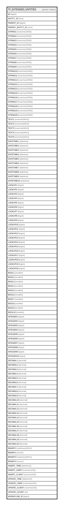

# TF_EXTENDED_ENTITIES

## Columns

| Name | Type | Default | Nullable | Comment |
| ---- | ---- | ------- | -------- | ------- |
| ID | bigint |  | false |  |
| ENTITY_ID | char |  | false |  |
| PARENT_ID | bigint |  | false |  |
| PARENT_ENTITY_ID | char |  | true |  |
| STRING1 | nvarchar(2000) |  | true |  |
| STRING2 | nvarchar(2000) |  | true |  |
| STRING3 | nvarchar(2000) |  | true |  |
| STRING4 | nvarchar(2000) |  | true |  |
| STRING5 | nvarchar(2000) |  | true |  |
| STRING6 | nvarchar(2000) |  | true |  |
| STRING7 | nvarchar(2000) |  | true |  |
| STRING8 | nvarchar(2000) |  | true |  |
| STRING9 | nvarchar(2000) |  | true |  |
| STRING10 | nvarchar(2000) |  | true |  |
| STRING11 | nvarchar(2000) |  | true |  |
| STRING12 | nvarchar(2000) |  | true |  |
| STRING13 | nvarchar(2000) |  | true |  |
| STRING14 | nvarchar(2000) |  | true |  |
| STRING15 | nvarchar(2000) |  | true |  |
| STRING16 | nvarchar(2000) |  | true |  |
| STRING17 | nvarchar(2000) |  | true |  |
| STRING18 | nvarchar(2000) |  | true |  |
| STRING19 | nvarchar(2000) |  | true |  |
| STRING20 | nvarchar(2000) |  | true |  |
| TEXT1 | nvarchar(MAX) |  | true |  |
| TEXT2 | nvarchar(MAX) |  | true |  |
| TEXT3 | nvarchar(MAX) |  | true |  |
| TEXT4 | nvarchar(MAX) |  | true |  |
| TEXT5 | nvarchar(MAX) |  | true |  |
| DATETIME1 | datetime |  | true |  |
| DATETIME2 | datetime |  | true |  |
| DATETIME3 | datetime |  | true |  |
| DATETIME4 | datetime |  | true |  |
| DATETIME5 | datetime |  | true |  |
| DATETIME6 | datetime |  | true |  |
| DATETIME7 | datetime |  | true |  |
| DATETIME8 | datetime |  | true |  |
| DATETIME9 | datetime |  | true |  |
| DATETIME10 | datetime |  | true |  |
| LOOKUP1 | bigint |  | true |  |
| LOOKUP2 | bigint |  | true |  |
| LOOKUP3 | bigint |  | true |  |
| LOOKUP4 | bigint |  | true |  |
| LOOKUP5 | bigint |  | true |  |
| LOOKUP6 | bigint |  | true |  |
| LOOKUP7 | bigint |  | true |  |
| LOOKUP8 | bigint |  | true |  |
| LOOKUP9 | bigint |  | true |  |
| LOOKUP10 | bigint |  | true |  |
| LOOKUP11 | bigint |  | true |  |
| LOOKUP12 | bigint |  | true |  |
| LOOKUP13 | bigint |  | true |  |
| LOOKUP14 | bigint |  | true |  |
| LOOKUP15 | bigint |  | true |  |
| LOOKUP16 | bigint |  | true |  |
| LOOKUP17 | bigint |  | true |  |
| LOOKUP18 | bigint |  | true |  |
| LOOKUP19 | bigint |  | true |  |
| LOOKUP20 | bigint |  | true |  |
| BOOL1 | smallint |  | true |  |
| BOOL2 | smallint |  | true |  |
| BOOL3 | smallint |  | true |  |
| BOOL4 | smallint |  | true |  |
| BOOL5 | smallint |  | true |  |
| BOOL6 | smallint |  | true |  |
| BOOL7 | smallint |  | true |  |
| BOOL8 | smallint |  | true |  |
| BOOL9 | smallint |  | true |  |
| BOOL10 | smallint |  | true |  |
| INTEGER1 | bigint |  | true |  |
| INTEGER2 | bigint |  | true |  |
| INTEGER3 | bigint |  | true |  |
| INTEGER4 | bigint |  | true |  |
| INTEGER5 | bigint |  | true |  |
| INTEGER6 | bigint |  | true |  |
| INTEGER7 | bigint |  | true |  |
| INTEGER8 | bigint |  | true |  |
| INTEGER9 | bigint |  | true |  |
| INTEGER10 | bigint |  | true |  |
| DECIMAL1 | decimal |  | true |  |
| DECIMAL2 | decimal |  | true |  |
| DECIMAL3 | decimal |  | true |  |
| DECIMAL4 | decimal |  | true |  |
| DECIMAL5 | decimal |  | true |  |
| DECIMAL6 | decimal |  | true |  |
| DECIMAL7 | decimal |  | true |  |
| DECIMAL8 | decimal |  | true |  |
| DECIMAL9 | decimal |  | true |  |
| DECIMAL10 | decimal |  | true |  |
| DECIMAL11 | decimal |  | true |  |
| DECIMAL12 | decimal |  | true |  |
| DECIMAL13 | decimal |  | true |  |
| DECIMAL14 | decimal |  | true |  |
| DECIMAL15 | decimal |  | true |  |
| DECIMAL16 | decimal |  | true |  |
| DECIMAL17 | decimal |  | true |  |
| DECIMAL18 | decimal |  | true |  |
| DECIMAL19 | decimal |  | true |  |
| DECIMAL20 | decimal |  | true |  |
| BINARY1 | varbinary(MAX) |  | true |  |
| BINARY1 | vector |  | true |  |
| BINARY2 | varbinary(MAX) |  | true |  |
| BINARY2 | vector |  | true |  |
| INSERT_TIME | datetime2 | (sysutcdatetime()) | false |  |
| INSERT_USER | nvarchar(100) | (N'MAIN') | false |  |
| INSERT_CLIENT | nvarchar(50) | (N'localhost') | false |  |
| UPDATE_TIME | datetime2 | (sysutcdatetime()) | false |  |
| UPDATE_USER | nvarchar(100) | (N'MAIN') | false |  |
| UPDATE_CLIENT | nvarchar(50) | (N'localhost') | false |  |
| UPDATE_COUNT | int | ((0)) | false |  |
| WORKFLOW_ID | bigint |  | true |  |

## Constraints

| Name | Type | Definition |
| ---- | ---- | ---------- |
| PK_EXTENDED_ENTITIES | PRIMARY KEY | CLUSTERED, unique, part of a PRIMARY KEY constraint, [ ID ] |

## Indexes

| Name | Definition |
| ---- | ---------- |
| PK_EXTENDED_ENTITIES | CLUSTERED, unique, part of a PRIMARY KEY constraint, [ ID ] |
| IDX_EXTENDED_ENTITIES | NONCLUSTERED, [ PARENT_ENTITY_ID, ENTITY_ID, PARENT_ID ] |
| IDX_EXTENDED_ENTITIES_PARENT | NONCLUSTERED, [ ENTITY_ID, PARENT_ID ] |
| TF_EXT_ENT_LOOKUP1 | NONCLUSTERED, [ LOOKUP1 ] |
| TF_EXT_ENT_LOOKUP2 | NONCLUSTERED, [ LOOKUP2 ] |
| TF_EXT_ENT_LOOKUP3 | NONCLUSTERED, [ LOOKUP3 ] |
| TF_EXT_ENT_LOOKUP4 | NONCLUSTERED, [ LOOKUP4 ] |
| TF_EXT_ENT_LOOKUP5 | NONCLUSTERED, [ LOOKUP5 ] |
| TF_EXT_ENT_LOOKUP6 | NONCLUSTERED, [ LOOKUP6 ] |
| TF_EXT_ENT_LOOKUP7 | NONCLUSTERED, [ LOOKUP7 ] |
| TF_EXT_ENT_LOOKUP8 | NONCLUSTERED, [ LOOKUP8 ] |
| TF_EXT_ENT_LOOKUP9 | NONCLUSTERED, [ LOOKUP9 ] |
| TF_EXT_ENT_LOOKUP10 | NONCLUSTERED, [ LOOKUP10 ] |
| TF_EXT_ENT_LOOKUP11 | NONCLUSTERED, [ LOOKUP11 ] |
| TF_EXT_ENT_LOOKUP12 | NONCLUSTERED, [ LOOKUP12 ] |
| TF_EXT_ENT_LOOKUP13 | NONCLUSTERED, [ LOOKUP13 ] |
| TF_EXT_ENT_LOOKUP14 | NONCLUSTERED, [ LOOKUP14 ] |
| TF_EXT_ENT_LOOKUP15 | NONCLUSTERED, [ LOOKUP15 ] |
| TF_EXT_ENT_LOOKUP16 | NONCLUSTERED, [ LOOKUP16 ] |
| TF_EXT_ENT_LOOKUP17 | NONCLUSTERED, [ LOOKUP17 ] |
| TF_EXT_ENT_LOOKUP18 | NONCLUSTERED, [ LOOKUP18 ] |
| TF_EXT_ENT_LOOKUP19 | NONCLUSTERED, [ LOOKUP19 ] |
| TF_EXT_ENT_LOOKUP20 | NONCLUSTERED, [ LOOKUP20 ] |

## Relations

---

> Generated by [tbls](https://github.com/k1LoW/tbls)
