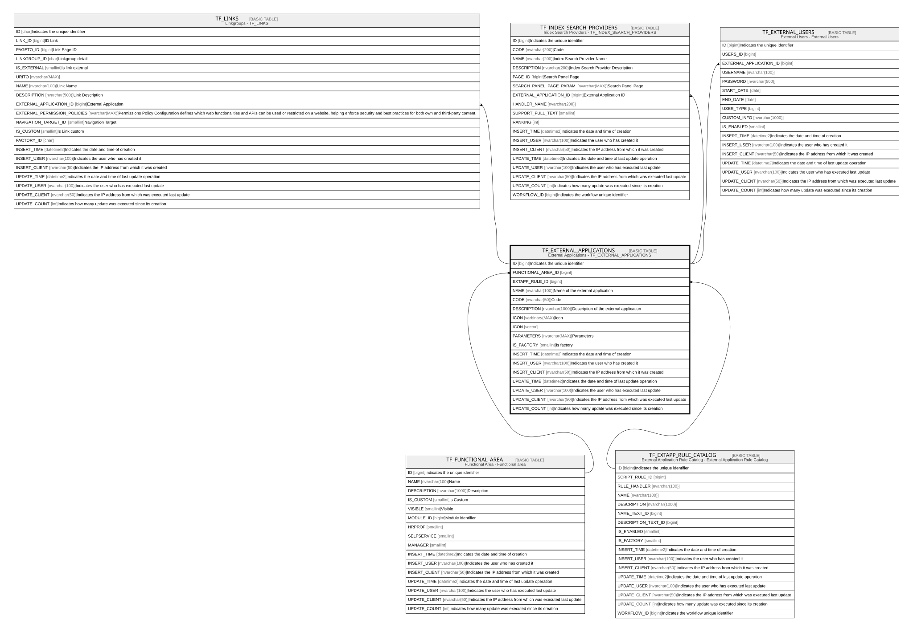

# TF_EXTERNAL_APPLICATIONS

## Description

External Applications - TF_EXTERNAL_APPLICATIONS  

## Columns

| Name | Type | Default | Nullable | Children | Parents | Comment |
| ---- | ---- | ------- | -------- | -------- | ------- | ------- |
| ID | bigint |  | false | [TF_LINKS](TF_LINKS.md) [TF_INDEX_SEARCH_PROVIDERS](TF_INDEX_SEARCH_PROVIDERS.md) [TF_EXTERNAL_USERS](TF_EXTERNAL_USERS.md) |  | Indicates the unique identifier |
| FUNCTIONAL_AREA_ID | bigint |  | true |  | [TF_FUNCTIONAL_AREA](TF_FUNCTIONAL_AREA.md) |  |
| EXTAPP_RULE_ID | bigint |  | true |  | [TF_EXTAPP_RULE_CATALOG](TF_EXTAPP_RULE_CATALOG.md) |  |
| NAME | nvarchar(100) |  | false |  |  | Name of the external application |
| CODE | nvarchar(50) |  | false |  |  | Code |
| DESCRIPTION | nvarchar(1000) |  | true |  |  | Description of the external application |
| ICON | varbinary(MAX) |  | true |  |  | Icon |
| ICON | vector |  | true |  |  |  |
| PARAMETERS | nvarchar(MAX) |  | true |  |  | Parameters |
| IS_FACTORY | smallint | ((0)) | false |  |  | Is factory |
| INSERT_TIME | datetime2 | (sysutcdatetime()) | false |  |  | Indicates the date and time of creation |
| INSERT_USER | nvarchar(100) | (N'MAIN') | false |  |  | Indicates the user who has created it |
| INSERT_CLIENT | nvarchar(50) | (N'localhost') | false |  |  | Indicates the IP address from which it was created |
| UPDATE_TIME | datetime2 | (sysutcdatetime()) | false |  |  | Indicates the date and time of last update operation |
| UPDATE_USER | nvarchar(100) | (N'MAIN') | false |  |  | Indicates the user who has executed last update |
| UPDATE_CLIENT | nvarchar(50) | (N'localhost') | false |  |  | Indicates the IP address from which was executed last update |
| UPDATE_COUNT | int | ((0)) | false |  |  | Indicates how many update was executed since its creation |

## Constraints

| Name | Type | Definition |
| ---- | ---- | ---------- |
| PK_EXTERNAL_APPLICATIONS | PRIMARY KEY | CLUSTERED, unique, part of a PRIMARY KEY constraint, [ ID ] |
| UQ_EXTERNALAPP_NAME | UNIQUE | NONCLUSTERED, unique, part of a UNIQUE constraint, [ NAME ] |
| FK_EXTAPP_EXTAPPCATALOG | FOREIGN KEY | FOREIGN KEY(EXTAPP_RULE_ID) REFERENCES TF_EXTAPP_RULE_CATALOG(ID) ON UPDATE NO_ACTION ON DELETE NO_ACTION |
| FK_EXTAPP_FUNCAREA | FOREIGN KEY | FOREIGN KEY(FUNCTIONAL_AREA_ID) REFERENCES TF_FUNCTIONAL_AREA(ID) ON UPDATE NO_ACTION ON DELETE NO_ACTION |

## Indexes

| Name | Definition |
| ---- | ---------- |
| PK_EXTERNAL_APPLICATIONS | CLUSTERED, unique, part of a PRIMARY KEY constraint, [ ID ] |
| UQ_EXTERNALAPP_NAME | NONCLUSTERED, unique, part of a UNIQUE constraint, [ NAME ] |

## Relations

---

> Generated by [tbls](https://github.com/k1LoW/tbls)
