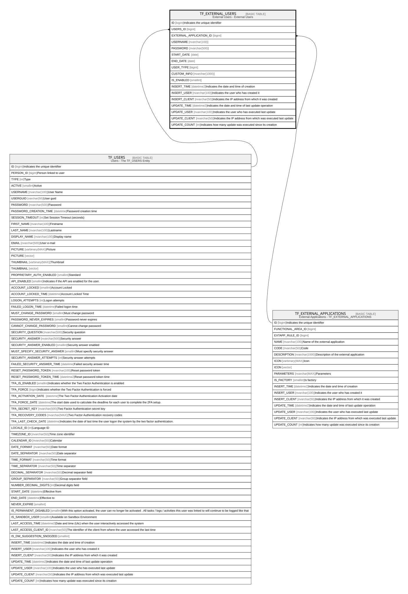

# TF_EXTERNAL_USERS

## Description

External Users - External Users  

## Columns

| Name | Type | Default | Nullable | Parents | Comment |
| ---- | ---- | ------- | -------- | ------- | ------- |
| ID | bigint |  | false |  | Indicates the unique identifier |
| USERS_ID | bigint |  | false | [TF_USERS](TF_USERS.md) |  |
| EXTERNAL_APPLICATION_ID | bigint |  | false | [TF_EXTERNAL_APPLICATIONS](TF_EXTERNAL_APPLICATIONS.md) |  |
| USERNAME | nvarchar(100) |  | true |  |  |
| PASSWORD | nvarchar(500) |  | true |  |  |
| START_DATE | date |  | true |  |  |
| END_DATE | date |  | true |  |  |
| USER_TYPE | bigint |  | true |  |  |
| CUSTOM_INFO | nvarchar(1000) |  | true |  |  |
| IS_ENABLED | smallint | ((1)) | false |  |  |
| INSERT_TIME | datetime2 | (sysutcdatetime()) | false |  | Indicates the date and time of creation |
| INSERT_USER | nvarchar(100) | (N'MAIN') | false |  | Indicates the user who has created it |
| INSERT_CLIENT | nvarchar(50) | (N'localhost') | false |  | Indicates the IP address from which it was created |
| UPDATE_TIME | datetime2 | (sysutcdatetime()) | false |  | Indicates the date and time of last update operation |
| UPDATE_USER | nvarchar(100) | (N'MAIN') | false |  | Indicates the user who has executed last update |
| UPDATE_CLIENT | nvarchar(50) | (N'localhost') | false |  | Indicates the IP address from which was executed last update |
| UPDATE_COUNT | int | ((0)) | false |  | Indicates how many update was executed since its creation |

## Constraints

| Name | Type | Definition |
| ---- | ---- | ---------- |
| PK_EXTERNAL_USERS | PRIMARY KEY | CLUSTERED, unique, part of a PRIMARY KEY constraint, [ ID ] |
| UQ_EXTUSERS_AK | UNIQUE | NONCLUSTERED, unique, part of a UNIQUE constraint, [ USERS_ID, EXTERNAL_APPLICATION_ID, USERNAME ] |
| FK_EXTUSERS_EXTAPP | FOREIGN KEY | FOREIGN KEY(EXTERNAL_APPLICATION_ID) REFERENCES TF_EXTERNAL_APPLICATIONS(ID) ON UPDATE NO_ACTION ON DELETE CASCADE |
| FK_EXTUSERS_USERS | FOREIGN KEY | FOREIGN KEY(USERS_ID) REFERENCES TF_USERS(ID) ON UPDATE NO_ACTION ON DELETE CASCADE |

## Indexes

| Name | Definition |
| ---- | ---------- |
| PK_EXTERNAL_USERS | CLUSTERED, unique, part of a PRIMARY KEY constraint, [ ID ] |
| UQ_EXTUSERS_AK | NONCLUSTERED, unique, part of a UNIQUE constraint, [ USERS_ID, EXTERNAL_APPLICATION_ID, USERNAME ] |

## Relations

---

> Generated by [tbls](https://github.com/k1LoW/tbls)
