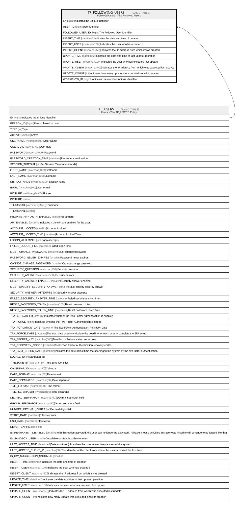

# TF_FOLLOWING_USERS

## Description

Followed Users - The Followed Users  

## Columns

| Name | Type | Default | Nullable | Parents | Comment |
| ---- | ---- | ------- | -------- | ------- | ------- |
| ID | bigint |  | false |  | Indicates the unique identifier |
| USER_ID | bigint |  | false | [TF_USERS](TF_USERS.md) | User identifier |
| FOLLOWED_USER_ID | bigint |  | false |  | The Followed User Identifier |
| INSERT_TIME | datetime2 | (sysutcdatetime()) | false |  | Indicates the date and time of creation |
| INSERT_USER | nvarchar(100) | (N'MAIN') | false |  | Indicates the user who has created it |
| INSERT_CLIENT | nvarchar(50) | (N'localhost') | false |  | Indicates the IP address from which it was created |
| UPDATE_TIME | datetime2 | (sysutcdatetime()) | false |  | Indicates the date and time of last update operation |
| UPDATE_USER | nvarchar(100) | (N'MAIN') | false |  | Indicates the user who has executed last update |
| UPDATE_CLIENT | nvarchar(50) | (N'localhost') | false |  | Indicates the IP address from which was executed last update |
| UPDATE_COUNT | int | ((0)) | false |  | Indicates how many update was executed since its creation |
| WORKFLOW_ID | bigint |  | true |  | Indicates the workflow unique identifier |

## Constraints

| Name | Type | Definition |
| ---- | ---- | ---------- |
| PK_FOLLOWING_USERS | PRIMARY KEY | CLUSTERED, unique, part of a PRIMARY KEY constraint, [ ID ] |
| UQ_FOLLOWING_USERS | UNIQUE | NONCLUSTERED, unique, part of a UNIQUE constraint, [ USER_ID, FOLLOWED_USER_ID ] |
| FK_FLWNGUSERS_USERS | FOREIGN KEY | FOREIGN KEY(USER_ID) REFERENCES TF_USERS(ID) ON UPDATE NO_ACTION ON DELETE CASCADE |

## Indexes

| Name | Definition |
| ---- | ---------- |
| PK_FOLLOWING_USERS | CLUSTERED, unique, part of a PRIMARY KEY constraint, [ ID ] |
| UQ_FOLLOWING_USERS | NONCLUSTERED, unique, part of a UNIQUE constraint, [ USER_ID, FOLLOWED_USER_ID ] |

## Relations

---

> Generated by [tbls](https://github.com/k1LoW/tbls)
