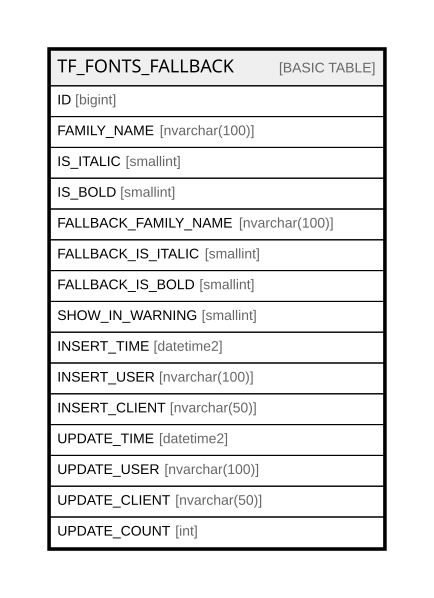

# TF_FONTS_FALLBACK

## Columns

| Name | Type | Default | Nullable | Comment |
| ---- | ---- | ------- | -------- | ------- |
| ID | bigint |  | false |  |
| FAMILY_NAME | nvarchar(100) |  | true |  |
| IS_ITALIC | smallint | ((0)) | false |  |
| IS_BOLD | smallint | ((0)) | false |  |
| FALLBACK_FAMILY_NAME | nvarchar(100) |  | true |  |
| FALLBACK_IS_ITALIC | smallint | ((0)) | false |  |
| FALLBACK_IS_BOLD | smallint | ((0)) | false |  |
| SHOW_IN_WARNING | smallint | ((1)) | false |  |
| INSERT_TIME | datetime2 | (sysutcdatetime()) | false |  |
| INSERT_USER | nvarchar(100) | (N'MAIN') | false |  |
| INSERT_CLIENT | nvarchar(50) | (N'localhost') | false |  |
| UPDATE_TIME | datetime2 | (sysutcdatetime()) | false |  |
| UPDATE_USER | nvarchar(100) | (N'MAIN') | false |  |
| UPDATE_CLIENT | nvarchar(50) | (N'localhost') | false |  |
| UPDATE_COUNT | int | ((0)) | false |  |

## Constraints

| Name | Type | Definition |
| ---- | ---- | ---------- |
| PK_TFFONTSFALLBACK | PRIMARY KEY | CLUSTERED, unique, part of a PRIMARY KEY constraint, [ ID ] |
| UQ_TFFONTSFALLBACK | UNIQUE | NONCLUSTERED, unique, part of a UNIQUE constraint, [ FAMILY_NAME, IS_ITALIC, IS_BOLD, FALLBACK_FAMILY_NAME, FALLBACK_IS_ITALIC, FALLBACK_IS_BOLD ] |

## Indexes

| Name | Definition |
| ---- | ---------- |
| PK_TFFONTSFALLBACK | CLUSTERED, unique, part of a PRIMARY KEY constraint, [ ID ] |
| UQ_TFFONTSFALLBACK | NONCLUSTERED, unique, part of a UNIQUE constraint, [ FAMILY_NAME, IS_ITALIC, IS_BOLD, FALLBACK_FAMILY_NAME, FALLBACK_IS_ITALIC, FALLBACK_IS_BOLD ] |
| IDX_TFFONTSFALLBACK | NONCLUSTERED, [ FAMILY_NAME ] |

## Relations

---

> Generated by [tbls](https://github.com/k1LoW/tbls)
