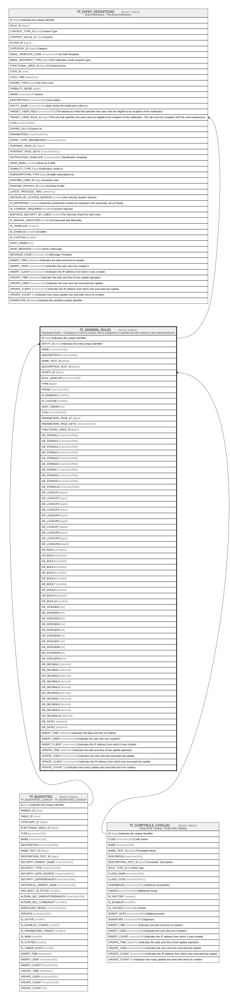

# TF_GENERAL_RULES

## Description

Resolution Rules - Catalogue of rules to resolve who is assigned to a specific function based on the selected person.  

## Columns

| Name | Type | Default | Nullable | Children | Parents | Comment |
| ---- | ---- | ------- | -------- | -------- | ------- | ------- |
| ID | bigint |  | false | [TF_EVENT_DEFINITIONS](TF_EVENT_DEFINITIONS.md) |  | Indicates the unique identifier |
| ENTITY_ID | char |  | false |  | [TF_BLENTITIES](TF_BLENTITIES.md) | Indicates the entity unique identifier |
| NAME | nvarchar(100) |  | false |  |  |  |
| DESCRIPTION | nvarchar(500) |  | true |  |  |  |
| NAME_TEXT_ID | bigint |  | true |  |  |  |
| DESCRIPTION_TEXT_ID | bigint |  | true |  |  |  |
| SCRIPT_ID | bigint |  | true |  | [TF_SCRIPTRULE_CATALOG](TF_SCRIPTRULE_CATALOG.md) |  |
| RULE_HANDLER | nvarchar(100) |  | false |  |  |  |
| TYPE | bigint |  | false |  |  |  |
| PHASE | nvarchar(100) |  | false |  |  |  |
| IS_ENABLED | smallint | ((0)) | false |  |  |  |
| IS_CUSTOM | smallint | ((0)) | false |  |  |  |
| SORT_ORDER | int | ((0)) | false |  |  |  |
| ICON | nvarchar(500) |  | false |  |  |  |
| PARAMETERS_PAGE_ID | bigint |  | true |  |  |  |
| PARAMETERS_PAGE_KEYS | nvarchar(MAX) |  | true |  |  |  |
| FUNCTIONAL_AREA_ID | bigint |  | true |  |  |  |
| GR_STRING1 | nvarchar(2000) |  | true |  |  |  |
| GR_STRING2 | nvarchar(2000) |  | true |  |  |  |
| GR_STRING3 | nvarchar(2000) |  | true |  |  |  |
| GR_STRING4 | nvarchar(2000) |  | true |  |  |  |
| GR_STRING5 | nvarchar(2000) |  | true |  |  |  |
| GR_STRING6 | nvarchar(2000) |  | true |  |  |  |
| GR_STRING7 | nvarchar(2000) |  | true |  |  |  |
| GR_STRING8 | nvarchar(2000) |  | true |  |  |  |
| GR_STRING9 | nvarchar(2000) |  | true |  |  |  |
| GR_STRING10 | nvarchar(2000) |  | true |  |  |  |
| GR_LOOKUP1 | bigint |  | true |  |  |  |
| GR_LOOKUP2 | bigint |  | true |  |  |  |
| GR_LOOKUP3 | bigint |  | true |  |  |  |
| GR_LOOKUP4 | bigint |  | true |  |  |  |
| GR_LOOKUP5 | bigint |  | true |  |  |  |
| GR_LOOKUP6 | bigint |  | true |  |  |  |
| GR_LOOKUP7 | bigint |  | true |  |  |  |
| GR_LOOKUP8 | bigint |  | true |  |  |  |
| GR_LOOKUP9 | bigint |  | true |  |  |  |
| GR_LOOKUP10 | bigint |  | true |  |  |  |
| GR_BOOL1 | smallint |  | true |  |  |  |
| GR_BOOL2 | smallint |  | true |  |  |  |
| GR_BOOL3 | smallint |  | true |  |  |  |
| GR_BOOL4 | smallint |  | true |  |  |  |
| GR_BOOL5 | smallint |  | true |  |  |  |
| GR_BOOL6 | smallint |  | true |  |  |  |
| GR_BOOL7 | smallint |  | true |  |  |  |
| GR_BOOL8 | smallint |  | true |  |  |  |
| GR_BOOL9 | smallint |  | true |  |  |  |
| GR_BOOL10 | smallint |  | true |  |  |  |
| GR_INTEGER1 | int |  | true |  |  |  |
| GR_INTEGER2 | int |  | true |  |  |  |
| GR_INTEGER3 | int |  | true |  |  |  |
| GR_INTEGER4 | int |  | true |  |  |  |
| GR_INTEGER5 | int |  | true |  |  |  |
| GR_INTEGER6 | int |  | true |  |  |  |
| GR_INTEGER7 | int |  | true |  |  |  |
| GR_INTEGER8 | int |  | true |  |  |  |
| GR_INTEGER9 | int |  | true |  |  |  |
| GR_INTEGER10 | int |  | true |  |  |  |
| GR_DECIMAL1 | decimal |  | true |  |  |  |
| GR_DECIMAL2 | decimal |  | true |  |  |  |
| GR_DECIMAL3 | decimal |  | true |  |  |  |
| GR_DECIMAL4 | decimal |  | true |  |  |  |
| GR_DECIMAL5 | decimal |  | true |  |  |  |
| GR_DECIMAL6 | decimal |  | true |  |  |  |
| GR_DECIMAL7 | decimal |  | true |  |  |  |
| GR_DECIMAL8 | decimal |  | true |  |  |  |
| GR_DECIMAL9 | decimal |  | true |  |  |  |
| GR_DECIMAL10 | decimal |  | true |  |  |  |
| GR_DATE1 | datetime |  | true |  |  |  |
| GR_DATE2 | datetime |  | true |  |  |  |
| INSERT_TIME | datetime2 | (sysutcdatetime()) | false |  |  | Indicates the date and time of creation |
| INSERT_USER | nvarchar(100) | (N'MAIN') | false |  |  | Indicates the user who has created it |
| INSERT_CLIENT | nvarchar(50) | (N'localhost') | false |  |  | Indicates the IP address from which it was created |
| UPDATE_TIME | datetime2 | (sysutcdatetime()) | false |  |  | Indicates the date and time of last update operation |
| UPDATE_USER | nvarchar(100) | (N'MAIN') | false |  |  | Indicates the user who has executed last update |
| UPDATE_CLIENT | nvarchar(50) | (N'localhost') | false |  |  | Indicates the IP address from which was executed last update |
| UPDATE_COUNT | int | ((0)) | false |  |  | Indicates how many update was executed since its creation |

## Constraints

| Name | Type | Definition |
| ---- | ---- | ---------- |
| PK_GENERAL_RULES | PRIMARY KEY | CLUSTERED, unique, part of a PRIMARY KEY constraint, [ ID ] |
| UQ_GENERAL_RULES | UNIQUE | NONCLUSTERED, unique, part of a UNIQUE constraint, [ ENTITY_ID, NAME ] |
| FK_GENERAL_RULES_BLENTITIES | FOREIGN KEY | FOREIGN KEY(ENTITY_ID) REFERENCES TF_BLENTITIES(ID) ON UPDATE NO_ACTION ON DELETE NO_ACTION |
| FK_GENERAL_RULES_SCRIPTRULES | FOREIGN KEY | FOREIGN KEY(SCRIPT_ID) REFERENCES TF_SCRIPTRULE_CATALOG(ID) ON UPDATE NO_ACTION ON DELETE NO_ACTION |

## Indexes

| Name | Definition |
| ---- | ---------- |
| PK_GENERAL_RULES | CLUSTERED, unique, part of a PRIMARY KEY constraint, [ ID ] |
| UQ_GENERAL_RULES | NONCLUSTERED, unique, part of a UNIQUE constraint, [ ENTITY_ID, NAME ] |

## Relations

---

> Generated by [tbls](https://github.com/k1LoW/tbls)
