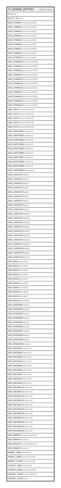

# TF_GENERIC_ENTITIES

## Columns

| Name | Type | Default | Nullable | Comment |
| ---- | ---- | ------- | -------- | ------- |
| ID | bigint |  | false |  |
| ENTITY_ID | char |  | false |  |
| GEN_STRING1 | nvarchar(2000) |  | true |  |
| GEN_STRING2 | nvarchar(2000) |  | true |  |
| GEN_STRING3 | nvarchar(2000) |  | true |  |
| GEN_STRING4 | nvarchar(2000) |  | true |  |
| GEN_STRING5 | nvarchar(2000) |  | true |  |
| GEN_STRING6 | nvarchar(2000) |  | true |  |
| GEN_STRING7 | nvarchar(2000) |  | true |  |
| GEN_STRING8 | nvarchar(2000) |  | true |  |
| GEN_STRING9 | nvarchar(2000) |  | true |  |
| GEN_STRING10 | nvarchar(2000) |  | true |  |
| GEN_STRING11 | nvarchar(2000) |  | true |  |
| GEN_STRING12 | nvarchar(2000) |  | true |  |
| GEN_STRING13 | nvarchar(2000) |  | true |  |
| GEN_STRING14 | nvarchar(2000) |  | true |  |
| GEN_STRING15 | nvarchar(2000) |  | true |  |
| GEN_STRING16 | nvarchar(2000) |  | true |  |
| GEN_STRING17 | nvarchar(2000) |  | true |  |
| GEN_STRING18 | nvarchar(2000) |  | true |  |
| GEN_STRING19 | nvarchar(2000) |  | true |  |
| GEN_STRING20 | nvarchar(2000) |  | true |  |
| GEN_TEXT1 | nvarchar(MAX) |  | true |  |
| GEN_TEXT2 | nvarchar(MAX) |  | true |  |
| GEN_TEXT3 | nvarchar(MAX) |  | true |  |
| GEN_TEXT4 | nvarchar(MAX) |  | true |  |
| GEN_TEXT5 | nvarchar(MAX) |  | true |  |
| GEN_DATETIME1 | datetime |  | true |  |
| GEN_DATETIME2 | datetime |  | true |  |
| GEN_DATETIME3 | datetime |  | true |  |
| GEN_DATETIME4 | datetime |  | true |  |
| GEN_DATETIME5 | datetime |  | true |  |
| GEN_DATETIME6 | datetime |  | true |  |
| GEN_DATETIME7 | datetime |  | true |  |
| GEN_DATETIME8 | datetime |  | true |  |
| GEN_DATETIME9 | datetime |  | true |  |
| GEN_DATETIME10 | datetime |  | true |  |
| GEN_LOOKUP1 | bigint |  | true |  |
| GEN_LOOKUP2 | bigint |  | true |  |
| GEN_LOOKUP3 | bigint |  | true |  |
| GEN_LOOKUP4 | bigint |  | true |  |
| GEN_LOOKUP5 | bigint |  | true |  |
| GEN_LOOKUP6 | bigint |  | true |  |
| GEN_LOOKUP7 | bigint |  | true |  |
| GEN_LOOKUP8 | bigint |  | true |  |
| GEN_LOOKUP9 | bigint |  | true |  |
| GEN_LOOKUP10 | bigint |  | true |  |
| GEN_LOOKUP11 | bigint |  | true |  |
| GEN_LOOKUP12 | bigint |  | true |  |
| GEN_LOOKUP13 | bigint |  | true |  |
| GEN_LOOKUP14 | bigint |  | true |  |
| GEN_LOOKUP15 | bigint |  | true |  |
| GEN_LOOKUP16 | bigint |  | true |  |
| GEN_LOOKUP17 | bigint |  | true |  |
| GEN_LOOKUP18 | bigint |  | true |  |
| GEN_LOOKUP19 | bigint |  | true |  |
| GEN_LOOKUP20 | bigint |  | true |  |
| GEN_BOOL1 | smallint |  | true |  |
| GEN_BOOL2 | smallint |  | true |  |
| GEN_BOOL3 | smallint |  | true |  |
| GEN_BOOL4 | smallint |  | true |  |
| GEN_BOOL5 | smallint |  | true |  |
| GEN_BOOL6 | smallint |  | true |  |
| GEN_BOOL7 | smallint |  | true |  |
| GEN_BOOL8 | smallint |  | true |  |
| GEN_BOOL9 | smallint |  | true |  |
| GEN_BOOL10 | smallint |  | true |  |
| GEN_INTEGER1 | bigint |  | true |  |
| GEN_INTEGER2 | bigint |  | true |  |
| GEN_INTEGER3 | bigint |  | true |  |
| GEN_INTEGER4 | bigint |  | true |  |
| GEN_INTEGER5 | bigint |  | true |  |
| GEN_INTEGER6 | bigint |  | true |  |
| GEN_INTEGER7 | bigint |  | true |  |
| GEN_INTEGER8 | bigint |  | true |  |
| GEN_INTEGER9 | bigint |  | true |  |
| GEN_INTEGER10 | bigint |  | true |  |
| GEN_DECIMAL1 | decimal |  | true |  |
| GEN_DECIMAL2 | decimal |  | true |  |
| GEN_DECIMAL3 | decimal |  | true |  |
| GEN_DECIMAL4 | decimal |  | true |  |
| GEN_DECIMAL5 | decimal |  | true |  |
| GEN_DECIMAL6 | decimal |  | true |  |
| GEN_DECIMAL7 | decimal |  | true |  |
| GEN_DECIMAL8 | decimal |  | true |  |
| GEN_DECIMAL9 | decimal |  | true |  |
| GEN_DECIMAL10 | decimal |  | true |  |
| GEN_DECIMAL11 | decimal |  | true |  |
| GEN_DECIMAL12 | decimal |  | true |  |
| GEN_DECIMAL13 | decimal |  | true |  |
| GEN_DECIMAL14 | decimal |  | true |  |
| GEN_DECIMAL15 | decimal |  | true |  |
| GEN_DECIMAL16 | decimal |  | true |  |
| GEN_DECIMAL17 | decimal |  | true |  |
| GEN_DECIMAL18 | decimal |  | true |  |
| GEN_DECIMAL19 | decimal |  | true |  |
| GEN_DECIMAL20 | decimal |  | true |  |
| GEN_BINARY1 | varbinary(MAX) |  | true |  |
| GEN_BINARY1 | vector |  | true |  |
| GEN_BINARY2 | varbinary(MAX) |  | true |  |
| GEN_BINARY2 | vector |  | true |  |
| INSERT_TIME | datetime2 | (sysutcdatetime()) | false |  |
| INSERT_USER | nvarchar(100) | (N'MAIN') | false |  |
| INSERT_CLIENT | nvarchar(50) | (N'localhost') | false |  |
| UPDATE_TIME | datetime2 | (sysutcdatetime()) | false |  |
| UPDATE_USER | nvarchar(100) | (N'MAIN') | false |  |
| UPDATE_CLIENT | nvarchar(50) | (N'localhost') | false |  |
| UPDATE_COUNT | int | ((0)) | false |  |

## Constraints

| Name | Type | Definition |
| ---- | ---- | ---------- |
| PK_GENERIC_ENTITIES | PRIMARY KEY | CLUSTERED, unique, part of a PRIMARY KEY constraint, [ ID, ENTITY_ID ] |

## Indexes

| Name | Definition |
| ---- | ---------- |
| PK_GENERIC_ENTITIES | CLUSTERED, unique, part of a PRIMARY KEY constraint, [ ID, ENTITY_ID ] |

## Relations

---

> Generated by [tbls](https://github.com/k1LoW/tbls)
