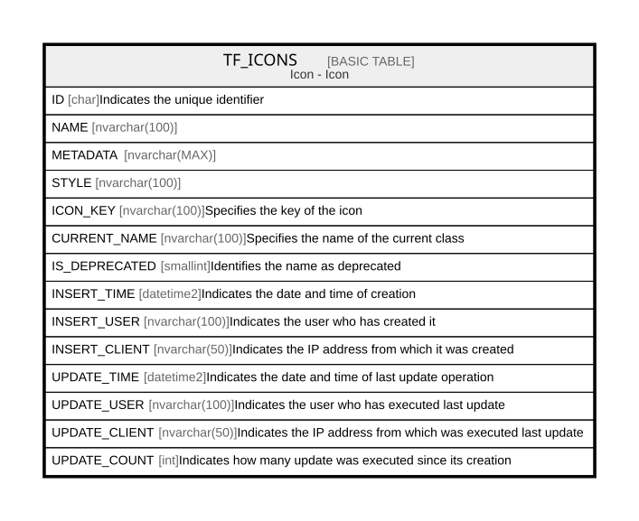

# TF_ICONS

## Description

Icon - Icon  

## Columns

| Name | Type | Default | Nullable | Comment |
| ---- | ---- | ------- | -------- | ------- |
| ID | char |  | false | Indicates the unique identifier |
| NAME | nvarchar(100) |  | false |  |
| METADATA | nvarchar(MAX) |  | true |  |
| STYLE | nvarchar(100) |  | true |  |
| ICON_KEY | nvarchar(100) |  | true | Specifies the key of the icon |
| CURRENT_NAME | nvarchar(100) |  | true | Specifies the name of the current class |
| IS_DEPRECATED | smallint | ((0)) | false | Identifies the name as deprecated |
| INSERT_TIME | datetime2 | (sysutcdatetime()) | false | Indicates the date and time of creation |
| INSERT_USER | nvarchar(100) | (N'MAIN') | false | Indicates the user who has created it |
| INSERT_CLIENT | nvarchar(50) | (N'localhost') | false | Indicates the IP address from which it was created |
| UPDATE_TIME | datetime2 | (sysutcdatetime()) | false | Indicates the date and time of last update operation |
| UPDATE_USER | nvarchar(100) | (N'MAIN') | false | Indicates the user who has executed last update |
| UPDATE_CLIENT | nvarchar(50) | (N'localhost') | false | Indicates the IP address from which was executed last update |
| UPDATE_COUNT | int | ((0)) | false | Indicates how many update was executed since its creation |

## Constraints

| Name | Type | Definition |
| ---- | ---- | ---------- |
| PK_TF_ICONS | PRIMARY KEY | CLUSTERED, unique, part of a PRIMARY KEY constraint, [ ID ] |
| UQ_ICONSNAME | UNIQUE | NONCLUSTERED, unique, part of a UNIQUE constraint, [ NAME ] |

## Indexes

| Name | Definition |
| ---- | ---------- |
| PK_TF_ICONS | CLUSTERED, unique, part of a PRIMARY KEY constraint, [ ID ] |
| UQ_ICONSNAME | NONCLUSTERED, unique, part of a UNIQUE constraint, [ NAME ] |

## Relations

---

> Generated by [tbls](https://github.com/k1LoW/tbls)
