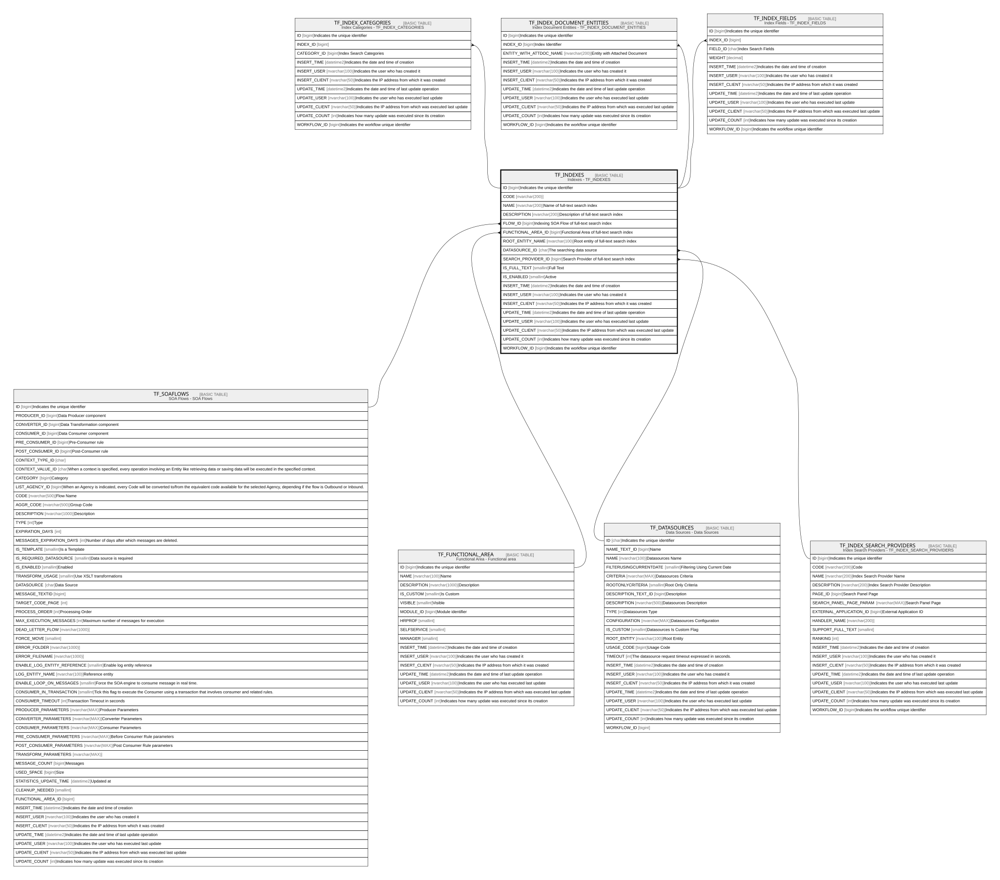

# TF_INDEXES

## Description

Indexes - TF_INDEXES  

## Columns

| Name | Type | Default | Nullable | Children | Parents | Comment |
| ---- | ---- | ------- | -------- | -------- | ------- | ------- |
| ID | bigint |  | false | [TF_INDEX_CATEGORIES](TF_INDEX_CATEGORIES.md) [TF_INDEX_DOCUMENT_ENTITIES](TF_INDEX_DOCUMENT_ENTITIES.md) [TF_INDEX_FIELDS](TF_INDEX_FIELDS.md) |  | Indicates the unique identifier |
| CODE | nvarchar(200) |  | false |  |  |  |
| NAME | nvarchar(200) |  | false |  |  | Name of full-text search index |
| DESCRIPTION | nvarchar(200) |  | true |  |  | Description of full-text search index |
| FLOW_ID | bigint |  | true |  | [TF_SOAFLOWS](TF_SOAFLOWS.md) | Indexing SOA Flow of full-text search index |
| FUNCTIONAL_AREA_ID | bigint |  | true |  | [TF_FUNCTIONAL_AREA](TF_FUNCTIONAL_AREA.md) | Functional Area of full-text search index |
| ROOT_ENTITY_NAME | nvarchar(100) |  | false |  |  | Root entity of full-text search index |
| DATASOURCE_ID | char |  | false |  | [TF_DATASOURCES](TF_DATASOURCES.md) | The searching data source  |
| SEARCH_PROVIDER_ID | bigint |  | false |  | [TF_INDEX_SEARCH_PROVIDERS](TF_INDEX_SEARCH_PROVIDERS.md) | Search Provider of full-text search index |
| IS_FULL_TEXT | smallint | ((0)) | false |  |  | Full Text |
| IS_ENABLED | smallint | ((0)) | false |  |  | Active |
| INSERT_TIME | datetime2 | (sysutcdatetime()) | false |  |  | Indicates the date and time of creation |
| INSERT_USER | nvarchar(100) | (N'MAIN') | false |  |  | Indicates the user who has created it |
| INSERT_CLIENT | nvarchar(50) | (N'localhost') | false |  |  | Indicates the IP address from which it was created |
| UPDATE_TIME | datetime2 | (sysutcdatetime()) | false |  |  | Indicates the date and time of last update operation |
| UPDATE_USER | nvarchar(100) | (N'MAIN') | false |  |  | Indicates the user who has executed last update |
| UPDATE_CLIENT | nvarchar(50) | (N'localhost') | false |  |  | Indicates the IP address from which was executed last update |
| UPDATE_COUNT | int | ((0)) | false |  |  | Indicates how many update was executed since its creation |
| WORKFLOW_ID | bigint |  | true |  |  | Indicates the workflow unique identifier |

## Constraints

| Name | Type | Definition |
| ---- | ---- | ---------- |
| PK_TF_INDEXES | PRIMARY KEY | CLUSTERED, unique, part of a PRIMARY KEY constraint, [ ID ] |
| UQ_TF_INDEXES | UNIQUE | NONCLUSTERED, unique, part of a UNIQUE constraint, [ CODE ] |
| FK_INDEXES_DATASOURCES | FOREIGN KEY | FOREIGN KEY(DATASOURCE_ID) REFERENCES TF_DATASOURCES(ID) ON UPDATE NO_ACTION ON DELETE NO_ACTION |
| FK_INDEXES_FUNCTIONAL_AREA | FOREIGN KEY | FOREIGN KEY(FUNCTIONAL_AREA_ID) REFERENCES TF_FUNCTIONAL_AREA(ID) ON UPDATE NO_ACTION ON DELETE NO_ACTION |
| FK_INDEXES_PROVIDERS | FOREIGN KEY | FOREIGN KEY(SEARCH_PROVIDER_ID) REFERENCES TF_INDEX_SEARCH_PROVIDERS(ID) ON UPDATE NO_ACTION ON DELETE NO_ACTION |
| FK_INDEXES_SOAFLOWS | FOREIGN KEY | FOREIGN KEY(FLOW_ID) REFERENCES TF_SOAFLOWS(ID) ON UPDATE NO_ACTION ON DELETE NO_ACTION |

## Indexes

| Name | Definition |
| ---- | ---------- |
| PK_TF_INDEXES | CLUSTERED, unique, part of a PRIMARY KEY constraint, [ ID ] |
| UQ_TF_INDEXES | NONCLUSTERED, unique, part of a UNIQUE constraint, [ CODE ] |

## Relations

---

> Generated by [tbls](https://github.com/k1LoW/tbls)
