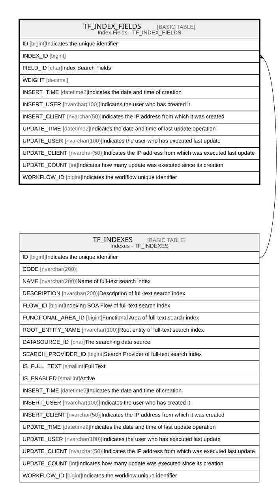

# TF_INDEX_FIELDS

## Description

Index Fields - TF_INDEX_FIELDS  

## Columns

| Name | Type | Default | Nullable | Parents | Comment |
| ---- | ---- | ------- | -------- | ------- | ------- |
| ID | bigint |  | false |  | Indicates the unique identifier |
| INDEX_ID | bigint |  | false | [TF_INDEXES](TF_INDEXES.md) |  |
| FIELD_ID | char |  | false |  | Index Search Fields |
| WEIGHT | decimal |  | true |  |  |
| INSERT_TIME | datetime2 | (sysutcdatetime()) | false |  | Indicates the date and time of creation |
| INSERT_USER | nvarchar(100) | (N'MAIN') | false |  | Indicates the user who has created it |
| INSERT_CLIENT | nvarchar(50) | (N'localhost') | false |  | Indicates the IP address from which it was created |
| UPDATE_TIME | datetime2 | (sysutcdatetime()) | false |  | Indicates the date and time of last update operation |
| UPDATE_USER | nvarchar(100) | (N'MAIN') | false |  | Indicates the user who has executed last update |
| UPDATE_CLIENT | nvarchar(50) | (N'localhost') | false |  | Indicates the IP address from which was executed last update |
| UPDATE_COUNT | int | ((0)) | false |  | Indicates how many update was executed since its creation |
| WORKFLOW_ID | bigint |  | true |  | Indicates the workflow unique identifier |

## Constraints

| Name | Type | Definition |
| ---- | ---- | ---------- |
| PK_INDEX_FIELDS | PRIMARY KEY | CLUSTERED, unique, part of a PRIMARY KEY constraint, [ ID ] |
| UQ_INDEX_FIELDS | UNIQUE | NONCLUSTERED, unique, part of a UNIQUE constraint, [ INDEX_ID, FIELD_ID ] |
| FK_INDEX_FIELDS_INDEXES | FOREIGN KEY | FOREIGN KEY(INDEX_ID) REFERENCES TF_INDEXES(ID) ON UPDATE NO_ACTION ON DELETE CASCADE |

## Indexes

| Name | Definition |
| ---- | ---------- |
| PK_INDEX_FIELDS | CLUSTERED, unique, part of a PRIMARY KEY constraint, [ ID ] |
| UQ_INDEX_FIELDS | NONCLUSTERED, unique, part of a UNIQUE constraint, [ INDEX_ID, FIELD_ID ] |

## Relations

---

> Generated by [tbls](https://github.com/k1LoW/tbls)
