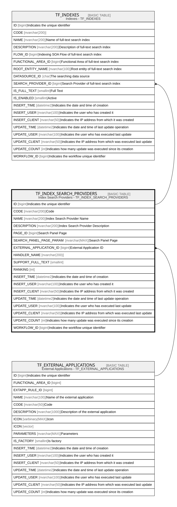

# TF_INDEX_SEARCH_PROVIDERS

## Description

Index Search Providers - TF_INDEX_SEARCH_PROVIDERS  

## Columns

| Name | Type | Default | Nullable | Children | Parents | Comment |
| ---- | ---- | ------- | -------- | -------- | ------- | ------- |
| ID | bigint |  | false | [TF_INDEXES](TF_INDEXES.md) |  | Indicates the unique identifier |
| CODE | nvarchar(200) |  | false |  |  | Code |
| NAME | nvarchar(200) |  | false |  |  | Index Search Provider Name |
| DESCRIPTION | nvarchar(200) |  | true |  |  | Index Search Provider Description |
| PAGE_ID | bigint |  | false |  |  | Search Panel Page |
| SEARCH_PANEL_PAGE_PARAM | nvarchar(MAX) |  | true |  |  | Search Panel Page |
| EXTERNAL_APPLICATION_ID | bigint |  | true |  | [TF_EXTERNAL_APPLICATIONS](TF_EXTERNAL_APPLICATIONS.md) | External Application ID |
| HANDLER_NAME | nvarchar(200) |  | false |  |  |  |
| SUPPORT_FULL_TEXT | smallint | ((0)) | false |  |  |  |
| RANKING | int | ((0)) | false |  |  |  |
| INSERT_TIME | datetime2 | (sysutcdatetime()) | false |  |  | Indicates the date and time of creation |
| INSERT_USER | nvarchar(100) | (N'MAIN') | false |  |  | Indicates the user who has created it |
| INSERT_CLIENT | nvarchar(50) | (N'localhost') | false |  |  | Indicates the IP address from which it was created |
| UPDATE_TIME | datetime2 | (sysutcdatetime()) | false |  |  | Indicates the date and time of last update operation |
| UPDATE_USER | nvarchar(100) | (N'MAIN') | false |  |  | Indicates the user who has executed last update |
| UPDATE_CLIENT | nvarchar(50) | (N'localhost') | false |  |  | Indicates the IP address from which was executed last update |
| UPDATE_COUNT | int | ((0)) | false |  |  | Indicates how many update was executed since its creation |
| WORKFLOW_ID | bigint |  | true |  |  | Indicates the workflow unique identifier |

## Constraints

| Name | Type | Definition |
| ---- | ---- | ---------- |
| PK_TF_INDEX_SEARCH_PROVIDERS | PRIMARY KEY | CLUSTERED, unique, part of a PRIMARY KEY constraint, [ ID ] |
| UQ_TF_INDEX_SEARCH_PROVIDERS | UNIQUE | NONCLUSTERED, unique, part of a UNIQUE constraint, [ CODE ] |
| FK_INDEXES_EXT_APPLICATIONS | FOREIGN KEY | FOREIGN KEY(EXTERNAL_APPLICATION_ID) REFERENCES TF_EXTERNAL_APPLICATIONS(ID) ON UPDATE NO_ACTION ON DELETE NO_ACTION |

## Indexes

| Name | Definition |
| ---- | ---------- |
| PK_TF_INDEX_SEARCH_PROVIDERS | CLUSTERED, unique, part of a PRIMARY KEY constraint, [ ID ] |
| UQ_TF_INDEX_SEARCH_PROVIDERS | NONCLUSTERED, unique, part of a UNIQUE constraint, [ CODE ] |

## Relations

---

> Generated by [tbls](https://github.com/k1LoW/tbls)
