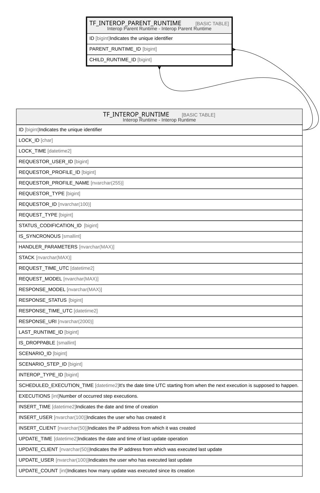

# TF_INTEROP_PARENT_RUNTIME

## Description

Interop Parent Runtime - Interop Parent Runtime  

## Columns

| Name | Type | Default | Nullable | Parents | Comment |
| ---- | ---- | ------- | -------- | ------- | ------- |
| ID | bigint |  | false |  | Indicates the unique identifier |
| PARENT_RUNTIME_ID | bigint |  | false | [TF_INTEROP_RUNTIME](TF_INTEROP_RUNTIME.md) |  |
| CHILD_RUNTIME_ID | bigint |  | false | [TF_INTEROP_RUNTIME](TF_INTEROP_RUNTIME.md) |  |

## Constraints

| Name | Type | Definition |
| ---- | ---- | ---------- |
| PK_TF_INTEROP_PARENT_RUNTIME | PRIMARY KEY | CLUSTERED, unique, part of a PRIMARY KEY constraint, [ ID ] |
| UQ_TF_INTEROP_PARENT_RUNTIME | UNIQUE | NONCLUSTERED, unique, part of a UNIQUE constraint, [ CHILD_RUNTIME_ID, PARENT_RUNTIME_ID ] |
| FK_RUNTIME_CHILD_RUNTIME | FOREIGN KEY | FOREIGN KEY(CHILD_RUNTIME_ID) REFERENCES TF_INTEROP_RUNTIME(ID) ON UPDATE NO_ACTION ON DELETE NO_ACTION |
| FK_RUNTIME_PARENT_RUNTIME | FOREIGN KEY | FOREIGN KEY(PARENT_RUNTIME_ID) REFERENCES TF_INTEROP_RUNTIME(ID) ON UPDATE NO_ACTION ON DELETE NO_ACTION |

## Indexes

| Name | Definition |
| ---- | ---------- |
| PK_TF_INTEROP_PARENT_RUNTIME | CLUSTERED, unique, part of a PRIMARY KEY constraint, [ ID ] |
| UQ_TF_INTEROP_PARENT_RUNTIME | NONCLUSTERED, unique, part of a UNIQUE constraint, [ CHILD_RUNTIME_ID, PARENT_RUNTIME_ID ] |

## Relations

---

> Generated by [tbls](https://github.com/k1LoW/tbls)
