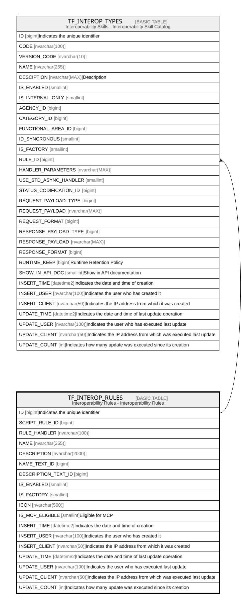

# TF_INTEROP_RULES

## Description

Interoperability Rules - Interoperability Rules  

## Columns

| Name | Type | Default | Nullable | Children | Comment |
| ---- | ---- | ------- | -------- | -------- | ------- |
| ID | bigint |  | false | [TF_INTEROP_TYPES](TF_INTEROP_TYPES.md) | Indicates the unique identifier |
| SCRIPT_RULE_ID | bigint |  | true |  |  |
| RULE_HANDLER | nvarchar(100) |  | false |  |  |
| NAME | nvarchar(255) |  | false |  |  |
| DESCRIPTION | nvarchar(2000) |  | true |  |  |
| NAME_TEXT_ID | bigint |  | true |  |  |
| DESCRIPTION_TEXT_ID | bigint |  | true |  |  |
| IS_ENABLED | smallint | ((1)) | false |  |  |
| IS_FACTORY | smallint | ((0)) | false |  |  |
| ICON | nvarchar(500) |  | true |  |  |
| IS_MCP_ELIGIBLE | smallint | ((0)) | false |  | Eligible for MCP |
| INSERT_TIME | datetime2 | (sysutcdatetime()) | false |  | Indicates the date and time of creation |
| INSERT_USER | nvarchar(100) | (N'MAIN') | false |  | Indicates the user who has created it |
| INSERT_CLIENT | nvarchar(50) | (N'localhost') | false |  | Indicates the IP address from which it was created |
| UPDATE_TIME | datetime2 | (sysutcdatetime()) | false |  | Indicates the date and time of last update operation |
| UPDATE_USER | nvarchar(100) | (N'MAIN') | false |  | Indicates the user who has executed last update |
| UPDATE_CLIENT | nvarchar(50) | (N'localhost') | false |  | Indicates the IP address from which was executed last update |
| UPDATE_COUNT | int | ((0)) | false |  | Indicates how many update was executed since its creation |

## Constraints

| Name | Type | Definition |
| ---- | ---- | ---------- |
| PK_TF_INTEROP_RULES | PRIMARY KEY | CLUSTERED, unique, part of a PRIMARY KEY constraint, [ ID ] |
| UQ_INTEROP_RULE | UNIQUE | NONCLUSTERED, unique, part of a UNIQUE constraint, [ NAME ] |

## Indexes

| Name | Definition |
| ---- | ---------- |
| PK_TF_INTEROP_RULES | CLUSTERED, unique, part of a PRIMARY KEY constraint, [ ID ] |
| UQ_INTEROP_RULE | NONCLUSTERED, unique, part of a UNIQUE constraint, [ NAME ] |

## Relations

---

> Generated by [tbls](https://github.com/k1LoW/tbls)
