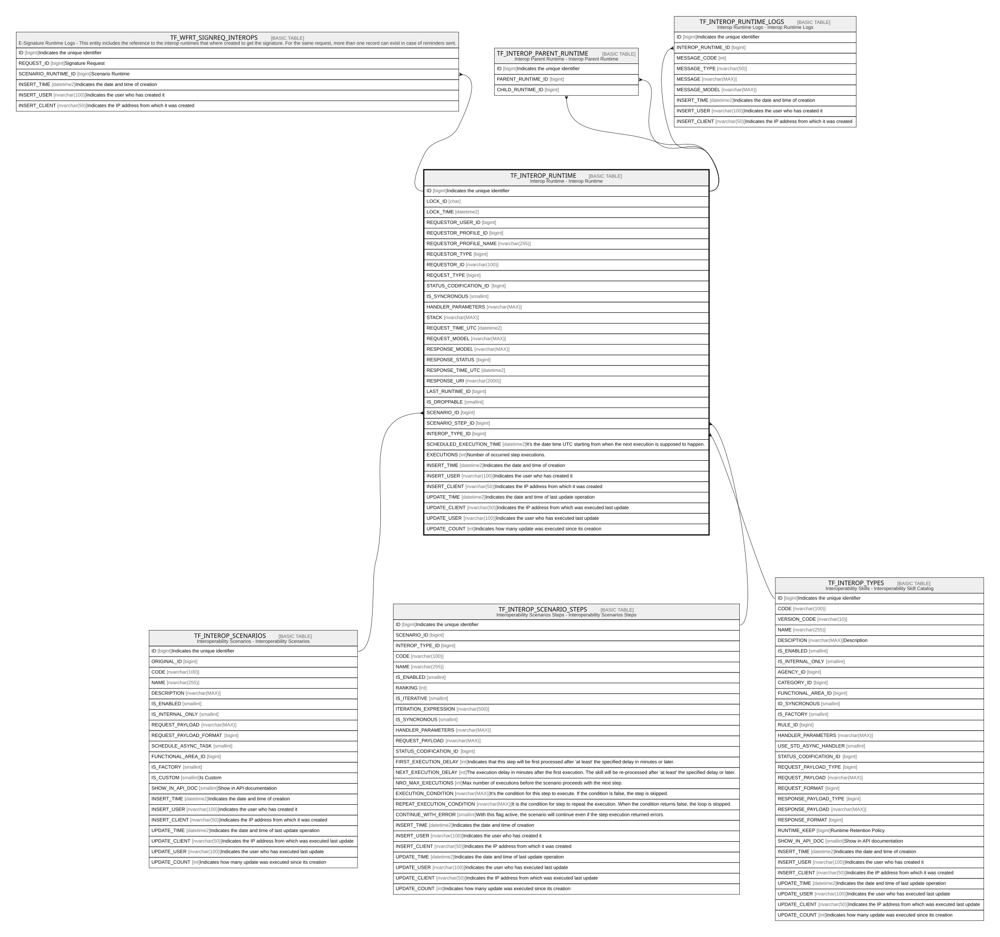

# TF_INTEROP_RUNTIME

## Description

Interop Runtime - Interop Runtime  

## Columns

| Name | Type | Default | Nullable | Children | Parents | Comment |
| ---- | ---- | ------- | -------- | -------- | ------- | ------- |
| ID | bigint |  | false | [TF_WFRT_SIGNREQ_INTEROPS](TF_WFRT_SIGNREQ_INTEROPS.md) [TF_INTEROP_PARENT_RUNTIME](TF_INTEROP_PARENT_RUNTIME.md) [TF_INTEROP_RUNTIME_LOGS](TF_INTEROP_RUNTIME_LOGS.md) |  | Indicates the unique identifier |
| LOCK_ID | char |  | true |  |  |  |
| LOCK_TIME | datetime2 |  | true |  |  |  |
| REQUESTOR_USER_ID | bigint |  | false |  |  |  |
| REQUESTOR_PROFILE_ID | bigint | ((-1)) | false |  |  |  |
| REQUESTOR_PROFILE_NAME | nvarchar(255) |  | false |  |  |  |
| REQUESTOR_TYPE | bigint |  | false |  |  |  |
| REQUESTOR_ID | nvarchar(100) |  | true |  |  |  |
| REQUEST_TYPE | bigint |  | false |  |  |  |
| STATUS_CODIFICATION_ID | bigint |  | true |  |  |  |
| IS_SYNCRONOUS | smallint | ((1)) | false |  |  |  |
| HANDLER_PARAMETERS | nvarchar(MAX) |  | true |  |  |  |
| STACK | nvarchar(MAX) |  | true |  |  |  |
| REQUEST_TIME_UTC | datetime2 | (sysutcdatetime()) | false |  |  |  |
| REQUEST_MODEL | nvarchar(MAX) |  | true |  |  |  |
| RESPONSE_MODEL | nvarchar(MAX) |  | true |  |  |  |
| RESPONSE_STATUS | bigint |  | false |  |  |  |
| RESPONSE_TIME_UTC | datetime2 |  | true |  |  |  |
| RESPONSE_URI | nvarchar(2000) |  | true |  |  |  |
| LAST_RUNTIME_ID | bigint |  | true |  |  |  |
| IS_DROPPABLE | smallint | ((0)) | false |  |  |  |
| SCENARIO_ID | bigint |  | true |  | [TF_INTEROP_SCENARIOS](TF_INTEROP_SCENARIOS.md) |  |
| SCENARIO_STEP_ID | bigint |  | true |  | [TF_INTEROP_SCENARIO_STEPS](TF_INTEROP_SCENARIO_STEPS.md) |  |
| INTEROP_TYPE_ID | bigint |  | true |  | [TF_INTEROP_TYPES](TF_INTEROP_TYPES.md) |  |
| SCHEDULED_EXECUTION_TIME | datetime2 |  | true |  |  | It's the date time UTC starting from when the next execution is supposed to happen. |
| EXECUTIONS | int | ((0)) | false |  |  | Number of occurred step executions. |
| INSERT_TIME | datetime2 | (sysutcdatetime()) | false |  |  | Indicates the date and time of creation |
| INSERT_USER | nvarchar(100) | (N'MAIN') | false |  |  | Indicates the user who has created it |
| INSERT_CLIENT | nvarchar(50) | (N'localhost') | false |  |  | Indicates the IP address from which it was created |
| UPDATE_TIME | datetime2 | (sysutcdatetime()) | false |  |  | Indicates the date and time of last update operation |
| UPDATE_CLIENT | nvarchar(50) | (N'localhost') | false |  |  | Indicates the IP address from which was executed last update |
| UPDATE_USER | nvarchar(100) | (N'MAIN') | false |  |  | Indicates the user who has executed last update |
| UPDATE_COUNT | int | ((0)) | false |  |  | Indicates how many update was executed since its creation |

## Constraints

| Name | Type | Definition |
| ---- | ---- | ---------- |
| PK_INTEROP_RUNTIME | PRIMARY KEY | CLUSTERED, unique, part of a PRIMARY KEY constraint, [ ID ] |
| FK_SCENARIOS_RUNTIME | FOREIGN KEY | FOREIGN KEY(SCENARIO_ID) REFERENCES TF_INTEROP_SCENARIOS(ID) ON UPDATE NO_ACTION ON DELETE NO_ACTION |
| FK_STEP_RUNTIME | FOREIGN KEY | FOREIGN KEY(SCENARIO_STEP_ID) REFERENCES TF_INTEROP_SCENARIO_STEPS(ID) ON UPDATE NO_ACTION ON DELETE NO_ACTION |
| FK_TYPES_RUNTIME | FOREIGN KEY | FOREIGN KEY(INTEROP_TYPE_ID) REFERENCES TF_INTEROP_TYPES(ID) ON UPDATE NO_ACTION ON DELETE NO_ACTION |

## Indexes

| Name | Definition |
| ---- | ---------- |
| PK_INTEROP_RUNTIME | CLUSTERED, unique, part of a PRIMARY KEY constraint, [ ID ] |
| IDX_INTEROP_RUNTIME_REQ_TIME | NONCLUSTERED, [ REQUEST_TIME_UTC ] |
| IDX_INTEROP_RUNTIME_INS_TIME | NONCLUSTERED, [ INSERT_TIME ] |
| IDX_INTEROP_RUNTIME_SEARCH | NONCLUSTERED, [ INTEROP_TYPE_ID, LOCK_ID, IS_SYNCRONOUS, RESPONSE_STATUS, SCHEDULED_EXECUTION_TIME ] |
| IDX_INTEROP_RUNTIME_DEL | NONCLUSTERED, [ REQUESTOR_TYPE, RESPONSE_TIME_UTC, IS_DROPPABLE, SCENARIO_ID, SCENARIO_STEP_ID, UPDATE_TIME, RESPONSE_STATUS ] |

## Relations

---

> Generated by [tbls](https://github.com/k1LoW/tbls)
