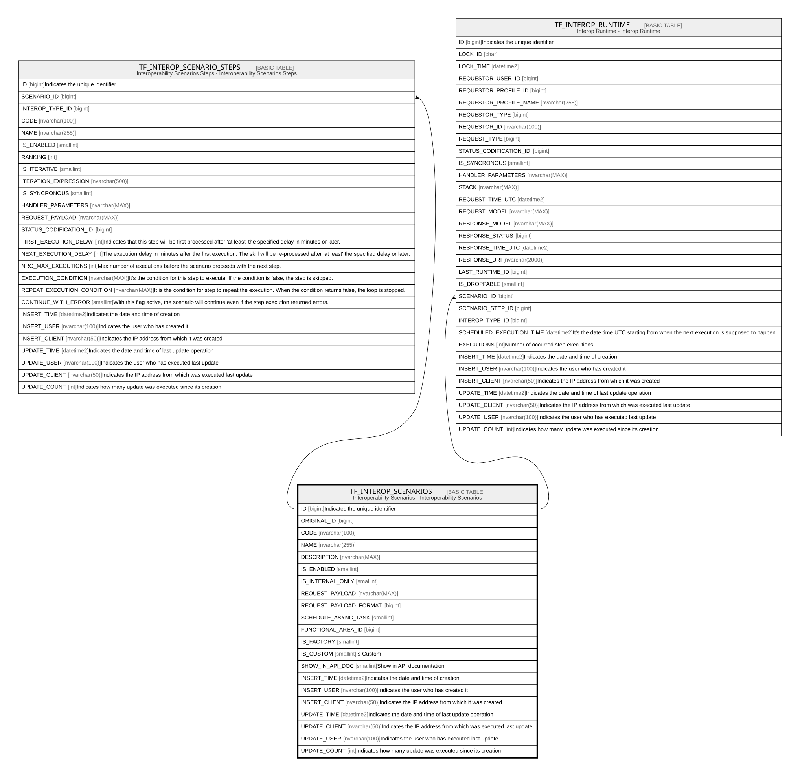

# TF_INTEROP_SCENARIOS

## Description

Interoperability Scenarios - Interoperability Scenarios  

## Columns

| Name | Type | Default | Nullable | Children | Comment |
| ---- | ---- | ------- | -------- | -------- | ------- |
| ID | bigint |  | false | [TF_INTEROP_SCENARIO_STEPS](TF_INTEROP_SCENARIO_STEPS.md) [TF_INTEROP_RUNTIME](TF_INTEROP_RUNTIME.md) | Indicates the unique identifier |
| ORIGINAL_ID | bigint |  | true |  |  |
| CODE | nvarchar(100) |  | false |  |  |
| NAME | nvarchar(255) |  | false |  |  |
| DESCRIPTION | nvarchar(MAX) |  | true |  |  |
| IS_ENABLED | smallint | ((0)) | false |  |  |
| IS_INTERNAL_ONLY | smallint | ((1)) | false |  |  |
| REQUEST_PAYLOAD | nvarchar(MAX) |  | false |  |  |
| REQUEST_PAYLOAD_FORMAT | bigint | ((0)) | false |  |  |
| SCHEDULE_ASYNC_TASK | smallint | ((0)) | false |  |  |
| FUNCTIONAL_AREA_ID | bigint |  | true |  |  |
| IS_FACTORY | smallint | ((0)) | false |  |  |
| IS_CUSTOM | smallint | ((1)) | false |  | Is Custom |
| SHOW_IN_API_DOC | smallint | ((0)) | false |  | Show in API documentation |
| INSERT_TIME | datetime2 | (sysutcdatetime()) | false |  | Indicates the date and time of creation |
| INSERT_USER | nvarchar(100) | (N'MAIN') | false |  | Indicates the user who has created it |
| INSERT_CLIENT | nvarchar(50) | (N'localhost') | false |  | Indicates the IP address from which it was created |
| UPDATE_TIME | datetime2 | (sysutcdatetime()) | false |  | Indicates the date and time of last update operation |
| UPDATE_CLIENT | nvarchar(50) | (N'localhost') | false |  | Indicates the IP address from which was executed last update |
| UPDATE_USER | nvarchar(100) | (N'MAIN') | false |  | Indicates the user who has executed last update |
| UPDATE_COUNT | int | ((0)) | false |  | Indicates how many update was executed since its creation |

## Constraints

| Name | Type | Definition |
| ---- | ---- | ---------- |
| PK_SCENARIOS | PRIMARY KEY | CLUSTERED, unique, part of a PRIMARY KEY constraint, [ ID ] |
| UQ_SCENARIO_CODE | UNIQUE | NONCLUSTERED, unique, part of a UNIQUE constraint, [ CODE, IS_CUSTOM ] |

## Indexes

| Name | Definition |
| ---- | ---------- |
| PK_SCENARIOS | CLUSTERED, unique, part of a PRIMARY KEY constraint, [ ID ] |
| UQ_SCENARIO_CODE | NONCLUSTERED, unique, part of a UNIQUE constraint, [ CODE, IS_CUSTOM ] |

## Relations

---

> Generated by [tbls](https://github.com/k1LoW/tbls)
