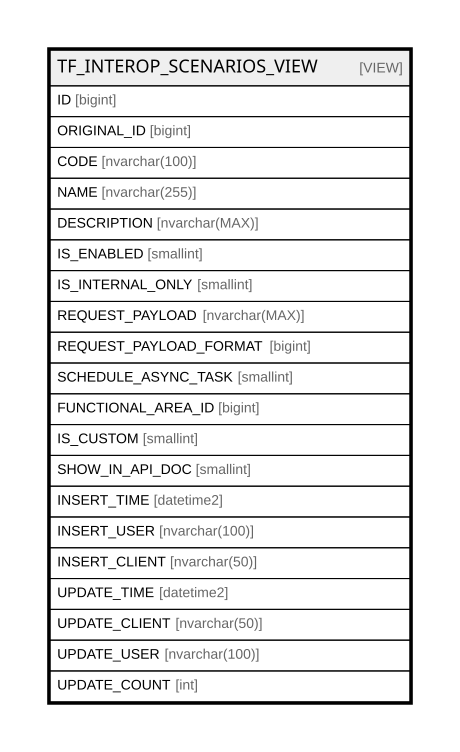

# TF_INTEROP_SCENARIOS_VIEW

## Description

<details>
<summary><strong>Table Definition</strong></summary>

```sql
-- Talentia Software - All right reserved
-- Type: VIEW                     Name: TF_INTEROP_SCENARIOS_VIEW
-- Date: 09-04-2026 07:27:59 (UTC)
-- 
-- ChangeLogId: 00000000-0000-0000-0000-000000000000
-- ChangeSetId: 8d0dc1df-f2f6-4da6-94b5-20525b24c2f7
-- Original file name: C:\repos\Talentia-Software\hcm-core/DB/ProductDB/EDM\Schema\Views\TF_INTEROP_SCENARIOS_VIEW.xml


CREATE VIEW [TF_INTEROP_SCENARIOS_VIEW]
 AS 
( 
          SELECT ID,ORIGINAL_ID,CODE,NAME,DESCRIPTION,IS_ENABLED,IS_INTERNAL_ONLY,REQUEST_PAYLOAD,REQUEST_PAYLOAD_FORMAT,SCHEDULE_ASYNC_TASK,
          FUNCTIONAL_AREA_ID,IS_CUSTOM,SHOW_IN_API_DOC,INSERT_TIME,INSERT_USER,INSERT_CLIENT,UPDATE_TIME,UPDATE_CLIENT,UPDATE_USER,UPDATE_COUNT
          FROM TF_INTEROP_SCENARIOS
          WHERE IS_CUSTOM = 1

          UNION ALL

          SELECT ID,ORIGINAL_ID,CODE,NAME,DESCRIPTION,IS_ENABLED,IS_INTERNAL_ONLY,REQUEST_PAYLOAD,REQUEST_PAYLOAD_FORMAT,SCHEDULE_ASYNC_TASK,
          FUNCTIONAL_AREA_ID,IS_FACTORY,SHOW_IN_API_DOC,INSERT_TIME,INSERT_USER,INSERT_CLIENT,UPDATE_TIME,UPDATE_CLIENT,UPDATE_USER,UPDATE_COUNT
          FROM TF_INTEROP_SCENARIOS
          WHERE IS_CUSTOM = 0 AND ID NOT IN (SELECT C.ORIGINAL_ID FROM TF_INTEROP_SCENARIOS C WHERE C.ORIGINAL_ID IS NOT NULL)
         )

```

</details>

## Columns

| Name | Type | Default | Nullable | Comment |
| ---- | ---- | ------- | -------- | ------- |
| ID | bigint |  | false |  |
| ORIGINAL_ID | bigint |  | true |  |
| CODE | nvarchar(100) |  | false |  |
| NAME | nvarchar(255) |  | false |  |
| DESCRIPTION | nvarchar(MAX) |  | true |  |
| IS_ENABLED | smallint |  | false |  |
| IS_INTERNAL_ONLY | smallint |  | false |  |
| REQUEST_PAYLOAD | nvarchar(MAX) |  | false |  |
| REQUEST_PAYLOAD_FORMAT | bigint |  | false |  |
| SCHEDULE_ASYNC_TASK | smallint |  | false |  |
| FUNCTIONAL_AREA_ID | bigint |  | true |  |
| IS_CUSTOM | smallint |  | false |  |
| SHOW_IN_API_DOC | smallint |  | false |  |
| INSERT_TIME | datetime2 |  | false |  |
| INSERT_USER | nvarchar(100) |  | false |  |
| INSERT_CLIENT | nvarchar(50) |  | false |  |
| UPDATE_TIME | datetime2 |  | false |  |
| UPDATE_CLIENT | nvarchar(50) |  | false |  |
| UPDATE_USER | nvarchar(100) |  | false |  |
| UPDATE_COUNT | int |  | false |  |

## Referenced Tables

| Name | Columns | Comment | Type |
| ---- | ------- | ------- | ---- |
| [TF_INTEROP_SCENARIOS](TF_INTEROP_SCENARIOS.md) | 21 | Interoperability Scenarios - Interoperability Scenarios<br /> | BASIC TABLE |

## Relations



---

> Generated by [tbls](https://github.com/k1LoW/tbls)
