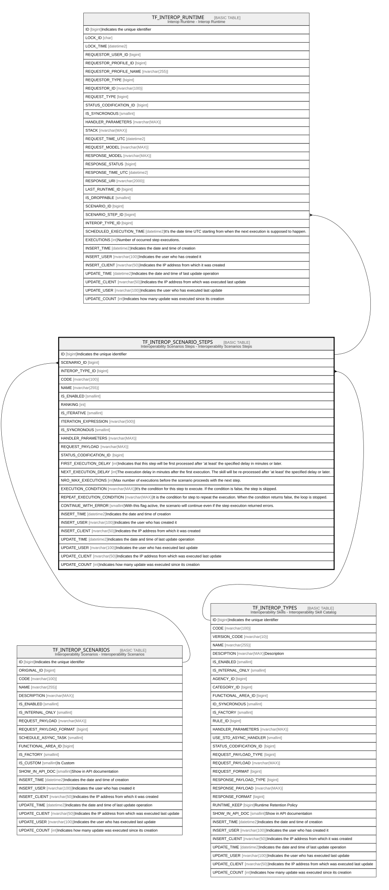

# TF_INTEROP_SCENARIO_STEPS

## Description

Interoperability Scenarios Steps - Interoperability Scenarios Steps  

## Columns

| Name | Type | Default | Nullable | Children | Parents | Comment |
| ---- | ---- | ------- | -------- | -------- | ------- | ------- |
| ID | bigint |  | false | [TF_INTEROP_RUNTIME](TF_INTEROP_RUNTIME.md) |  | Indicates the unique identifier |
| SCENARIO_ID | bigint |  | false |  | [TF_INTEROP_SCENARIOS](TF_INTEROP_SCENARIOS.md) |  |
| INTEROP_TYPE_ID | bigint |  | false |  | [TF_INTEROP_TYPES](TF_INTEROP_TYPES.md) |  |
| CODE | nvarchar(100) |  | false |  |  |  |
| NAME | nvarchar(255) |  | false |  |  |  |
| IS_ENABLED | smallint | ((1)) | true |  |  |  |
| RANKING | int | ((0)) | false |  |  |  |
| IS_ITERATIVE | smallint | ((0)) | false |  |  |  |
| ITERATION_EXPRESSION | nvarchar(500) |  | true |  |  |  |
| IS_SYNCRONOUS | smallint | ((1)) | false |  |  |  |
| HANDLER_PARAMETERS | nvarchar(MAX) |  | true |  |  |  |
| REQUEST_PAYLOAD | nvarchar(MAX) |  | false |  |  |  |
| STATUS_CODIFICATION_ID | bigint |  | true |  |  |  |
| FIRST_EXECUTION_DELAY | int | ((30)) | false |  |  | Indicates that this step will be first processed after 'at least' the specified delay in minutes or later. |
| NEXT_EXECUTION_DELAY | int | ((30)) | false |  |  | The execution delay in minutes after the first execution. The skill will be re-processed after 'at least' the specified delay or later. |
| NRO_MAX_EXECUTIONS | int |  | true |  |  | Max number of executions before the scenario proceeds with the next step. |
| EXECUTION_CONDITION | nvarchar(MAX) |  | true |  |  | It's the condition for this step to execute. If the condition is false, the step is skipped. |
| REPEAT_EXECUTION_CONDITION | nvarchar(MAX) |  | true |  |  | It is the condition for step to repeat the execution. When the condition returns false, the loop is stopped. |
| CONTINUE_WITH_ERROR | smallint | ((0)) | false |  |  | With this flag active, the scenario will continue even if the step execution returned errors. |
| INSERT_TIME | datetime2 | (sysutcdatetime()) | false |  |  | Indicates the date and time of creation |
| INSERT_USER | nvarchar(100) | (N'MAIN') | false |  |  | Indicates the user who has created it |
| INSERT_CLIENT | nvarchar(50) | (N'localhost') | false |  |  | Indicates the IP address from which it was created |
| UPDATE_TIME | datetime2 | (sysutcdatetime()) | false |  |  | Indicates the date and time of last update operation |
| UPDATE_USER | nvarchar(100) | (N'MAIN') | false |  |  | Indicates the user who has executed last update |
| UPDATE_CLIENT | nvarchar(50) | (N'localhost') | false |  |  | Indicates the IP address from which was executed last update |
| UPDATE_COUNT | int | ((0)) | false |  |  | Indicates how many update was executed since its creation |

## Constraints

| Name | Type | Definition |
| ---- | ---- | ---------- |
| PK_INTEROP_SCDENARIO_STEPS | PRIMARY KEY | CLUSTERED, unique, part of a PRIMARY KEY constraint, [ ID ] |
| UQ_STEP_CODE | UNIQUE | NONCLUSTERED, unique, part of a UNIQUE constraint, [ SCENARIO_ID, CODE ] |
| FK_SCENARIOS_STEPS | FOREIGN KEY | FOREIGN KEY(SCENARIO_ID) REFERENCES TF_INTEROP_SCENARIOS(ID) ON UPDATE NO_ACTION ON DELETE NO_ACTION |
| FK_TYPES_SCENARIOS | FOREIGN KEY | FOREIGN KEY(INTEROP_TYPE_ID) REFERENCES TF_INTEROP_TYPES(ID) ON UPDATE NO_ACTION ON DELETE NO_ACTION |

## Indexes

| Name | Definition |
| ---- | ---------- |
| PK_INTEROP_SCDENARIO_STEPS | CLUSTERED, unique, part of a PRIMARY KEY constraint, [ ID ] |
| UQ_STEP_CODE | NONCLUSTERED, unique, part of a UNIQUE constraint, [ SCENARIO_ID, CODE ] |

## Relations

---

> Generated by [tbls](https://github.com/k1LoW/tbls)
