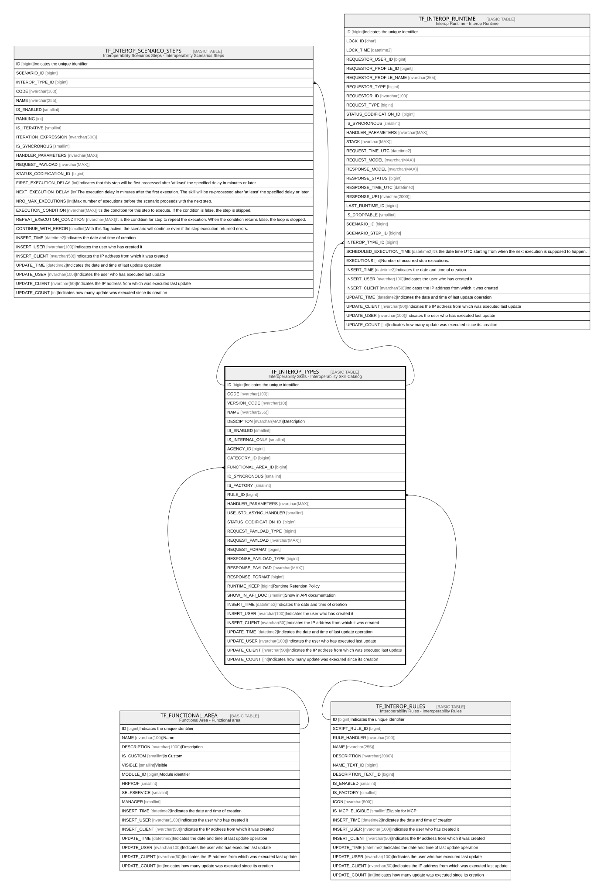

# TF_INTEROP_TYPES

## Description

Interoperability Skills - Interoperability Skill Catalog  

## Columns

| Name | Type | Default | Nullable | Children | Parents | Comment |
| ---- | ---- | ------- | -------- | -------- | ------- | ------- |
| ID | bigint |  | false | [TF_INTEROP_SCENARIO_STEPS](TF_INTEROP_SCENARIO_STEPS.md) [TF_INTEROP_RUNTIME](TF_INTEROP_RUNTIME.md) |  | Indicates the unique identifier |
| CODE | nvarchar(100) |  | false |  |  |  |
| VERSION_CODE | nvarchar(10) |  | false |  |  |  |
| NAME | nvarchar(255) |  | false |  |  |  |
| DESCIPTION | nvarchar(MAX) |  | true |  |  | Description |
| IS_ENABLED | smallint | ((0)) | false |  |  |  |
| IS_INTERNAL_ONLY | smallint | ((1)) | false |  |  |  |
| AGENCY_ID | bigint |  | true |  |  |  |
| CATEGORY_ID | bigint |  | true |  |  |  |
| FUNCTIONAL_AREA_ID | bigint |  | true |  | [TF_FUNCTIONAL_AREA](TF_FUNCTIONAL_AREA.md) |  |
| ID_SYNCRONOUS | smallint | ((1)) | false |  |  |  |
| IS_FACTORY | smallint | ((0)) | false |  |  |  |
| RULE_ID | bigint |  | false |  | [TF_INTEROP_RULES](TF_INTEROP_RULES.md) |  |
| HANDLER_PARAMETERS | nvarchar(MAX) |  | true |  |  |  |
| USE_STD_ASYNC_HANDLER | smallint | ((1)) | true |  |  |  |
| STATUS_CODIFICATION_ID | bigint |  | true |  |  |  |
| REQUEST_PAYLOAD_TYPE | bigint |  | false |  |  |  |
| REQUEST_PAYLOAD | nvarchar(MAX) |  | true |  |  |  |
| REQUEST_FORMAT | bigint |  | false |  |  |  |
| RESPONSE_PAYLOAD_TYPE | bigint |  | false |  |  |  |
| RESPONSE_PAYLOAD | nvarchar(MAX) |  | true |  |  |  |
| RESPONSE_FORMAT | bigint |  | false |  |  |  |
| RUNTIME_KEEP | bigint |  | false |  |  | Runtime Retention Policy |
| SHOW_IN_API_DOC | smallint | ((0)) | false |  |  | Show in API documentation |
| INSERT_TIME | datetime2 | (sysutcdatetime()) | false |  |  | Indicates the date and time of creation |
| INSERT_USER | nvarchar(100) | (N'MAIN') | false |  |  | Indicates the user who has created it |
| INSERT_CLIENT | nvarchar(50) | (N'localhost') | false |  |  | Indicates the IP address from which it was created |
| UPDATE_TIME | datetime2 | (sysutcdatetime()) | false |  |  | Indicates the date and time of last update operation |
| UPDATE_USER | nvarchar(100) | (N'MAIN') | false |  |  | Indicates the user who has executed last update |
| UPDATE_CLIENT | nvarchar(50) | (N'localhost') | false |  |  | Indicates the IP address from which was executed last update |
| UPDATE_COUNT | int | ((0)) | false |  |  | Indicates how many update was executed since its creation |

## Constraints

| Name | Type | Definition |
| ---- | ---- | ---------- |
| PK_TF_INTEROP_TYPES | PRIMARY KEY | CLUSTERED, unique, part of a PRIMARY KEY constraint, [ ID ] |
| UQ_TF_INTEROP_TYPES | UNIQUE | NONCLUSTERED, unique, part of a UNIQUE constraint, [ CODE, VERSION_CODE ] |
| FK_INTEROP_TYPES_FUNC_AREA | FOREIGN KEY | FOREIGN KEY(FUNCTIONAL_AREA_ID) REFERENCES TF_FUNCTIONAL_AREA(ID) ON UPDATE NO_ACTION ON DELETE NO_ACTION |
| FK_RULE_TYPE | FOREIGN KEY | FOREIGN KEY(RULE_ID) REFERENCES TF_INTEROP_RULES(ID) ON UPDATE NO_ACTION ON DELETE NO_ACTION |

## Indexes

| Name | Definition |
| ---- | ---------- |
| PK_TF_INTEROP_TYPES | CLUSTERED, unique, part of a PRIMARY KEY constraint, [ ID ] |
| UQ_TF_INTEROP_TYPES | NONCLUSTERED, unique, part of a UNIQUE constraint, [ CODE, VERSION_CODE ] |

## Relations

---

> Generated by [tbls](https://github.com/k1LoW/tbls)
