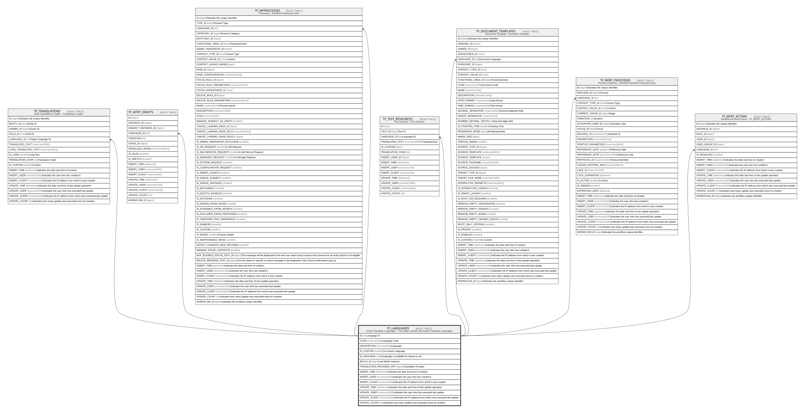

# TF_LANGUAGES

## Description

Smart Translator Languages - This entity contains the Smart Translator Languages  

## Columns

| Name | Type | Default | Nullable | Children | Comment |
| ---- | ---- | ------- | -------- | -------- | ------- |
| ID | int |  | false | [TF_TRANSLATIONS](TF_TRANSLATIONS.md) [TF_WFRT_DRAFTS](TF_WFRT_DRAFTS.md) [TF_WFPROCESSES](TF_WFPROCESSES.md) [TF_TEXT_RESOURCES](TF_TEXT_RESOURCES.md) [TF_DOCUMENT_TEMPLATES](TF_DOCUMENT_TEMPLATES.md) [TF_WFRT_PROCESSES](TF_WFRT_PROCESSES.md) [TF_WFRT_ACTORS](TF_WFRT_ACTORS.md) | Language ID |
| CODE | nvarchar(50) |  | true |  | Language Code |
| DESCRIPTION | nvarchar(50) |  | true |  | Language |
| IS_CUSTOM | smallint | ((0)) | false |  | Is Custom Language |
| IS_AVAILABLE | int | ((0)) | false |  | If language is available for tenant or not |
| BATCH_ID | bigint |  | true |  | Last Batch Instance |
| TRANSLATION_PROVIDER_APP | bigint |  | true |  | Translation Provider |
| INSERT_TIME | datetime2 | (sysutcdatetime()) | false |  | Indicates the date and time of creation |
| INSERT_USER | nvarchar(100) | (N'MAIN') | false |  | Indicates the user who has created it |
| INSERT_CLIENT | nvarchar(50) | (N'localhost') | false |  | Indicates the IP address from which it was created |
| UPDATE_TIME | datetime2 | (sysutcdatetime()) | false |  | Indicates the date and time of last update operation |
| UPDATE_USER | nvarchar(100) | (N'MAIN') | false |  | Indicates the user who has executed last update |
| UPDATE_CLIENT | nvarchar(50) | (N'localhost') | false |  | Indicates the IP address from which was executed last update |
| UPDATE_COUNT | int | ((0)) | false |  | Indicates how many update was executed since its creation |

## Constraints

| Name | Type | Definition |
| ---- | ---- | ---------- |
| PK_LANGUAGES | PRIMARY KEY | CLUSTERED, unique, part of a PRIMARY KEY constraint, [ ID ] |

## Indexes

| Name | Definition |
| ---- | ---------- |
| PK_LANGUAGES | CLUSTERED, unique, part of a PRIMARY KEY constraint, [ ID ] |

## Relations

---

> Generated by [tbls](https://github.com/k1LoW/tbls)
