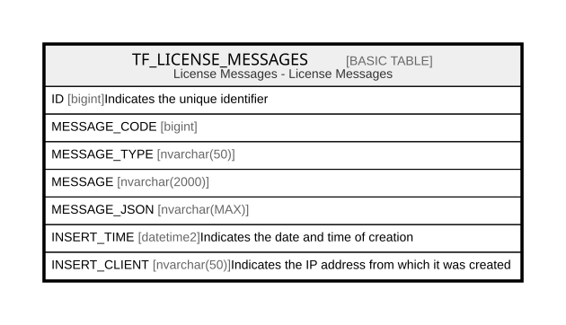

# TF_LICENSE_MESSAGES

## Description

License Messages - License Messages  

## Columns

| Name | Type | Default | Nullable | Comment |
| ---- | ---- | ------- | -------- | ------- |
| ID | bigint |  | false | Indicates the unique identifier |
| MESSAGE_CODE | bigint |  | false |  |
| MESSAGE_TYPE | nvarchar(50) |  | false |  |
| MESSAGE | nvarchar(2000) |  | false |  |
| MESSAGE_JSON | nvarchar(MAX) |  | true |  |
| INSERT_TIME | datetime2 | (sysutcdatetime()) | false | Indicates the date and time of creation |
| INSERT_CLIENT | nvarchar(50) | (N'localhost') | false | Indicates the IP address from which it was created |

## Constraints

| Name | Type | Definition |
| ---- | ---- | ---------- |
| PK_LICENSE_MESSAGES | PRIMARY KEY | CLUSTERED, unique, part of a PRIMARY KEY constraint, [ ID ] |

## Indexes

| Name | Definition |
| ---- | ---------- |
| PK_LICENSE_MESSAGES | CLUSTERED, unique, part of a PRIMARY KEY constraint, [ ID ] |

## Relations

---

> Generated by [tbls](https://github.com/k1LoW/tbls)
