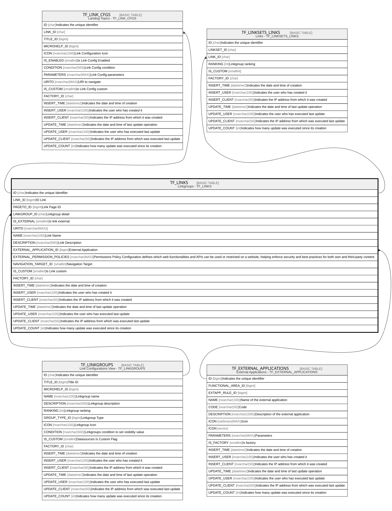

# TF_LINKS

## Description

Linkgroups - TF_LINKS  

## Columns

| Name | Type | Default | Nullable | Children | Parents | Comment |
| ---- | ---- | ------- | -------- | -------- | ------- | ------- |
| ID | char |  | false | [TF_LINK_CFGS](TF_LINK_CFGS.md) [TF_LINKSETS_LINKS](TF_LINKSETS_LINKS.md) |  | Indicates the unique identifier |
| LINK_ID | bigint |  | false |  |  | ID Link |
| PAGETO_ID | bigint |  | true |  |  | Link Page ID |
| LINKGROUP_ID | char |  | true |  | [TF_LINKGROUPS](TF_LINKGROUPS.md) | Linkgroup detail |
| IS_EXTERNAL | smallint | ((0)) | false |  |  | Is link external |
| URITO | nvarchar(MAX) |  | true |  |  |  |
| NAME | nvarchar(100) |  | false |  |  | Link Name |
| DESCRIPTION | nvarchar(500) |  | true |  |  | Link Description |
| EXTERNAL_APPLICATION_ID | bigint |  | true |  | [TF_EXTERNAL_APPLICATIONS](TF_EXTERNAL_APPLICATIONS.md) | External Application |
| EXTERNAL_PERMISSION_POLICIES | nvarchar(MAX) |  | true |  |  | Permissions Policy Configuration defines which web functionalities and APIs can be used or restricted on a website, helping enforce security and best practices for both own and third-party content. |
| NAVIGATION_TARGET_ID | smallint |  | true |  |  | Navigation Target |
| IS_CUSTOM | smallint |  | false |  |  | Is Link custom |
| FACTORY_ID | char |  | true |  |  |  |
| INSERT_TIME | datetime2 | (sysutcdatetime()) | false |  |  | Indicates the date and time of creation |
| INSERT_USER | nvarchar(100) | (N'MAIN') | false |  |  | Indicates the user who has created it |
| INSERT_CLIENT | nvarchar(50) | (N'localhost') | false |  |  | Indicates the IP address from which it was created |
| UPDATE_TIME | datetime2 | (sysutcdatetime()) | false |  |  | Indicates the date and time of last update operation |
| UPDATE_USER | nvarchar(100) | (N'MAIN') | false |  |  | Indicates the user who has executed last update |
| UPDATE_CLIENT | nvarchar(50) | (N'localhost') | false |  |  | Indicates the IP address from which was executed last update |
| UPDATE_COUNT | int | ((0)) | false |  |  | Indicates how many update was executed since its creation |

## Constraints

| Name | Type | Definition |
| ---- | ---- | ---------- |
| PK_LINKS | PRIMARY KEY | CLUSTERED, unique, part of a PRIMARY KEY constraint, [ ID ] |
| UQ_LINKS | UNIQUE | NONCLUSTERED, unique, part of a UNIQUE constraint, [ LINK_ID, IS_CUSTOM ] |
| UQ_LINKSNAME | UNIQUE | NONCLUSTERED, unique, part of a UNIQUE constraint, [ NAME, IS_CUSTOM ] |
| FK_LINKS_EXTAPPS | FOREIGN KEY | FOREIGN KEY(EXTERNAL_APPLICATION_ID) REFERENCES TF_EXTERNAL_APPLICATIONS(ID) ON UPDATE NO_ACTION ON DELETE NO_ACTION |
| FK_LINKS_LINKGROUPS | FOREIGN KEY | FOREIGN KEY(LINKGROUP_ID) REFERENCES TF_LINKGROUPS(ID) ON UPDATE NO_ACTION ON DELETE NO_ACTION |

## Indexes

| Name | Definition |
| ---- | ---------- |
| PK_LINKS | CLUSTERED, unique, part of a PRIMARY KEY constraint, [ ID ] |
| UQ_LINKS | NONCLUSTERED, unique, part of a UNIQUE constraint, [ LINK_ID, IS_CUSTOM ] |
| UQ_LINKSNAME | NONCLUSTERED, unique, part of a UNIQUE constraint, [ NAME, IS_CUSTOM ] |
| IDX_LINKS_CUSTOM_FACTORY | NONCLUSTERED, [ FACTORY_ID, IS_CUSTOM ] |

## Relations

---

> Generated by [tbls](https://github.com/k1LoW/tbls)
