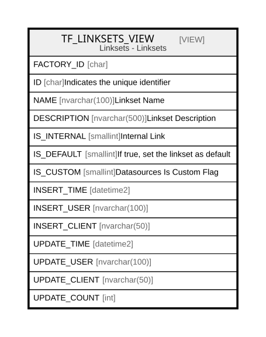

# TF_LINKSETS_VIEW

## Description

Linksets - Linksets  


<details>
<summary><strong>Table Definition</strong></summary>

```sql
-- Talentia Software - All right reserved
-- Type: VIEW                     Name: TF_LINKSETS_VIEW
-- Date: 09-04-2026 07:27:59 (UTC)
-- 
-- ChangeLogId: 00000000-0000-0000-0000-000000000000
-- ChangeSetId: 3955fa96-5d31-4baa-b783-5e692131900a
-- Original file name: C:\repos\Talentia-Software\hcm-core/DB/ProductDB/EDM\Schema\Views\TF_LINKSETS_VIEW.xml


CREATE VIEW [TF_LINKSETS_VIEW]
 AS 
( 
          SELECT FACTORY_ID,
                 ID,
                 NAME,
                 DESCRIPTION,
                 IS_INTERNAL,
                 IS_DEFAULT,
                 IS_CUSTOM,
                 INSERT_TIME,
                 INSERT_USER,
                 INSERT_CLIENT,
                 UPDATE_TIME,
                 UPDATE_USER,
                 UPDATE_CLIENT,
                 UPDATE_COUNT
          FROM TF_LINKSETS
          WHERE IS_CUSTOM = 1
          UNION ALL
          SELECT FACTORY_ID,
                 ID,
                 NAME,
                 DESCRIPTION,
                 IS_INTERNAL,
                 IS_DEFAULT,
                 IS_CUSTOM,
                 INSERT_TIME,
                 INSERT_USER,
                 INSERT_CLIENT,
                 UPDATE_TIME,
                 UPDATE_USER,
                 UPDATE_CLIENT,
                 UPDATE_COUNT
          FROM TF_LINKSETS
          WHERE IS_CUSTOM = 0 AND NOT EXISTS (SELECT ID FROM TF_LINKSETS LS WHERE LS.IS_CUSTOM = 1 AND TF_LINKSETS.ID = LS.FACTORY_ID)
         )

```

</details>

## Columns

| Name | Type | Default | Nullable | Comment |
| ---- | ---- | ------- | -------- | ------- |
| FACTORY_ID | char |  | true |  |
| ID | char |  | false | Indicates the unique identifier |
| NAME | nvarchar(100) |  | false | Linkset Name |
| DESCRIPTION | nvarchar(500) |  | true | Linkset Description |
| IS_INTERNAL | smallint |  | false | Internal Link |
| IS_DEFAULT | smallint |  | false | If true, set the linkset as default |
| IS_CUSTOM | smallint |  | false | Datasources Is Custom Flag |
| INSERT_TIME | datetime2 |  | false |  |
| INSERT_USER | nvarchar(100) |  | false |  |
| INSERT_CLIENT | nvarchar(50) |  | false |  |
| UPDATE_TIME | datetime2 |  | false |  |
| UPDATE_USER | nvarchar(100) |  | false |  |
| UPDATE_CLIENT | nvarchar(50) |  | false |  |
| UPDATE_COUNT | int |  | false |  |

## Referenced Tables

| Name | Columns | Comment | Type |
| ---- | ------- | ------- | ---- |
| [TF_LINKSETS](TF_LINKSETS.md) | 14 | Link sets - Link sets<br /> | BASIC TABLE |

## Relations



---

> Generated by [tbls](https://github.com/k1LoW/tbls)
