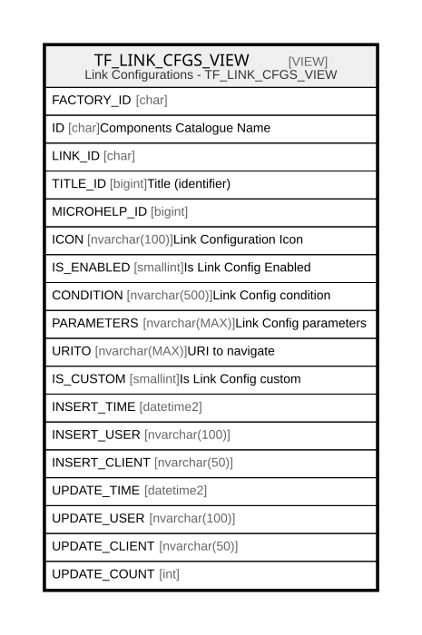

# TF_LINK_CFGS_VIEW

## Description

Link Configurations - TF_LINK_CFGS_VIEW  


<details>
<summary><strong>Table Definition</strong></summary>

```sql
-- Talentia Software - All right reserved
-- Type: VIEW                     Name: TF_LINK_CFGS_VIEW
-- Date: 09-04-2026 07:27:59 (UTC)
-- 
-- ChangeLogId: 00000000-0000-0000-0000-000000000000
-- ChangeSetId: b969ddb7-715a-4d84-94e1-876684f1828c
-- Original file name: C:\repos\Talentia-Software\hcm-core/DB/ProductDB/EDM\Schema\Views\TF_LINK_CFGS_VIEW.xml


CREATE VIEW [TF_LINK_CFGS_VIEW]
 AS 
( 
          SELECT FACTORY_ID,
          ID,
          LINK_ID,
          TITLE_ID,
          MICROHELP_ID,
          ICON,
          IS_ENABLED,
          CONDITION,
          PARAMETERS,
          URITO,
          IS_CUSTOM,          
          INSERT_TIME,
          INSERT_USER,
          INSERT_CLIENT,
          UPDATE_TIME,
          UPDATE_USER,
          UPDATE_CLIENT,
          UPDATE_COUNT
          FROM TF_LINK_CFGS
          WHERE IS_CUSTOM = 1
          UNION ALL
          SELECT FACTORY_ID,
          ID,
          LINK_ID,
          TITLE_ID,
          MICROHELP_ID,
          ICON,
          IS_ENABLED,
          CONDITION,
          PARAMETERS,
          URITO,
          IS_CUSTOM,          
          INSERT_TIME,
          INSERT_USER,
          INSERT_CLIENT,
          UPDATE_TIME,
          UPDATE_USER,
          UPDATE_CLIENT,
          UPDATE_COUNT
          FROM TF_LINK_CFGS
          WHERE IS_CUSTOM = 0 AND NOT EXISTS (SELECT ID FROM TF_LINK_CFGS LC WHERE LC.IS_CUSTOM = 1 AND TF_LINK_CFGS.ID = LC.FACTORY_ID)
         )

```

</details>

## Columns

| Name | Type | Default | Nullable | Comment |
| ---- | ---- | ------- | -------- | ------- |
| FACTORY_ID | char |  | true |  |
| ID | char |  | false | Components Catalogue Name |
| LINK_ID | char |  | false |  |
| TITLE_ID | bigint |  | false | Title (identifier) |
| MICROHELP_ID | bigint |  | false |  |
| ICON | nvarchar(100) |  | false | Link Configuration Icon |
| IS_ENABLED | smallint |  | false | Is Link Config Enabled |
| CONDITION | nvarchar(500) |  | true | Link Config condition |
| PARAMETERS | nvarchar(MAX) |  | true | Link Config parameters |
| URITO | nvarchar(MAX) |  | true | URI to navigate |
| IS_CUSTOM | smallint |  | false | Is Link Config custom |
| INSERT_TIME | datetime2 |  | false |  |
| INSERT_USER | nvarchar(100) |  | false |  |
| INSERT_CLIENT | nvarchar(50) |  | false |  |
| UPDATE_TIME | datetime2 |  | false |  |
| UPDATE_USER | nvarchar(100) |  | false |  |
| UPDATE_CLIENT | nvarchar(50) |  | false |  |
| UPDATE_COUNT | int |  | false |  |

## Referenced Tables

| Name | Columns | Comment | Type |
| ---- | ------- | ------- | ---- |
| [TF_LINK_CFGS](TF_LINK_CFGS.md) | 18 | Landing Topics - TF_LINK_CFGS<br /> | BASIC TABLE |

## Relations



---

> Generated by [tbls](https://github.com/k1LoW/tbls)
