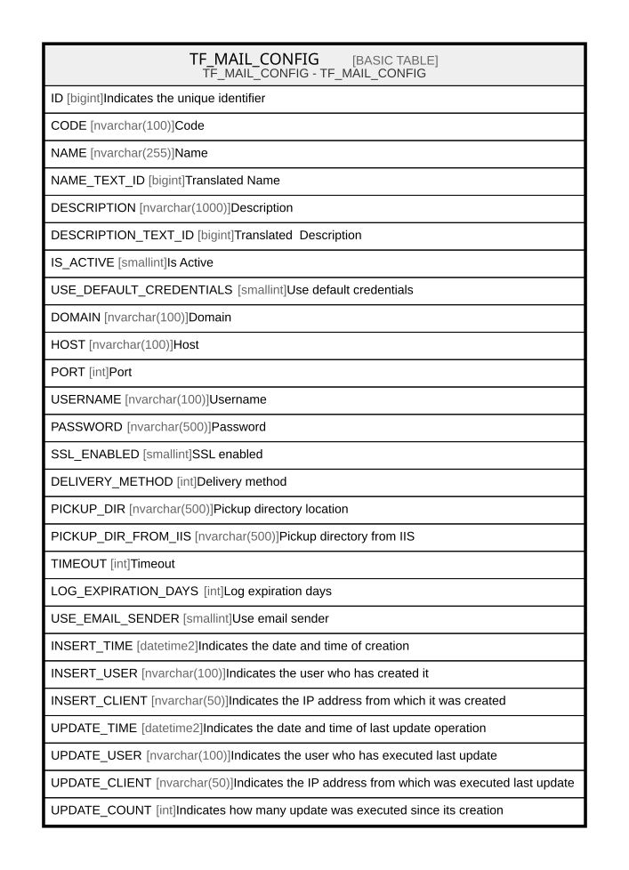

# TF_MAIL_CONFIG

## Description

TF_MAIL_CONFIG - TF_MAIL_CONFIG  

## Columns

| Name | Type | Default | Nullable | Comment |
| ---- | ---- | ------- | -------- | ------- |
| ID | bigint |  | false | Indicates the unique identifier |
| CODE | nvarchar(100) |  | false | Code |
| NAME | nvarchar(255) |  | false | Name |
| NAME_TEXT_ID | bigint |  | true | Translated Name |
| DESCRIPTION | nvarchar(1000) |  | true | Description |
| DESCRIPTION_TEXT_ID | bigint |  | true | Translated  Description |
| IS_ACTIVE | smallint | ((0)) | false | Is Active |
| USE_DEFAULT_CREDENTIALS | smallint | ((1)) | false | Use default credentials |
| DOMAIN | nvarchar(100) |  | true | Domain |
| HOST | nvarchar(100) |  | false | Host |
| PORT | int | ((587)) | true | Port |
| USERNAME | nvarchar(100) |  | true | Username |
| PASSWORD | nvarchar(500) |  | true | Password |
| SSL_ENABLED | smallint | ((0)) | false | SSL enabled |
| DELIVERY_METHOD | int | ((0)) | false | Delivery method |
| PICKUP_DIR | nvarchar(500) |  | true | Pickup directory location |
| PICKUP_DIR_FROM_IIS | nvarchar(500) |  | true | Pickup directory from IIS |
| TIMEOUT | int | ((10000)) | false | Timeout |
| LOG_EXPIRATION_DAYS | int | ((90)) | false | Log expiration days |
| USE_EMAIL_SENDER | smallint | ((1)) | false | Use email sender |
| INSERT_TIME | datetime2 | (sysutcdatetime()) | false | Indicates the date and time of creation |
| INSERT_USER | nvarchar(100) | (N'MAIN') | false | Indicates the user who has created it |
| INSERT_CLIENT | nvarchar(50) | (N'localhost') | false | Indicates the IP address from which it was created |
| UPDATE_TIME | datetime2 | (sysutcdatetime()) | false | Indicates the date and time of last update operation |
| UPDATE_USER | nvarchar(100) | (N'MAIN') | false | Indicates the user who has executed last update |
| UPDATE_CLIENT | nvarchar(50) | (N'localhost') | false | Indicates the IP address from which was executed last update |
| UPDATE_COUNT | int | ((0)) | false | Indicates how many update was executed since its creation |

## Constraints

| Name | Type | Definition |
| ---- | ---- | ---------- |
| PK_MAIL_CONFIG | PRIMARY KEY | CLUSTERED, unique, part of a PRIMARY KEY constraint, [ ID ] |
| UQ_MAIL_CONIG_CODES | UNIQUE | NONCLUSTERED, unique, part of a UNIQUE constraint, [ CODE ] |

## Indexes

| Name | Definition |
| ---- | ---------- |
| PK_MAIL_CONFIG | CLUSTERED, unique, part of a PRIMARY KEY constraint, [ ID ] |
| UQ_MAIL_CONIG_CODES | NONCLUSTERED, unique, part of a UNIQUE constraint, [ CODE ] |

## Relations

---

> Generated by [tbls](https://github.com/k1LoW/tbls)
