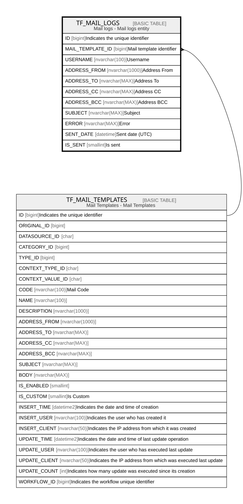

# TF_MAIL_LOGS

## Description

Mail logs - Mail logs entity  

## Columns

| Name | Type | Default | Nullable | Parents | Comment |
| ---- | ---- | ------- | -------- | ------- | ------- |
| ID | bigint |  | false |  | Indicates the unique identifier |
| MAIL_TEMPLATE_ID | bigint |  | true | [TF_MAIL_TEMPLATES](TF_MAIL_TEMPLATES.md) | Mail template identifier |
| USERNAME | nvarchar(100) |  | false |  | Username |
| ADDRESS_FROM | nvarchar(1000) |  | true |  | Address From |
| ADDRESS_TO | nvarchar(MAX) |  | true |  | Address To |
| ADDRESS_CC | nvarchar(MAX) |  | true |  | Address CC |
| ADDRESS_BCC | nvarchar(MAX) |  | true |  | Address BCC |
| SUBJECT | nvarchar(MAX) |  | true |  | Subject |
| ERROR | nvarchar(MAX) |  | true |  | Error |
| SENT_DATE | datetime |  | false |  | Sent date (UTC) |
| IS_SENT | smallint | ((1)) | false |  | Is sent |

## Constraints

| Name | Type | Definition |
| ---- | ---- | ---------- |
| PK_MAIL_LOGS | PRIMARY KEY | CLUSTERED, unique, part of a PRIMARY KEY constraint, [ ID ] |
| FK_MAILLOGS_MAILTEMPLATES | FOREIGN KEY | FOREIGN KEY(MAIL_TEMPLATE_ID) REFERENCES TF_MAIL_TEMPLATES(ID) ON UPDATE NO_ACTION ON DELETE SET_NULL |

## Indexes

| Name | Definition |
| ---- | ---------- |
| PK_MAIL_LOGS | CLUSTERED, unique, part of a PRIMARY KEY constraint, [ ID ] |
| IDX_MAIL_LOGS_SENTDATE | NONCLUSTERED, [ SENT_DATE ] |

## Relations

---

> Generated by [tbls](https://github.com/k1LoW/tbls)
