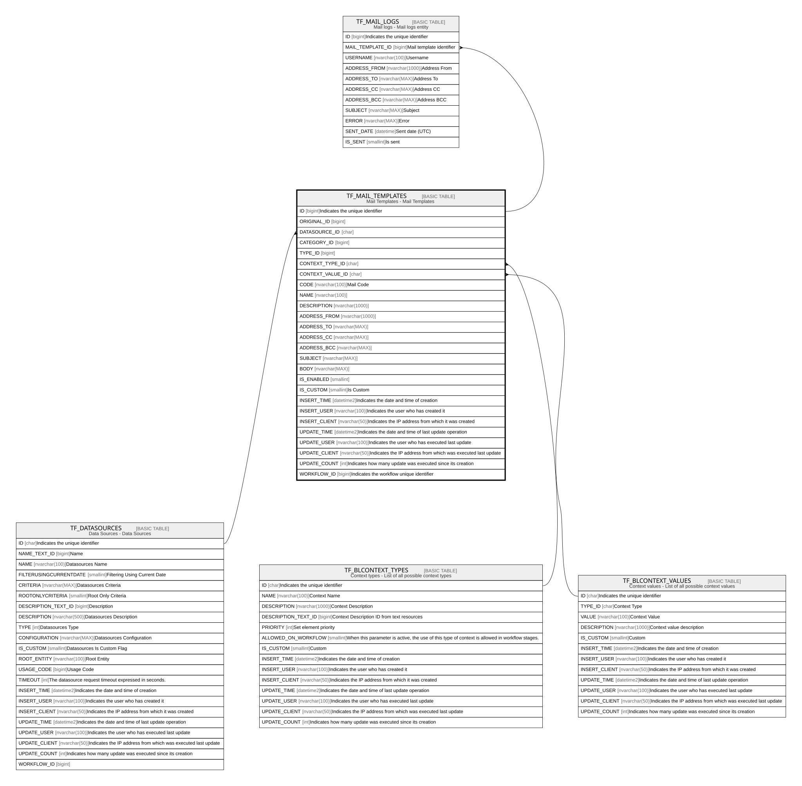

# TF_MAIL_TEMPLATES

## Description

Mail Templates - Mail Templates  

## Columns

| Name | Type | Default | Nullable | Children | Parents | Comment |
| ---- | ---- | ------- | -------- | -------- | ------- | ------- |
| ID | bigint |  | false | [TF_MAIL_LOGS](TF_MAIL_LOGS.md) |  | Indicates the unique identifier |
| ORIGINAL_ID | bigint |  | true |  |  |  |
| DATASOURCE_ID | char |  | true |  | [TF_DATASOURCES](TF_DATASOURCES.md) |  |
| CATEGORY_ID | bigint |  | true |  |  |  |
| TYPE_ID | bigint |  | false |  |  |  |
| CONTEXT_TYPE_ID | char | ('00000000-0000-0000-0000-000000000001') | false |  | [TF_BLCONTEXT_TYPES](TF_BLCONTEXT_TYPES.md) |  |
| CONTEXT_VALUE_ID | char |  | true |  | [TF_BLCONTEXT_VALUES](TF_BLCONTEXT_VALUES.md) |  |
| CODE | nvarchar(100) |  | false |  |  | Mail Code |
| NAME | nvarchar(100) |  | false |  |  |  |
| DESCRIPTION | nvarchar(1000) |  | true |  |  |  |
| ADDRESS_FROM | nvarchar(1000) |  | false |  |  |  |
| ADDRESS_TO | nvarchar(MAX) |  | true |  |  |  |
| ADDRESS_CC | nvarchar(MAX) |  | true |  |  |  |
| ADDRESS_BCC | nvarchar(MAX) |  | true |  |  |  |
| SUBJECT | nvarchar(MAX) |  | false |  |  |  |
| BODY | nvarchar(MAX) |  | false |  |  |  |
| IS_ENABLED | smallint | ((0)) | false |  |  |  |
| IS_CUSTOM | smallint |  | false |  |  | Is Custom |
| INSERT_TIME | datetime2 | (sysutcdatetime()) | false |  |  | Indicates the date and time of creation |
| INSERT_USER | nvarchar(100) | (N'MAIN') | false |  |  | Indicates the user who has created it |
| INSERT_CLIENT | nvarchar(50) | (N'localhost') | false |  |  | Indicates the IP address from which it was created |
| UPDATE_TIME | datetime2 | (sysutcdatetime()) | false |  |  | Indicates the date and time of last update operation |
| UPDATE_USER | nvarchar(100) | (N'MAIN') | false |  |  | Indicates the user who has executed last update |
| UPDATE_CLIENT | nvarchar(50) | (N'localhost') | false |  |  | Indicates the IP address from which was executed last update |
| UPDATE_COUNT | int | ((0)) | false |  |  | Indicates how many update was executed since its creation |
| WORKFLOW_ID | bigint |  | true |  |  | Indicates the workflow unique identifier |

## Constraints

| Name | Type | Definition |
| ---- | ---- | ---------- |
| PK_MAILTEMPLATES | PRIMARY KEY | CLUSTERED, unique, part of a PRIMARY KEY constraint, [ ID ] |
| UQ_MAILTEMPLATES | UNIQUE | NONCLUSTERED, unique, part of a UNIQUE constraint, [ CODE, IS_CUSTOM ] |
| FK_MAILTEMPLATES_CTXS_TYPES | FOREIGN KEY | FOREIGN KEY(CONTEXT_TYPE_ID) REFERENCES TF_BLCONTEXT_TYPES(ID) ON UPDATE NO_ACTION ON DELETE NO_ACTION |
| FK_MAILTEMPLATES_CTXS_VALUES | FOREIGN KEY | FOREIGN KEY(CONTEXT_VALUE_ID) REFERENCES TF_BLCONTEXT_VALUES(ID) ON UPDATE NO_ACTION ON DELETE NO_ACTION |
| FK_MAILTEMPLATES_DATASOURCES | FOREIGN KEY | FOREIGN KEY(DATASOURCE_ID) REFERENCES TF_DATASOURCES(ID) ON UPDATE NO_ACTION ON DELETE NO_ACTION |

## Indexes

| Name | Definition |
| ---- | ---------- |
| PK_MAILTEMPLATES | CLUSTERED, unique, part of a PRIMARY KEY constraint, [ ID ] |
| UQ_MAILTEMPLATES | NONCLUSTERED, unique, part of a UNIQUE constraint, [ CODE, IS_CUSTOM ] |
| IDX_MAILTPT_CUSTOM_FACTORY | NONCLUSTERED, [ ORIGINAL_ID, IS_CUSTOM ] |

## Relations

---

> Generated by [tbls](https://github.com/k1LoW/tbls)
