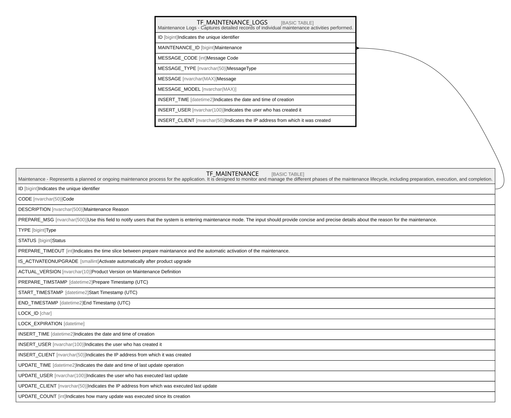

# TF_MAINTENANCE_LOGS

## Description

Maintenance Logs - Captures detailed records of individual maintenance activities performed.  

## Columns

| Name | Type | Default | Nullable | Parents | Comment |
| ---- | ---- | ------- | -------- | ------- | ------- |
| ID | bigint |  | false |  | Indicates the unique identifier |
| MAINTENANCE_ID | bigint |  | false | [TF_MAINTENANCE](TF_MAINTENANCE.md) | Maintenance |
| MESSAGE_CODE | int |  | false |  | Message Code |
| MESSAGE_TYPE | nvarchar(50) |  | false |  | MessageType |
| MESSAGE | nvarchar(MAX) |  | true |  | Message |
| MESSAGE_MODEL | nvarchar(MAX) |  | true |  |  |
| INSERT_TIME | datetime2 | (sysutcdatetime()) | false |  | Indicates the date and time of creation |
| INSERT_USER | nvarchar(100) | (N'MAIN') | false |  | Indicates the user who has created it |
| INSERT_CLIENT | nvarchar(50) | (N'localhost') | false |  | Indicates the IP address from which it was created |

## Constraints

| Name | Type | Definition |
| ---- | ---- | ---------- |
| PK_MAINTENANCE_LOGS | PRIMARY KEY | CLUSTERED, unique, part of a PRIMARY KEY constraint, [ ID ] |
| FK_MAINTENANCE_LOGS | FOREIGN KEY | FOREIGN KEY(MAINTENANCE_ID) REFERENCES TF_MAINTENANCE(ID) ON UPDATE NO_ACTION ON DELETE CASCADE |

## Indexes

| Name | Definition |
| ---- | ---------- |
| PK_MAINTENANCE_LOGS | CLUSTERED, unique, part of a PRIMARY KEY constraint, [ ID ] |

## Relations

---

> Generated by [tbls](https://github.com/k1LoW/tbls)
