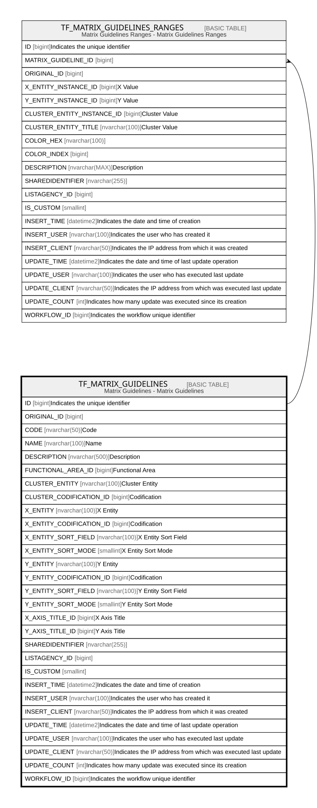

# TF_MATRIX_GUIDELINES

## Description

Matrix Guidelines - Matrix Guidelines  

## Columns

| Name | Type | Default | Nullable | Children | Comment |
| ---- | ---- | ------- | -------- | -------- | ------- |
| ID | bigint |  | false | [TF_MATRIX_GUIDELINES_RANGES](TF_MATRIX_GUIDELINES_RANGES.md) | Indicates the unique identifier |
| ORIGINAL_ID | bigint |  | true |  |  |
| CODE | nvarchar(50) |  | false |  | Code |
| NAME | nvarchar(100) |  | false |  | Name |
| DESCRIPTION | nvarchar(500) |  | true |  | Description |
| FUNCTIONAL_AREA_ID | bigint |  | true |  | Functional Area |
| CLUSTER_ENTITY | nvarchar(100) |  | true |  | Cluster Entity |
| CLUSTER_CODIFICATION_ID | bigint |  | true |  | Codification |
| X_ENTITY | nvarchar(100) |  | false |  | X Entity |
| X_ENTITY_CODIFICATION_ID | bigint |  | true |  | Codification |
| X_ENTITY_SORT_FIELD | nvarchar(100) |  | true |  | X Entity Sort Field |
| X_ENTITY_SORT_MODE | smallint | ((0)) | true |  | X Entity Sort Mode |
| Y_ENTITY | nvarchar(100) |  | false |  | Y Entity |
| Y_ENTITY_CODIFICATION_ID | bigint |  | true |  | Codification |
| Y_ENTITY_SORT_FIELD | nvarchar(100) |  | true |  | Y Entity Sort Field |
| Y_ENTITY_SORT_MODE | smallint | ((0)) | true |  | Y Entity Sort Mode |
| X_AXIS_TITLE_ID | bigint |  | true |  | X Axis Title |
| Y_AXIS_TITLE_ID | bigint |  | true |  | Y Axis Title |
| SHAREDIDENTIFIER | nvarchar(255) |  | true |  |  |
| LISTAGENCY_ID | bigint |  | true |  |  |
| IS_CUSTOM | smallint |  | false |  |  |
| INSERT_TIME | datetime2 | (sysutcdatetime()) | false |  | Indicates the date and time of creation |
| INSERT_USER | nvarchar(100) | (N'MAIN') | false |  | Indicates the user who has created it |
| INSERT_CLIENT | nvarchar(50) | (N'localhost') | false |  | Indicates the IP address from which it was created |
| UPDATE_TIME | datetime2 | (sysutcdatetime()) | false |  | Indicates the date and time of last update operation |
| UPDATE_USER | nvarchar(100) | (N'MAIN') | false |  | Indicates the user who has executed last update |
| UPDATE_CLIENT | nvarchar(50) | (N'localhost') | false |  | Indicates the IP address from which was executed last update |
| UPDATE_COUNT | int | ((0)) | false |  | Indicates how many update was executed since its creation |
| WORKFLOW_ID | bigint |  | true |  | Indicates the workflow unique identifier |

## Constraints

| Name | Type | Definition |
| ---- | ---- | ---------- |
| PK_MATRIX_GUIDELINES | PRIMARY KEY | CLUSTERED, unique, part of a PRIMARY KEY constraint, [ ID ] |
| UQ_MATRIX_GUIDELINES | UNIQUE | NONCLUSTERED, unique, part of a UNIQUE constraint, [ CODE, IS_CUSTOM ] |

## Indexes

| Name | Definition |
| ---- | ---------- |
| PK_MATRIX_GUIDELINES | CLUSTERED, unique, part of a PRIMARY KEY constraint, [ ID ] |
| UQ_MATRIX_GUIDELINES | NONCLUSTERED, unique, part of a UNIQUE constraint, [ CODE, IS_CUSTOM ] |
| IDX_MTRX_GLS_CUSTOM_FACTORY | NONCLUSTERED, [ ORIGINAL_ID, IS_CUSTOM ] |

## Relations

---

> Generated by [tbls](https://github.com/k1LoW/tbls)
